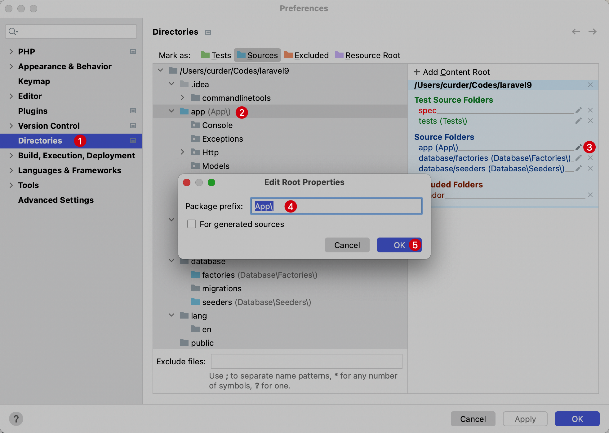

# 自动 PSR-4 命名空间

现代PHP项目基本都使用 `PSR-4` 自动加载规范，可以在 PhpStorm 中简单配置即可实现。

在 PhpStorm 中，可以通过配置实现根命名空间与指定目录的映射，进而在创建 PHP 类时通过 `PSR-4` 自动载入标准，根据类所在的目录路径生成对应的命名空间。

## PSR-4

在 Laravel 项目中，通过 `composer.json` 文件进行命名空间和目录的映射关系配置：

- `App\\` 命名空间对应的是根目录下的 `app/` 子目录
- `Database\\Factories\\` 命名灵就按对应的是跟目录下的 `database/factories/` 子目录
- `Database\\Seeders\\` 命名灵就按对应的是跟目录下的 `database/seeders/` 子目录

```json
{
    "autoload": {
        "psr-4": {
            "App\\": "app/",
            "Database\\Factories\\": "database/factories/",
            "Database\\Seeders\\": "database/seeders/"
        }
    },
}
```

在 PhpStorm ，还可以通过 `Preferences` -> `Directories` 进行配置。

具体操作如下：

1. 使用快捷键 `⌘ + ,` ，进入到系统偏好设置并选择 `Directories`
2. 选中要操作的目标文件所在目录（这里以 `app` 为例），将其添加到 `Sources`
3. 在右侧来到上一步选中的目录并点击编辑图标
4. 在弹出层输入命名空间前缀
5. 点击 **OK** 保存设置



> 从图上可知在 Laravel 框架项目中，PhpStorm 默认给其添加了三个 `Source Folders`。
> 这样在对应目录有新的类添加时就会自动添加命名空间前缀了。

通过这种方式，可以很方便的在 PhpStorm 中修改命名空间并且基于 `PSR-4` 自动载入标准新建 PHP 类。
