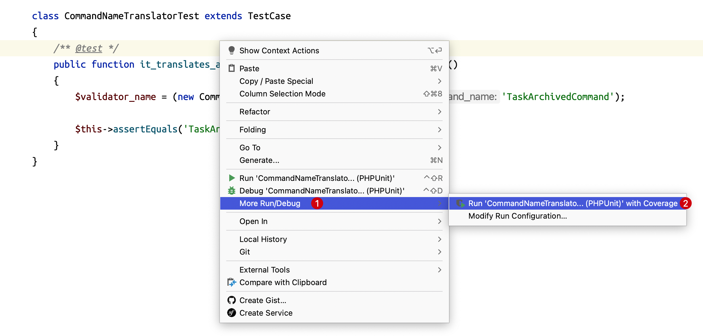

# Code Coverage 代码覆盖率

我们一起通过简单的示例来看一下 PhpStorm 中代码覆盖率的测试。

依然使用 Laravel 项目框架作为代码演示。

打开 Laravel 项目在 `tests/Unit/` 目录下添加一个测试文件 `CommandNameTranslatorTest` 内容如下：

```php
<?php

namespace Tests\Unit;

use PHPUnit\Framework\TestCase;

class CommandNameTranslatorTest extends TestCase
{
    // 
}
```

然后添加一个自定义类文件，在 `app/` 目录下添加一个空的 `CommandNameTranslator` 类。

```php
<?php

namespace App;

class CommandNameTranslator
{
    //
}
```

`CommandNameTranslator` 类的功能逻辑很简单，添加一个 `toValidatorName` 方法，用于分析方法提供的类名参数，将其中的 `Command`
关键字转换成 `Validator`。

首先，来到测试类 `CommandNameTranslatorTest` 编写一个测试用例：

```php
<?php

namespace Tests\Unit;

use App\CommandNameTranslator;
use PHPUnit\Framework\TestCase;

class CommandNameTranslatorTest extends TestCase
{
     /** @test */
     // 它将命令名转换为对应的验证器
     public function it_translates_a_command_name_to_its_validator_counterpart()
     {
         $validator_name = (new CommandNameTranslator)->toValidatorName('TaskArchivedCommand');
 
         $this->assertEquals('TaskArchivedValidator', $validator_name);
     }
}
```

此时右键点击选择 `More Run/Debug` | `Run ... With Coverage`



运行之后会抛出错误，因为 `CommandNameTranslator` 类中当前并没有对应的 `toValidatorName` 方法。

我们来到 `CommandNameTranslator` 类中添加 `toValidatorName` 方法：

```php
<?php

namespace App;

class CommandNameTranslator
{
    public function toValidatorName()
    {
       
    }
}
```

在 Debug 面板处选择再次测试，看到编写的 `toValidatorName` 方法左侧的代码覆盖标识。

但是代码测试的逻辑依然失败，这里需要添加代码逻辑。

```php
<?php

namespace App;

class CommandNameTranslator
{
    public function toValidatorName(string $command_name): string
    {
        return str_replace('Command', 'Validator', $command_name);
    }
}
```

添加上代码逻辑后重新执行代码覆盖测试，可以看到测试成功，并且 `CommandNameTranslator` 类的代码覆盖率为 100%。

下面我们将 `toValidatorName` 的代码逻辑修改得复杂些

```php
<?php

namespace App;

class CommandNameTranslator
{
    public function toValidatorName(string $command_name): string
    {
        if ($command_name === 'foo') {
            return 'bar';
        }
    
        return str_replace('Command', 'Validator', $command_name);
    }
}
```

编写完上面的代码逻辑之后，重新执行代码覆盖，可以看到新增的逻辑 return 语句处没有被覆盖。

并且当前 `CommandNameTranslator` 类的代码覆盖率为 75%。

这是因为我们编写的测试代码没有覆盖 if 条件的逻辑。

所以可以来到测试类中添加一个测试用例

```php
/** @test */
public function it_returns_bar_if_foo_is_provider()
{
    $validatorName = (new CommandNameTranslator)->toValidatorName('foo');

    $this->assertEquals('bar', $validatorName);
}
```

再次运行代码覆盖测试，会发现当前单元测试全部通过并且当前代码覆盖率又回到了 100%。

再次来到 `CommandNameTranslator` 可以看到所有的代码均已覆盖到。

另外，如果需要修改显示颜色，可以使用快捷键 Command , 来到 `Editor` | `Color Scheme` | `General` 可以在 `Line Coverage` 处分别定义 `Full`、`Partial` 和 `Uncovered` 的显示颜色。