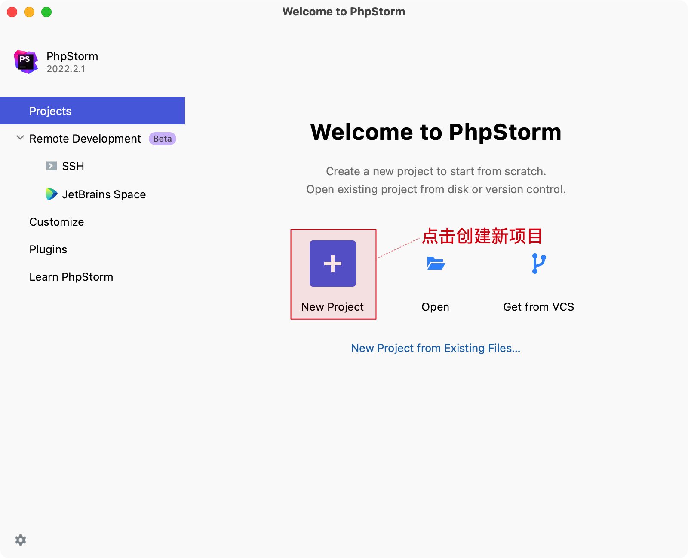
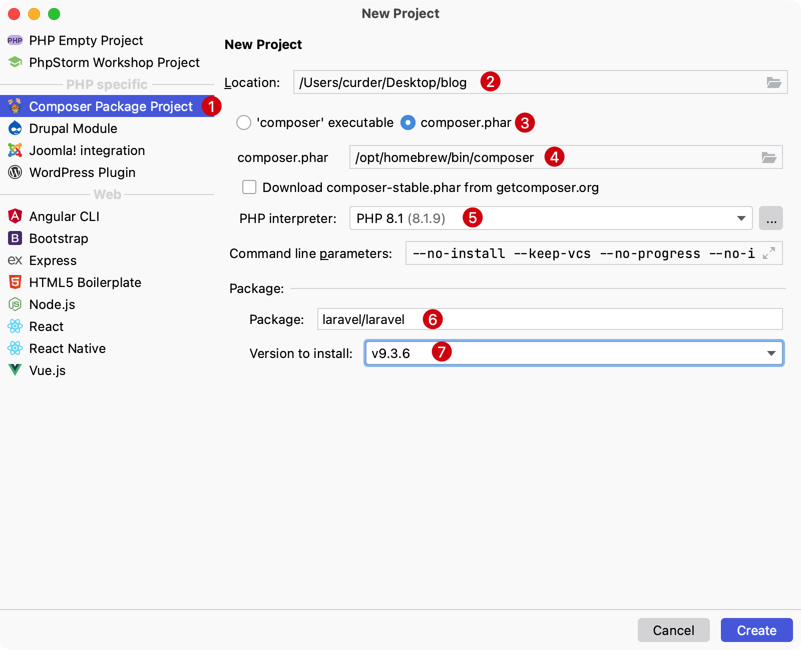
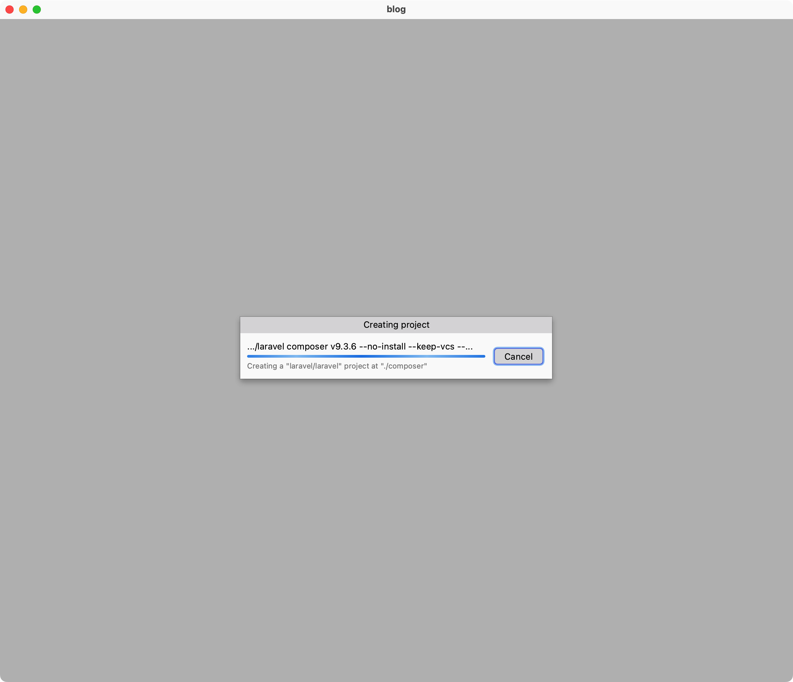

# Composer 依赖

一般使用命令行终端命令创建 Composer 依赖，也可以使用 PhpStorm 编辑带给我们的编辑体验。

比如这里以创建一个 [laravel/laravel](https://github.com/laravel/laravel) 项目，并安装一个依赖包：[spatie/laravel-backup](https://github.com/spatie/laravel-backup) 为例作为演示。

## 创建 Laravel 项目

在创建 Laravel 项目时，一般情况下在命令行终端中使用 `composer create-project laravel/laravel:^9.3.6 blog` 来创建，或者使用 `laravel` 命令，`laravel new blog` 也可以。

如果要使用 PhpStorm 工作流应该怎样创建呢？

1. 点击 `New Project` 创建一个新项目，或者也可以在主菜单上点击 `File` -> `New Project...`
    ::: details 点击切换截图展示与隐藏
    
    :::

2. 在弹出的 `New Project` 界面依次选择并输入如下内容，并点击 `Create`。
    ::: details 点击切换细节流程信息
    1. 选择左侧项目类型 `Composer Package Project`
    2. 右侧选择存放位置，这里选择存储在桌面上，并命名为：`blog`
    3. 右侧选择 `composer.phar` 类型
    4. 输入本地 composer 所在路径，可以使用 `which composer` 获取到执行文件的全路径
    5. 选择当前使用的 PHP 版本，这里是 `PHP 8.1.9`
    6. 输入要安装的软件包，这里是 `laravel/laravel`
    7. 输入对应安装软件包的版本，这里以最新的  `v9.3.6` 为例

    具体选择如下：
    

    执行完上面的命令后出现下面的下载进度条，根据网络情况需要耐心等待。
    
    :::

## 添加 Composer 依赖

可以在命令行中使用 `composer require spatie/laravel-backup` 命令添加对应的第三方扩展包 `spatie/laravel-backup`。

如果要使用 PhpStorm 工作流程应该怎么添加它呢？

1. 在主菜单界面选择 `Tools` -> `Composer` -> 选择 `Manage Dependencies...`（或者在打开 `composer.json` 文件界面点击右上角的 ⚙️ 按钮，选择 `Manage Dependencies...`）
    ::: details 点击切换截图展示与隐藏
    
    :::

2. 在随即打开的 `composer.json` 文件中输入要安装的软件包名，并点击 `Update` 安装软件包
   ::: details 点击切换截图展示与隐藏
   1. 输入需要安装的软件包
   2. 确认安装包输入无误后，点击 `Update` 确认安装
   3. 等待片刻，软件包就安装到本地 `vendor/` 目录下
   
   :::

> 如果需要安装的软件包是仅开发时使用，可以选中对应的软件包后，使用快捷键 `Option（或 Alt）⌥ + Shift ⇧ + 上箭头` 将它移动到 `require-dev` 里。