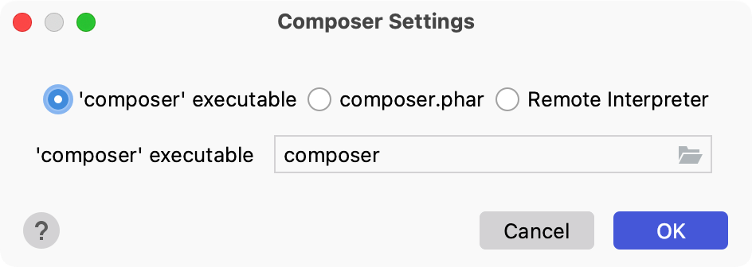
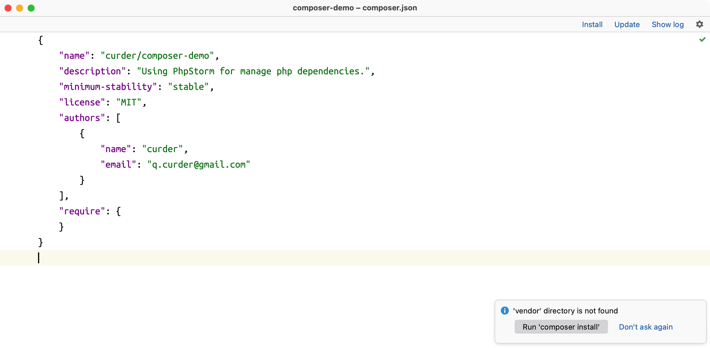
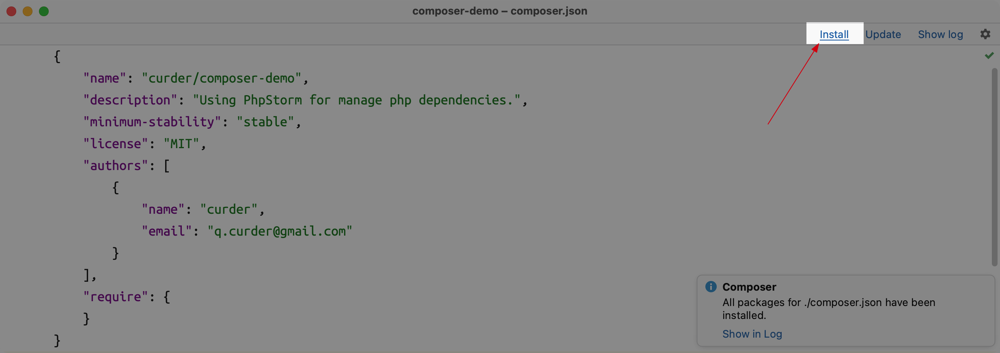
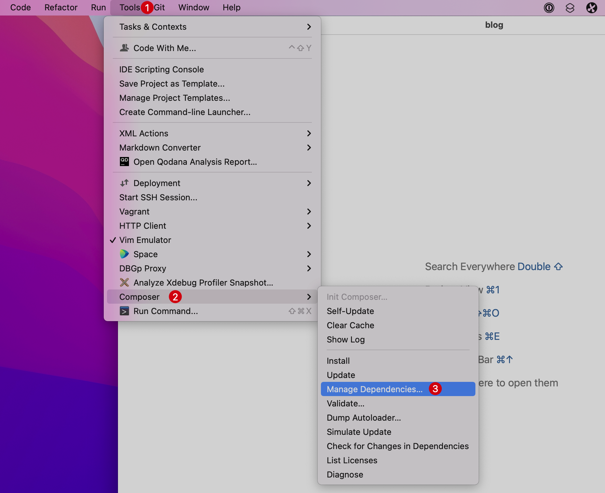
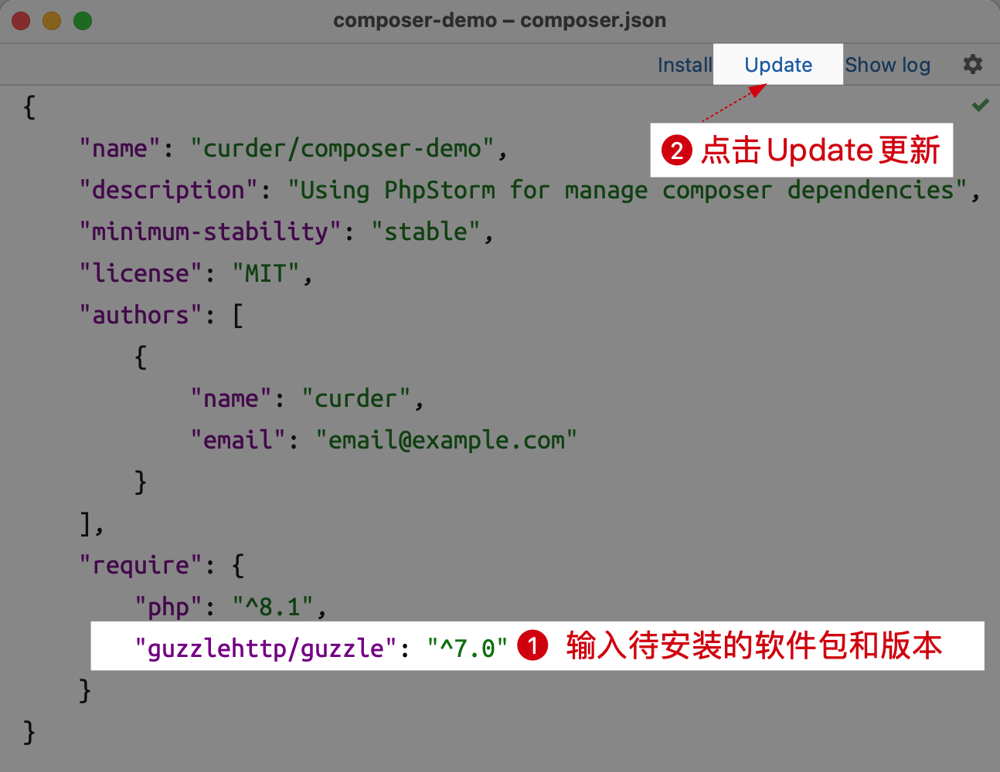
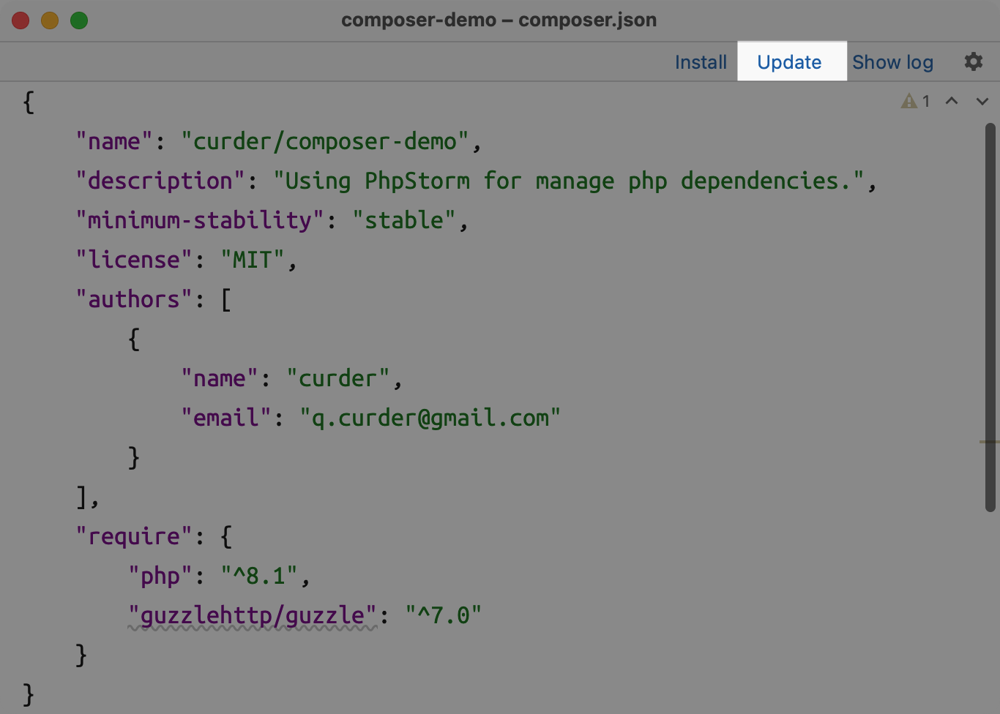

# Composer 依赖

在开发中一般会使用命令行终端命令管理 Composer 依赖，也可以使用 PhpStorm 编辑带给我们的编辑体验。

这里以初始化一个空白的项目为例，简单演示 Composer 在 PhpStorm 编辑器中的使用。

包括 composer 初始化和扩展包的增删改查操作。

## 下载 Composer

首先我们需要安装 composer 到本地，在命令行终端输入如下命令安装

```bash
php -r "copy('https://getcomposer.org/installer', 'composer-setup.php');"
php composer-setup.php
php -r "unlink('composer-setup.php');"
```

通过下面的命令将可执行文件 composer 移动到全局 bin 路径

```bash
sudo mv composer.phar /usr/local/bin/composer  # For Mac Intel
sudo mv composer.phar /opt/homebrew/bin/composer # For Mac Silicon
```

通过下面的命令验证 composer 是否正确安装（如果有版本信息输出则表示正确安装）

```bash
composer -V
```

## Composer 初始化

使用 PhpStorm 编辑器打开一个空白的目录，在顶部菜单选择 Tools | Composer | 点击 Init Composer...，会弹出 Composer 设置弹出层。

选择 `'composer' executable` 后点击 OK。



依次输入 `license`、`authors.name`、`name`、`description`、`minimum-stability`、`authors.email`



至此初始化 composer 已经完成。

## 下载 Composer 依赖

在编辑器顶部菜单选择 `Tools` | `Composer` | 点击 `Install`，或者直接在打开 `composer.json` 文件的界面选择 **Install**。



可以看到当前项目生成了 `vendor/` 目录和 `composer.lock` 文件。

## 添加 Composer 依赖

可以在命令行中使用 `composer require guzzlehttp/guzzle` 命令添加对应的第三方扩展包 `guzzlehttp/guzzle`。

如果要使用 PhpStorm 工作流程应该怎么添加它呢？

1. 在主菜单界面选择 `Tools` -> `Composer` -> 选择 `Manage Dependencies...`（或者在打开 `composer.json` 文件界面点击右上角的
   ⚙️ 按钮，选择 `Manage Dependencies...`）
   

2. 在随即打开的 `composer.json` 文件中输入要安装的软件包名，并点击 `Update` 安装软件包
    1. 输入需要安装的软件包 [guzzlehttp/guzzle](https://github.com/guzzle/guzzle)
    2. 确认安装包输入无误后，点击 `Update` 确认安装
    3. 等待片刻，软件包就安装到本地 `vendor/` 目录下
       

## 更新 Composer 依赖

在编辑器顶部菜单选择 `Tools` | `Composer` | 点击 `Update`，或者直接在打开 `composer.json` 文件的界面选择 **Update**。



可以看到本地生成了 `vendor/` 目录和 `composer.lock` 文件。

## 删除 Composer 依赖

打开项目的 `composer.json` 文件，将需要删除的依赖删除即可（注意保持json文件的完整）。

然后再更新 Composer 依赖即可。
