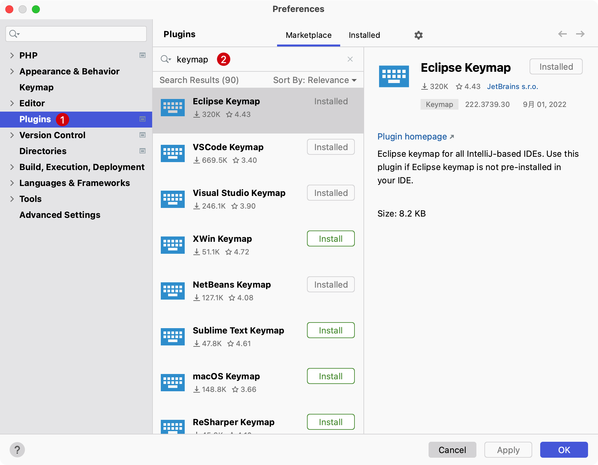
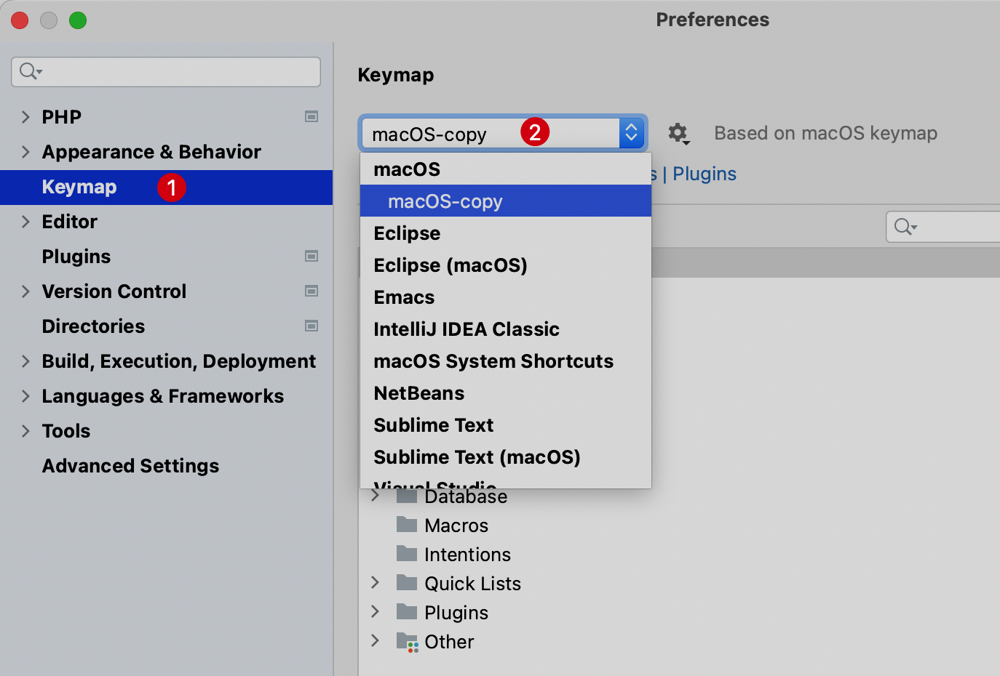

# 自定义快捷方式

PhpStorm 包括几个预定义的键盘映射，基本上能看到的操作都能使用快捷键，如果软件默认的快捷键不满足需求，可以尝试自定义常用的快捷键。

## 快捷键预设

优先选择之前熟悉的快捷键方式，如果没有使用系统默认的 `macOS` 即可。

### 下载预设

如果之前使用过其它代码编辑器，比如 `VS Code`、`Eclipse`、`Sublime Text` 等等，并且已经习惯那一套快捷键，可以在 PhpStorm
的插件市场安装对应的快捷键映射方案：

::: details 点击展示或隐藏截图

1. 进入到 PhpStorm 系统偏好设置(使用快捷键 `Command + ,`)
2. 选择 `Plugins` -> `Marketplace` -> 搜索 `keymap` 关键字，选择需要映射的编辑器快捷键
   
   :::

### 启用预设

使用快捷键 `⌘ +,` 打开软件偏好设定对话框，然后选中 `Keymap`，在下拉选项中找到符合的快捷键预设

::: details 点击展示或隐藏截图

:::

## 自定义快捷方式

经过使用快捷键预设或者直接使用系统默认的 `macOS` 预设，大部分的编码流程都能快速上手，但是如果需要对某些操作设定特殊的快捷键应该怎么做呢？

在需要设定快捷键、鼠标快捷方式或添加简写时，都需要先找到对应的其对应的位置所在，再对其进行设置，PhpStorm 提供了两种方式。

1. 通过操作或菜单命名缩写，比如很清晰的知道操作的是 `Jump to Colors and Fonts`，则可以在输入框输入关键词进行过滤
2. 通过当前快捷键或者鼠标快捷方式定位到对应项。

### 添加快捷键

1. 使用快捷键 `Command + ,` 打开系统首选项对话框，找到 `Keymap`，右键单击一个操作并选择 `Add Keyboard Shortcut`

2. 在 `Keyboard Shortcut` 对话框中，输入需要自定的快捷键

3. 如有必要，请选择 `Second stroke` 复选框来定义具有两个连续组合键的复杂快捷方式

4. 单击 `OK` 以保存

> 按下的组合键会显示在 `Keyboard Shortcut` 对话框中，如果它与现有快捷键冲突，还会显示警告，可以选择覆盖之前的快捷键，或者另外输入自定义快捷键。

### 添加鼠标快捷方式

1. 使用快捷键 `Command + ,` 打开 系统首选项对话框，找到 `Keymap`，右键单击一个操作并选择 `Add Mouse Shortcut`

2. 在 `Mouse Shortcut` 对话框中，将鼠标指针移动到中心区域并根据需要单击、双击或上、下滚动

3. 单击 `OK` 以保存

> 按下的组合键会显示在 `Mouse Shortcut` 对话框中，如果它与现有快捷键冲突，还会显示警告，可以选择覆盖之前的快捷键，或者另外输入自定义快捷键。

### 添加简写

缩写可用于快速查找操作，无需快捷方式。

例如，可以按 `Shift⇧ + Command⌘ + A` 并输入 `Jump to Colors and Fonts` 操作的名称，以快速修改当前插入符号位置下元素的颜色和字体设置。

如果为该操作指定了缩写（如JCF）的话，则可以键入它，而不是完整的操作名称。

1. 使用快捷键 `Command + ,` 打开 系统首选项对话框，找到 `Keymap`，右键单击一个操作并选择 `Add Abbreviation`
2. 在 `Abbreviation` 对话框中，键入所需的缩写并单击 `OK`
