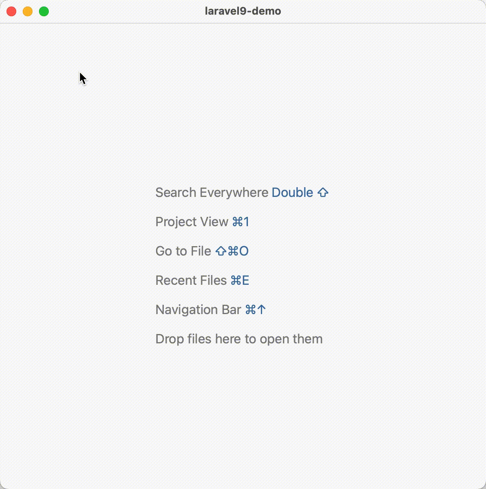

# 快速创建文件

## 一般方式创建文件

普通方式创建文件，可以在左侧侧边栏点击对应的文件目录后按照下列步骤进行：

1. 点击右键，选中 `New`
2. 选中要创建的文件类型，比如这里的 `PHP Class` 文件
3. 输入要创建的类名，核对命名空间等信息
4. 点击 **OK** 或者按回车按键确认创建文件

::: details 点击切换动态图展示与隐藏

:::

## 使用快捷键创建文件

