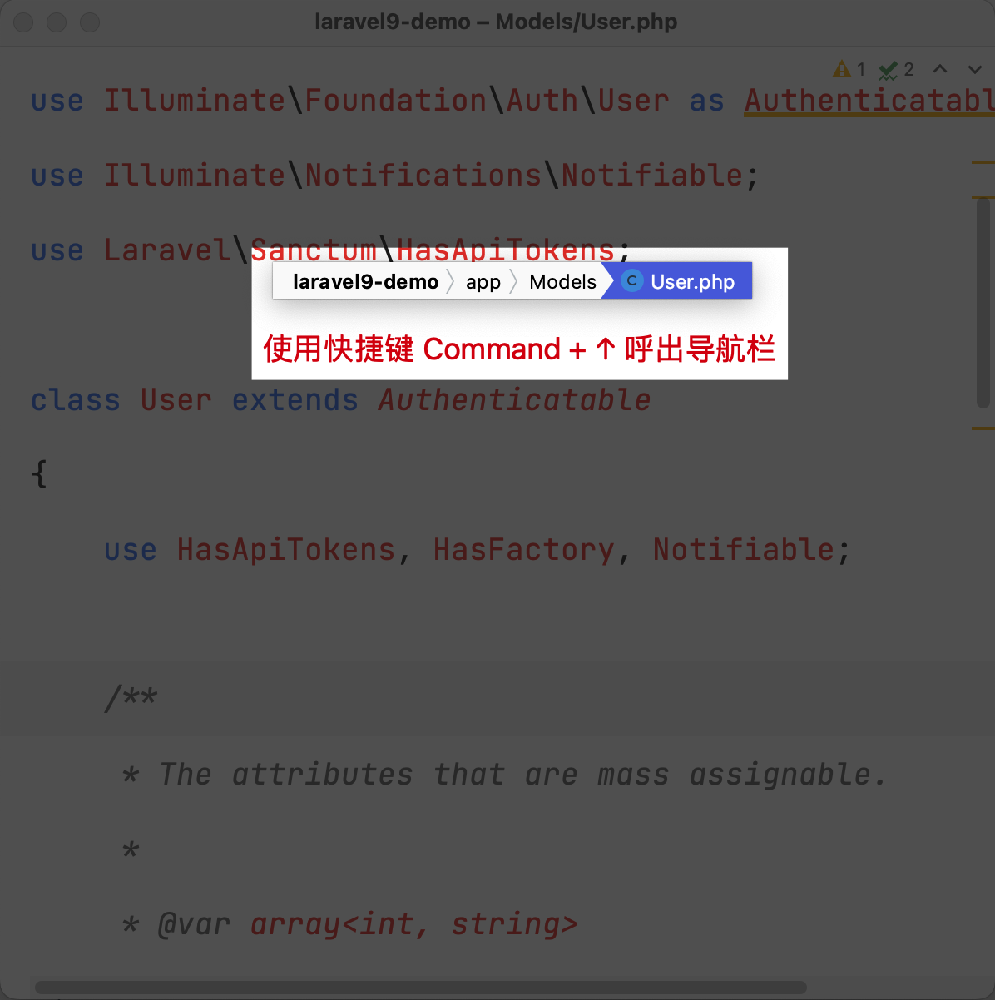
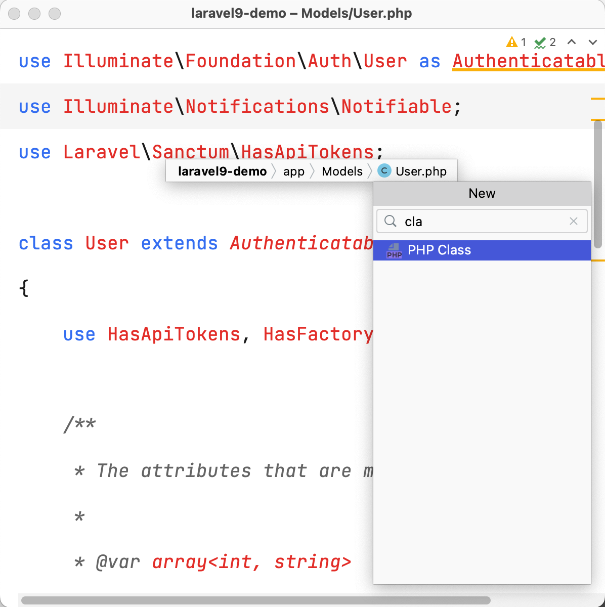
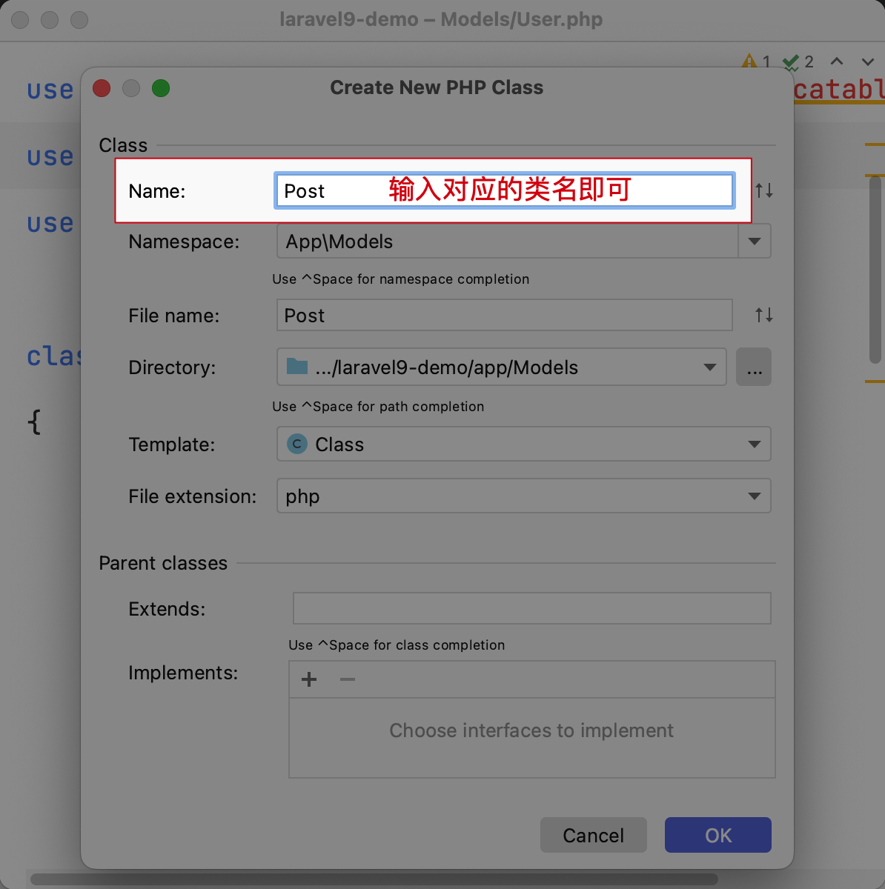
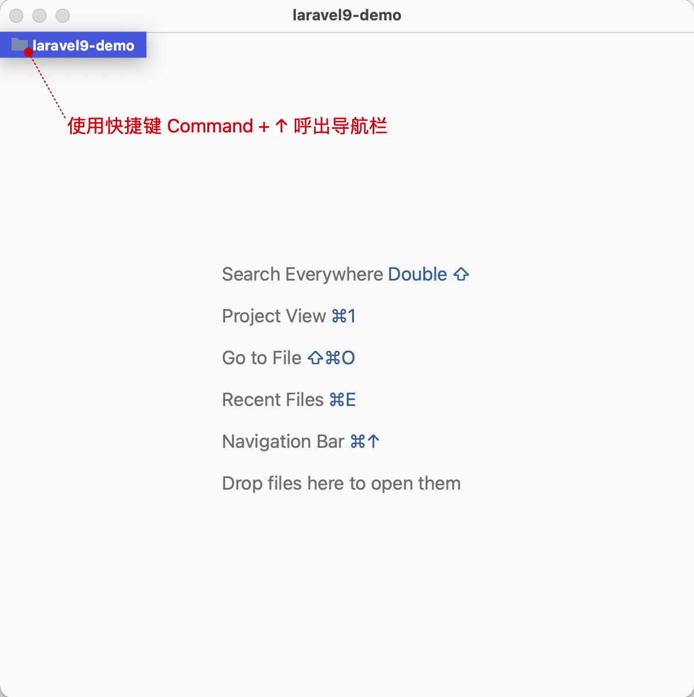
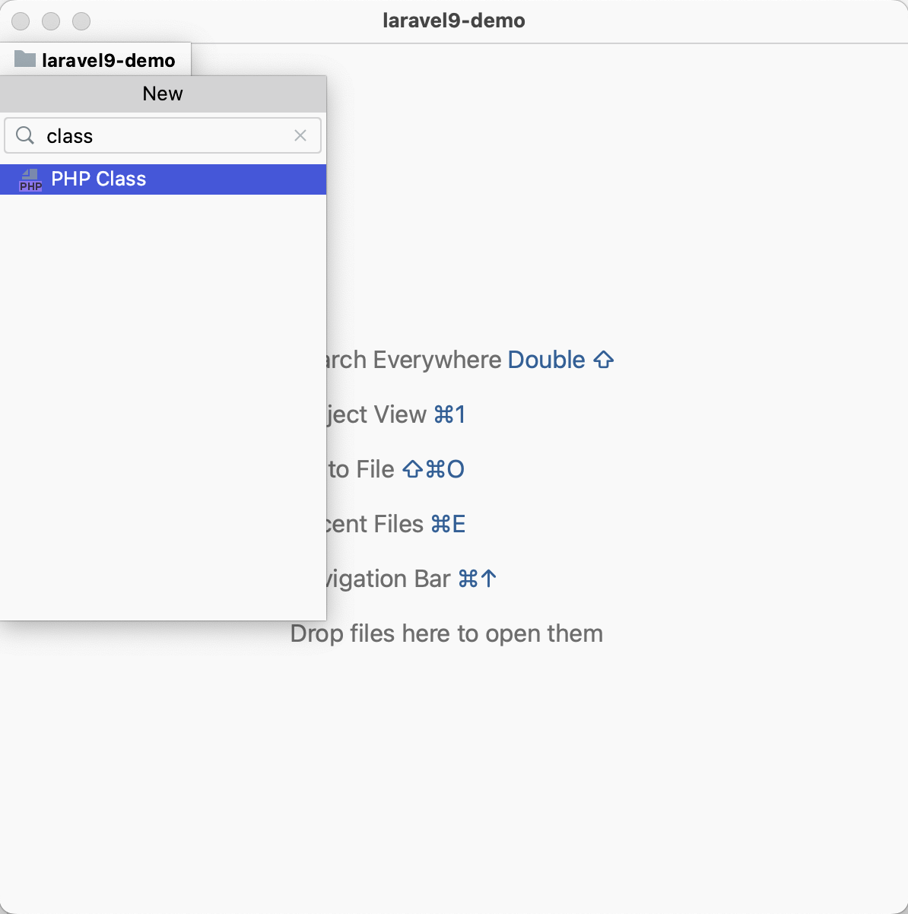
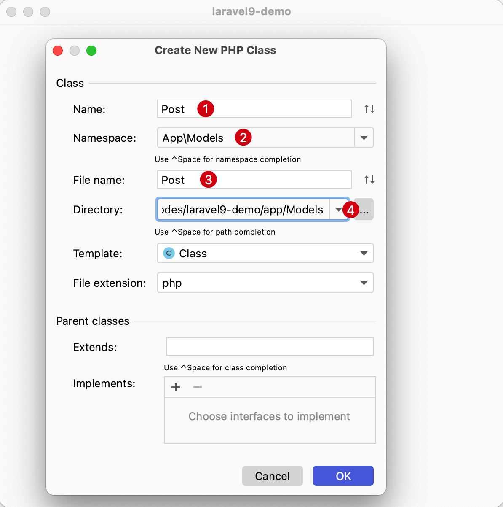
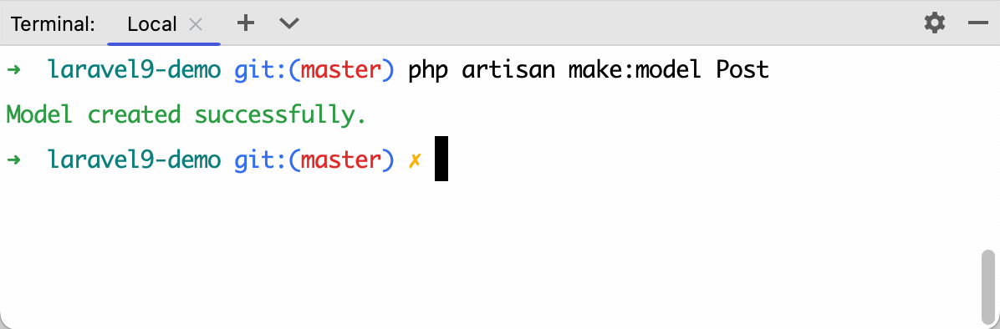
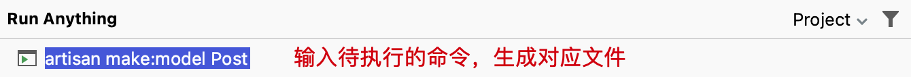
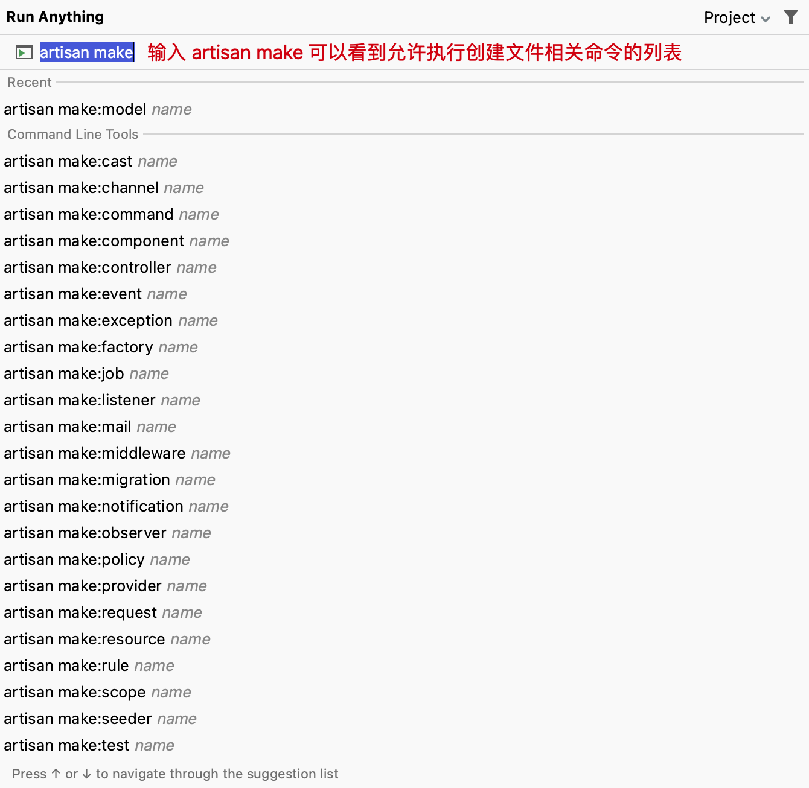

# 快速创建文件

## 一般方式创建文件

普通方式创建文件，可以在左侧侧边栏点击对应的文件目录后按照下列步骤进行：

1. 点击右键，选中 `New`
2. 选中要创建的文件类型，比如这里的 `PHP Class` 文件
3. 输入要创建的类名，核对命名空间等信息
4. 点击 **OK** 或者按回车按键确认创建文件

::: details 点击切换动态图展示与隐藏

:::

## 使用快捷键创建文件

快捷方式创建文件的流程可以总结为：
1. 在编辑器中打开导航栏
2. 新建文件

具体由如下两种方式：

- 方式一：如果当前打开了文件，则可以使用下面的工作流创建新文件。
    1. 使用快捷键 `Command + ↑`呼出导航栏，其中 `↑` 为方向键上
        :::details 点击切换截图展示与隐藏
        
        :::

    2. 使用快捷键 `Command + N` 后输入 `class` 关键字筛选要新建的文件类型
        :::details 点击切换截图展示与隐藏
        
        :::

    3. 点击回车确认选择，在弹出层可以看到类命名空间和文件路径已经默认提供，输入对应的文件名即可点击回车确认
        :::details 点击切换截图展示与隐藏
        
        :::

- 方式二：如果当前未打开任何文件，则可以使用如下工作流创建新文件。

    1. 使用快捷键 `Command + ↑`呼出导航栏，其中 `↑` 为方向键上
        :::details 点击切换截图展示与隐藏
        
        :::
    2. 使用快捷键 `Command + N` 后输入 `class` 关键字筛选要新建的文件类型
        :::details 点击切换截图展示与隐藏
        
        :::
    3. 点击回车确认选择，在弹出层中输入类名、命名空间、文件名以及文件路径等，点击回车确认
        :::details 点击切换截图展示与隐藏
        
        :::

## Laravel 新建常规文件

如果当前使用的是 Laravel 项目，并且创建的是 Model模型、Job任务、Command命令等文件，使用下面的方式会更加优雅。

### 在命令行终端创建

在打开命令行终端（`Option(或 Alt)⌥ + F12`），输入对应的创建命令，比如： `php artisan make:model Post`

:::details 点击切换截图展示与隐藏

:::

### 使用快捷键创建

使用快捷键 `Command + Shift + X`，在弹出层中输入 `artisan make:model Post` 点击回车会自动在目录 `app/Models` 生成模型文件 `Post.php`，如下图所示：

### 支持创建哪些文件

使用快捷键 `Command + Shift + X`，在弹出层中输入 `artisan make` 命令，可以看到对应命令下的所有可执行列表，使用上、下方向键进行选择即可。

:::details 点击切换截图展示与隐藏

:::
