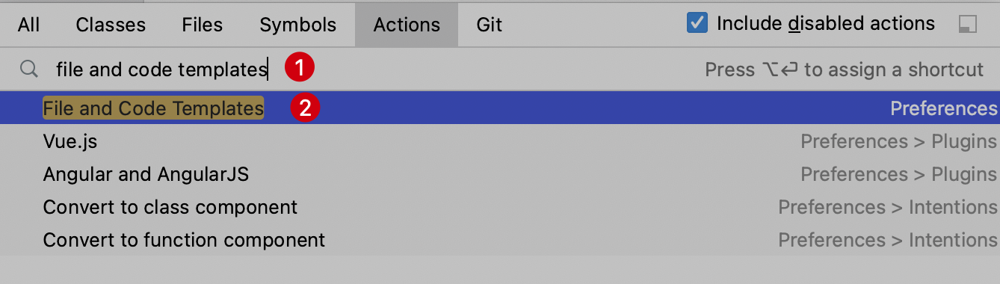
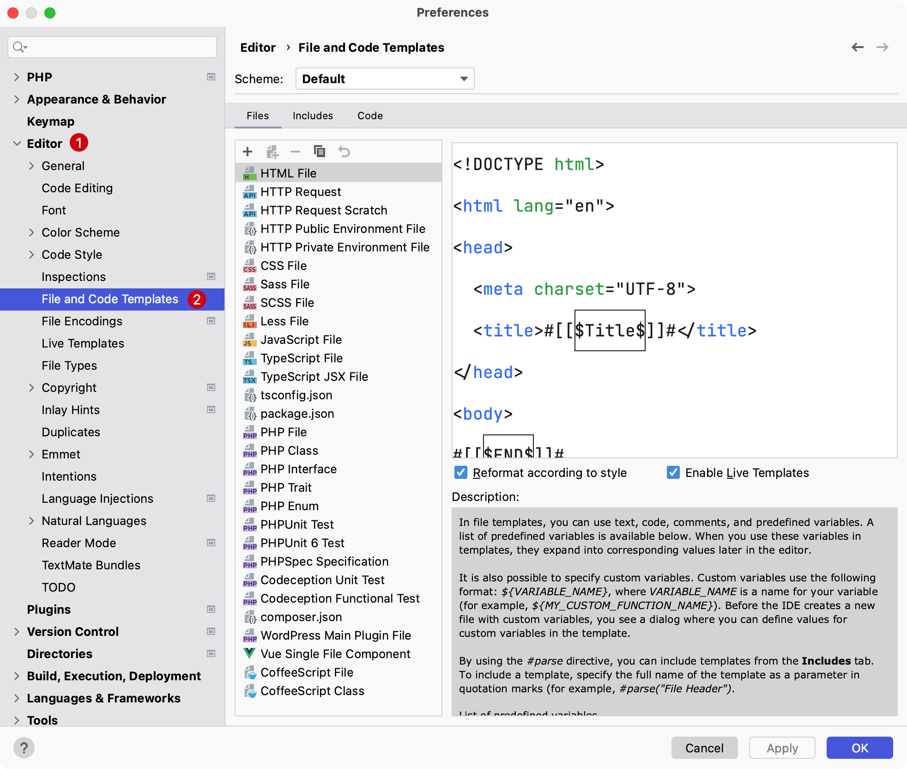
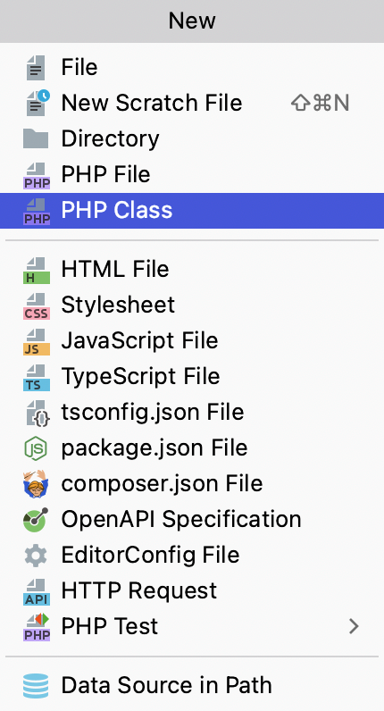
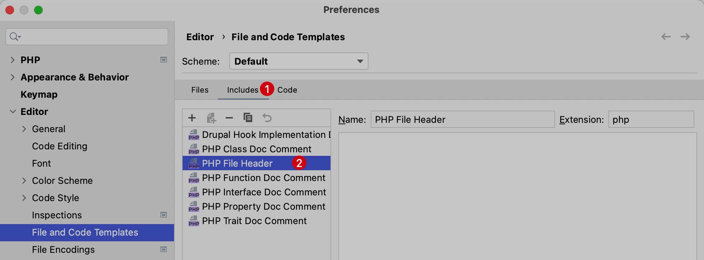
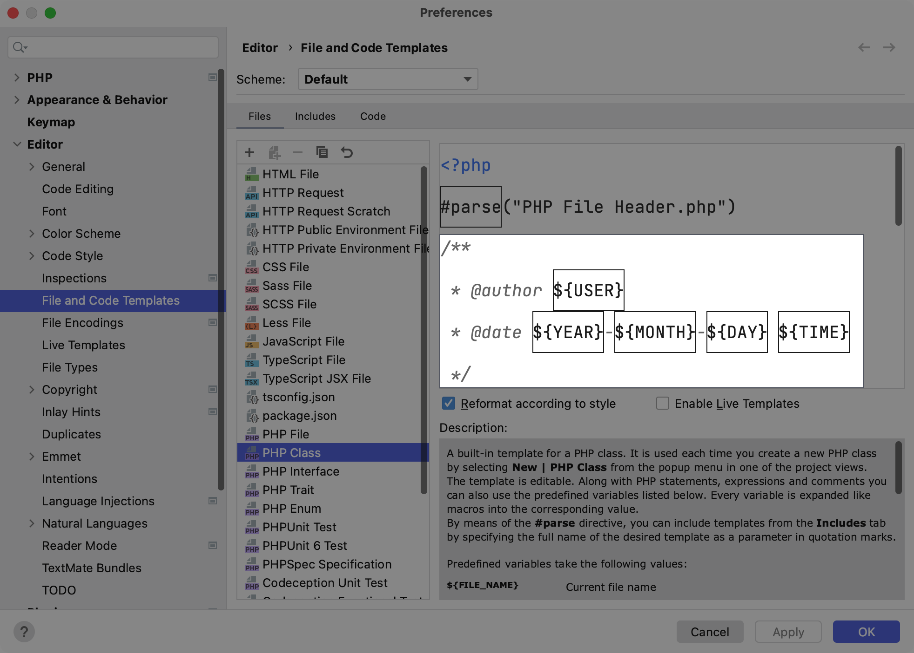
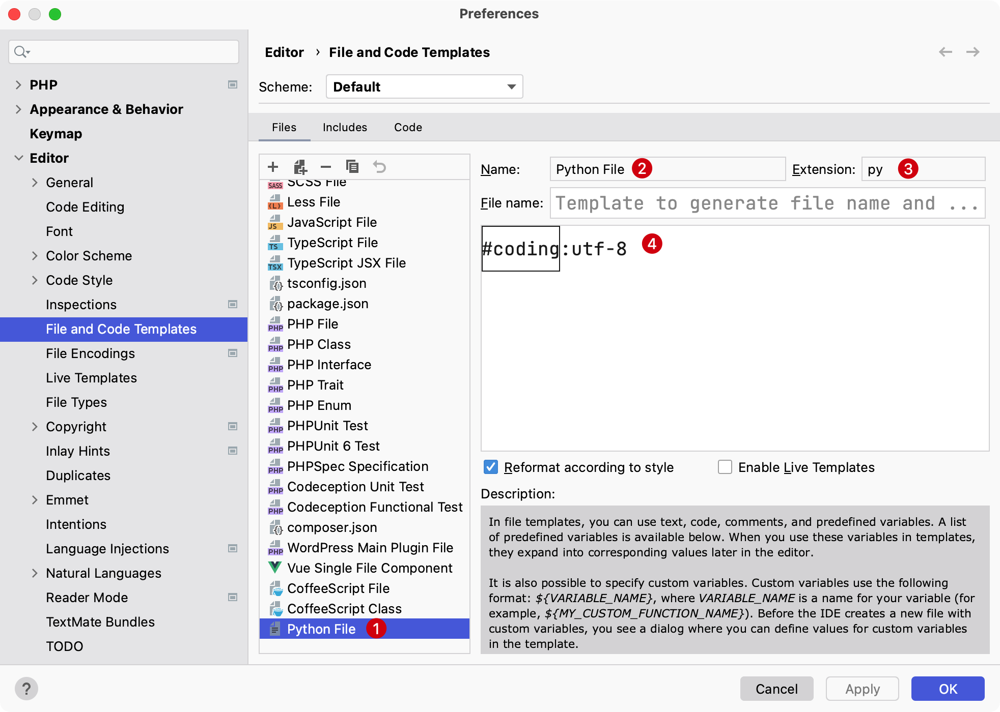

# 自定义文件模版

在 PhpStorm 中，可以通过代码模板功能快速生成初始文件代码，方便在新建文件时使用，提高编码效率。

PhpStorm 默认内置一些文件模版，要定位到自定义文件模版有如下两种方式：

1. 在 PhpStorm 的 `Preferences` 偏好设置中选择 `Editor` -> `File and Code Templates`

2. 或者通过快捷键 `Command + Shift + A` 呼出 `Action` 导航界面，在输入框输入 `file and code templates`，在下拉列表中选中`File and Code Templates`：

    ::: details 点击切换截图展示与隐藏
    
    :::

进入文件代码模板界面，在这里可以看到 PhpStorm 内置支持的所有语言/框架的代码模板：

::: details 点击切换截图展示与隐藏

:::

这些文件列表模版的内容对应在新建文件时默认的文件内容：

::: details 点击切换截图展示与隐藏

:::

## 内容简单说明

以 PHP Class 文件内容为例：

```php
<?php
#parse("PHP File Header.php")

#if (${NAMESPACE})
namespace ${NAMESPACE};

#end
class ${NAME} {

}
```

- `#parse("PHP File Header.php")` 引用公共头文件，在 `Includes` 中的 `PHP File Header`定义，如下图所示：
    
- `#if (${NAMESPACE})` 判断是否包含命名空间，如果新建文件时提供了就会在创建文件时添上
- `${NAME}` 为创建的文件名

## 编辑模版

如果编写的模版已经存在可以拷贝一份进行编辑，比如这里给 `PHP Class` 添加上一些作者、时间等信息，如下：

::: details 点击切换展示与隐藏


```php
<?php
#parse("PHP File Header.php")
/**
 * @author ${USER}
 * @date ${YEAR}-${MONTH}-${DAY} ${TIME}
 */

#if (${NAMESPACE})
namespace ${NAMESPACE};

#end
class ${NAME} {

}
```
:::

使用上面编辑的 PHP Class 模版，新建一个测试文件 `Test.php`，内容如下：

```php
<?php
/**
 * @author curder
 * @date 2022-09-06 17:53
 */

class Test
{

}
```

> **注意：** 如果新增的内容可以被其他文件使用，可以将其放在 `Includes` 下，方便其他文件使用，也便于后续维护。

## 新增模版

在面板操作顶部点击 `+`（或者使用快捷键 `Control（或 Ctrl）⌃ + N`） 新增模版。

- Name: 输入一个名称方便在新建文件时识别
- Extension: 文件名拓展后缀
- 文件内容自定义即可，如果没有可以留空

下面截图以新建一个 Python 文件为例：


