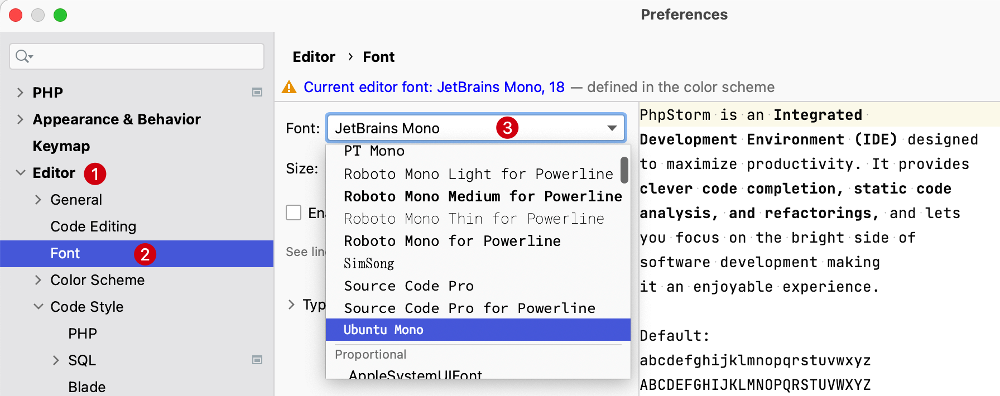

# 自定义字体

默认安装的 PhpStorm 使用的是面向开发人员的免费开源字体 [JetBrains Mono](https://www.jetbrains.com/lp/mono/) 个人感觉已经十分够用。

## 编程字体推荐

如果觉得 PhpStorm 默认提供的 JetBrains Mono 不好看或者想换一换字体，下面推荐几款常用字体（排序不分先后）：

- [Operator Mono](https://github.com/beichensky/Font) 收费
- [Ubuntu Mono](https://github.com/ryanoasis/nerd-fonts/blob/master/patched-fonts/UbuntuMono/readme.md)
- [Fira Code](https://github.com/beichensky/Font/tree/master/FiraCode)
- [Source Code Pro](https://github.com/ryanoasis/nerd-fonts/blob/master/patched-fonts/SourceCodePro/readme.md)
- [Robot Mono](https://github.com/ryanoasis/nerd-fonts/blob/master/patched-fonts/RobotoMono/readme.md)

## 安装字体

以上字体从 GitHub 下载后，可以点击对应的 `ttf` 或者 `otf` 文件进行安装到本地 Mac 电脑。

可以在 Mac 系统的 `字体册 Font` 中查看当前用户安装的所有字体。

## PhpStorm 中使用字体

PhpStorm 内置终端，可以分别对编辑器的编辑区域和终端区域设定字体和字号。

### 编辑区域

使用快捷键 `Command + ,` 来到 PhpStorm 系统偏好设定，选择 `Editor` -> `Font` -> 选择 需要替换的字体，也可以调整字号以及行间距，点击
OK 确认选择。

> **注意：** 在系统偏好设定中的 `Editor` -> `Color Scheme` -> `Color Scheme Font`
> 配置的字体和字号，会覆盖掉上面的配置，可以不勾选 `Use color scheme font instead of the default`

### 终端区域

使用快捷键 `Command + ,` 来到 PhpStorm 系统偏好设定，选择 `Editor` -> `Console Font` -> 选择 需要替换的字体，也可以调整字号以及行间距，点击
OK 确认选择。

> 也可以选择反选上图中的高亮部分将不自定义字体配置，使用默认 `Editor` -> `Font` 下的配置。
