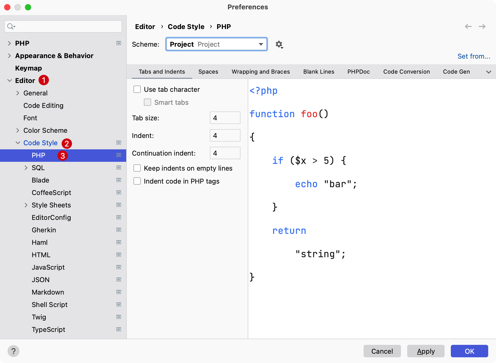
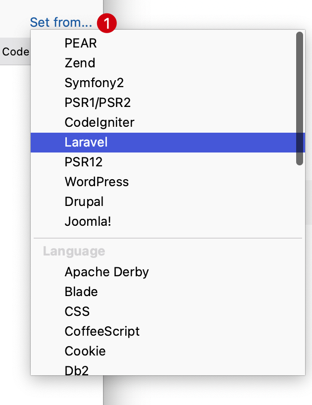

# 自定义代码风格

PhpStorm 允许在当前编辑器自定义代码风格或 `.editorconfig` 文件中指定的要求重新格式化的代码。如果 `.editorconfig` 中未定义任何内容，则它取自项目设置。

使用 PhpStorm 可以重新格式化代码的一部分、整个文件、文件组或目录。还可以从重新格式化中排除部分代码或某些文件。

## 重新格式化代码片段

在顶部的主菜单中，选择 `Code` -> `Reformat Code` 或者使用快捷键  `Option（或 Alt）⌥ + Command + L`

> 如果当前没有选择代码片段，PhpStorm 将重新格式化整个文件

## 重新格式化文件

在编辑器中打开文件并按 `Option（或 Alt）⌥ + Shift ⇧ + Command ⌘ + L` ，或在顶部菜单栏选择 `Code` -> `Refomating File...`。

在打开的对话框中，如果需要，选择以下重新格式化选项：

* **优化导入：** 如果要删除未使用的导入、添加缺失的导入或组织导入语句，请选择此选项
* **重新排列条目：** 如果需要根据代码样式设置中指定的排列规则重新排列代码，请选择此选项
* **代码清理：** 选择此选项以运行代码清理检查
* **不要保留换行符：** 根据代码样式设置重新格式化换行符

## 保存时自动重新格式化代码

可以将 IDE 配置为在保存更改时自动重新格式化修改文件中的代码。

1. 打开系统偏好设置，按快捷键 `Command ⌘ + ，`，并选择 `Tools` -> `Actions on Save`
2. 启用 `Reformat code` 选项
3. 可以配置 IDE 重新格式化代码的方式：
   1. 单击配置范围以指定要从重新格式化中[排除的文件名和目录](https://www.jetbrains.com/help/phpstorm/reformat-and-rearrange-code.html#exclude_file_from_reformat)
   2. 从所有文件类型列表中，选择要重新格式化代码的文件类型
   3. 如果当前项目使用版本控制，可以选择整个文件或更改的行
      如果选择 `Changed lines`，则重新格式化将仅适用于已在本地更改但尚未提交到版本库的代码行

## 自定义代码风格

上面说到的都是如何执行重新格式化代码风格，那么如何自定义代码风格呢？

在 PhpStorm 中使用快捷键 `Command + ,` 打开偏好设置，选择 `Editors` -> `Code Style` -> 选择文件类型，这里选择 `PHP`

* 在 `Scheme` 可以选择当前查看或者带修改的是是 `Project` 级别还是 `Default`级别，两者应用的范围不一致。其中 `Project` 是记录到当前项目，而 `Default` 是对整个编辑器生效。
* PhpStorm 也提供了一些默认的代码风格预设，比如：`Symfony2`、`Laravel`、`PSR12` 等等，点击右侧的 `Set from...` 可以选择。
    

* 在代码风格切换条可以看到 `制表符和缩进` `空白` `包裹和支撑` `空行` `PHPDOC` `代码转换` `代码生成` `排列` 等配置组，可以根据实际需要进行调整。
    > **温馨提示：** 建议调整前复制一份当前代码风格的配置后再进行调整，这样不会破坏系统之前的配置。
