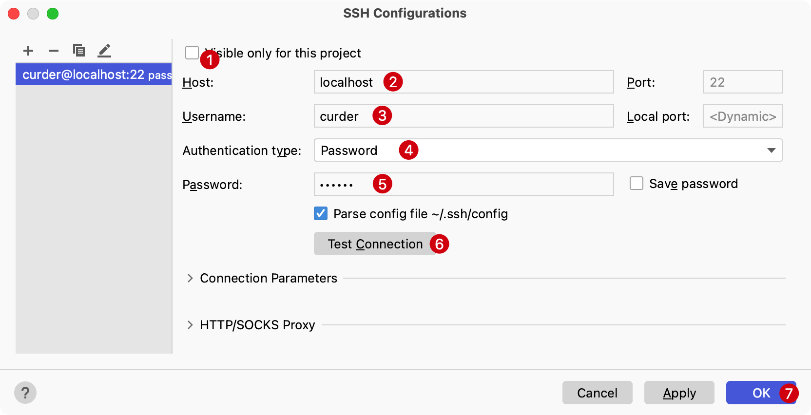

# 数据库和SQL

PhpStorm 内置支持了市面上常见的数据库连接和管理，比如：`MySQL`、`MariaDB`、`Sqlite`、`MongoDB`、`Oracle`等等。

通过使用快捷键 `Command + Shift + A` 输入关键字 `Database`

回车确认选中，一般情况下在右侧就会出现 **Database** 的预览和管理窗口。

1. 选中操作区左侧的 **+** 可以新建一个数据源。
2. 选中需要连接的数据库类型，比如这里的 MySQL。

## 下载对应驱动

不管需要连接哪种数据库，当使用 PhpStorm 编辑器第一次连接时都需要作如下准备：

下载对应数据库驱动，以 MySQL 驱动为例：

## 连接数据库

以 MySQL 为例，常用的有两种来接方式，一种是通过常规方式，一种是通过SSH连接到主机并来接到对应数据库。

### 常规连接

在默认的常规面板需要提供一些数据连接信息，大致如下：

1. 连接名称，一般为项目名+数据库类型，增加连接信息的可读性
2. 连接主机
3. 连接端口，MySQL默认端口为 3306，需要保证端口是连通的
4. 数据库连接用户名
5. 数据库连接密码
6. 数据库名称
7. 以上信息配制完毕后，点击 `Test Connection` 可以快速验证连接可用性
8. 如果可用性没有问题可以点 `OK` 确认保存连接信息

### SSH 连接

使用这种方式连接数据库，一般是由于服务器对数据库操作的用户做了限制，不允许其他IP地址而仅允许本地访问数据库服务。

具体配置如下：

1. 选中 **SSH/SSL**
2. 选中 `Use SSH tunnel`
3. 并点击右侧 `...` 图标，或者使用快捷键 `Shift + Enter` 新建一个SSH连接配置

在接下来的弹出窗口中，新增一个 SSH 配置

本地以新建一个本地 SSH 连接信息为例做演示：

1. 选择当前 SSH 连接信息是否仅对当前项目生效，勾选后其他项目看不到，一般为共享SSH连接信息
2. SSH 连接主机，这里一般为您的服务器 IP
3. SSH 连接用户名，这里一般是服务器连接用户名
4. 选择授权校验类型，可以选择 密码 或 SSH 私钥（授权了免密登录建议使用这种方式）
5. SSH 连接密码，这里一般是服务器来接密码
6. 确认填写完以上信息后，点击 `Test Connection` 来检测填写是否有误
7. 如果没有问题，点击 `OK` 保存 SSH 连接信息

至此，数据库的连接已经正常，接下来就是一些数据库的一些基本操作，比如表的增删改查和数据库的导入、导出等

## 增删改查

经过一下步骤可以选择对应的数据库和要操作的表：

- 选择数据库连接
- 选择目标数据库
- 选择 `tables`
- 双击选择对应表 这里是`users`

  

### 查询

当双击选择对应的表后，在主编辑器视图中将出现对应表的默认前 500 条数据

### 新增

在主编辑器视图上右击选择 `Add Row` 或者直接使用快捷键 `Command + N` 允许新增一行数据。

或者也可以在顶部操作栏上点击新增按钮：

### 修改

在主编辑器视图上点击对应行数据的具体列进行修改，就像修改 `Excel` 单元格的数据一样，提供字段的新值到对应的字段即可。

::: tip 注意

1. 如果不想应用变更，可以点击 `Revert Selected` 来恢复变更前的记录
2. 修改后如果想预览具体要执行的数据 SQL 语句，可以点击 `Preview pending changes` 查看 SQL
3. 修改完毕后需要点击顶部操作栏的 `Submit` (快捷键 `Command + Enter`) 对变更进行保存。

如果不需要保存变更，则选中
:::

### 删除

点击选中的行，使用快捷键 `Delete` 删除对应行，并点击 `Submit` 保存删除变更。

::: tip 注意

1. 如果不想应用变更，可以点击 `Revert Selected` 来恢复变更前的记录
2. 修改后如果想预览具体要执行的数据 SQL 语句，可以点击 `Preview pending changes` 查看 SQL
3. 修改完毕后需要点击顶部操作栏的 `Submit` (快捷键 `Command + Enter`) 对变更进行保存。

:::

## 导入导出

PhpStorm 支持数据库、表结构级别的导入导出。实际开发中，使用数据库的导入导出会比较常见。

1. 选中要导入或导出的数据库，右键点击
2. 在弹出窗口中选择 `Import/Export`
3. 可选择使用 `mysqlbin` 导出 或者使用 SQL 文件导入

