# Deployment

通过使用 PhpStorm 逐步配置代码到远程主机的管理部署。

## 配置部署服务器

在主工具栏上点击设置/首选项，或按 `⌘ + ,`打开**设置/首选项**对话框，然后选择 `Build, Execution, Deployment`
-> `Deployment` 页面（也可以通过从主菜单中选择 `Tools` -> `Deployment` -> `Configration...`）

点击 `Add +`，选择其类型（这是 Local or mounted folder），然后在 `Create New Server`
对话框中，键入服务器名称 `CustomLocalFolder`：

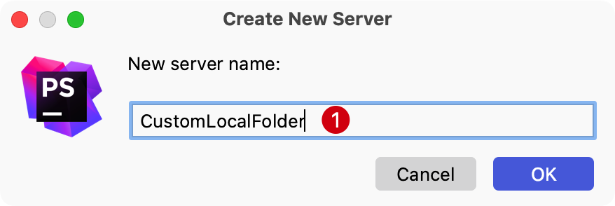

新服务器已添加，但当前仍然无效，因为它仅显示Web服务器URL `http://localhost`，将在其中实际浏览上传的文件。

### 连接选项 Connection

选择将要上传的项目文件目录。在当前示例中是 `/Users/curder/Desktop/codes` 本地文件夹。可以按快捷键 `Shift + Enter`
打开 `Browser...` 对话框 。

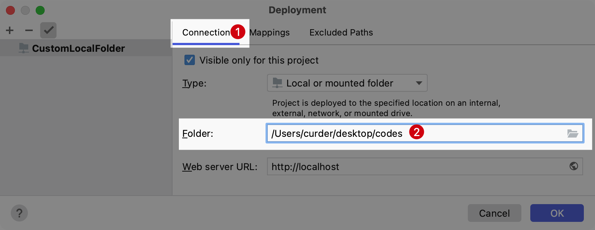

### 映射选项 Mappings

- 默认情况下，`Local Path` 字段包含项目根目录的路径。但可以根据实际需求在项目树中选择任何其他目录，这里使用默认值

- 在`Deployment Path` 字段中（默认情况下为空），指定服务器上的文件夹，PhpStorm 将在其中从 `Local Path`
  字段中指定的文件夹上传数据。相对于文件夹 `phpstorm` 指定此路径。相对于 `/Users/curder/Codes/phpstorm` 文件夹

- 最后，Web路径使用默认值 `/`

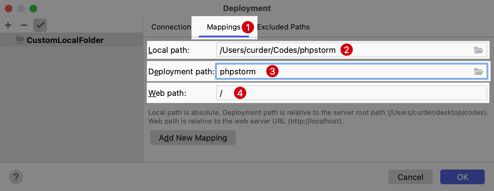

然后单击确定，应用更改，服务器就可以使用了。

## 部署

### 上传

首先尝试将本地一个文件传递到远程服务器 `CustomLocalFolder`。

使用快捷键 `Command + 1` 打开 `Project` 窗口，右键单击待上传的文件。当前使用 `README.md` 文件。

从上下文菜单中，选择 `Upload to CustomLocalFolder`

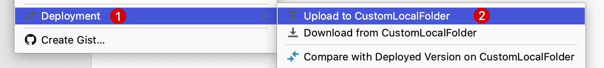

然后通过顶部主菜单点击 `Tools` -> `Deployment` -> 选择 `Browse Romote Host`，查看上传结果。

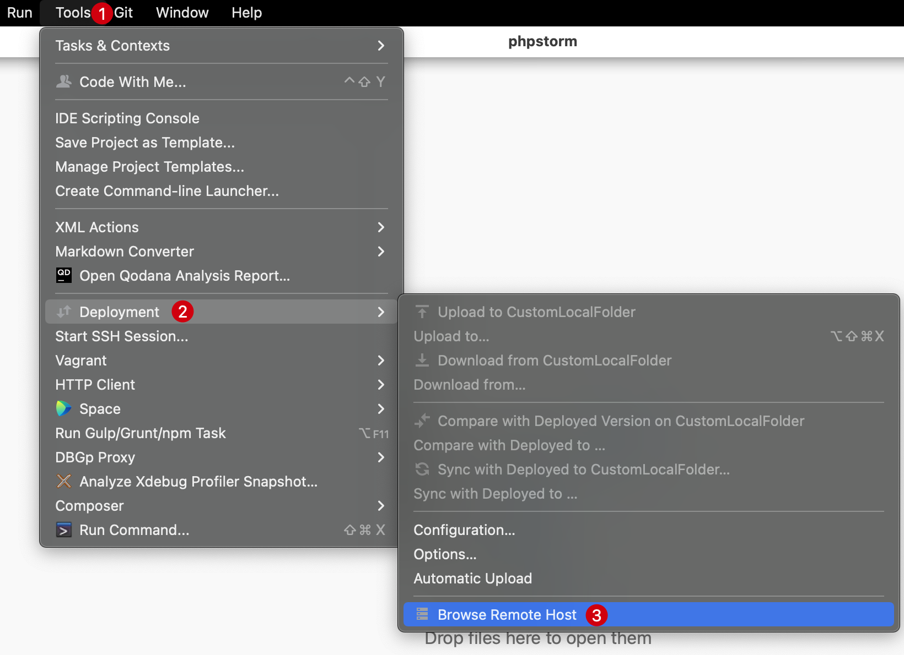

可以看到远程服务器已经存在同步过去的文件

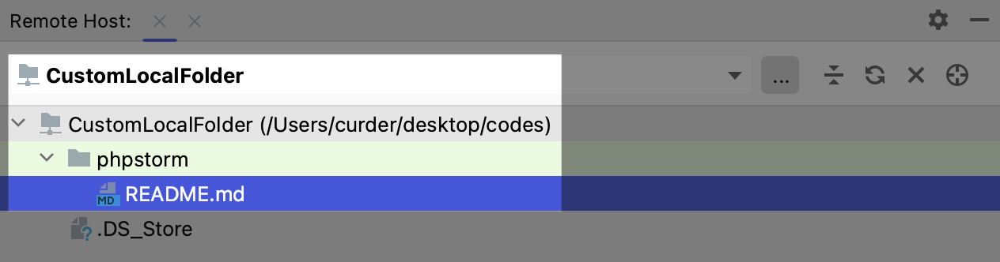

当然也支持上传文件夹，由于操作类似这边不展开讨论。

### 比较远程版本和本地版本

`README.md` 文件有本地和远程副本，当前二者文件内容是相同的。此时尝试修改本地文件内容，添加一个 `Hello world!`

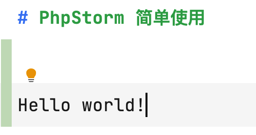

现在由于更改了 `README.md` 本地版本。需要确保 PhpStorm 了解这些更改。

为此，请转到 `Remote Host` 工具窗口，然后单击鼠标右键，从上下文菜单中，选择与本地版本比较。

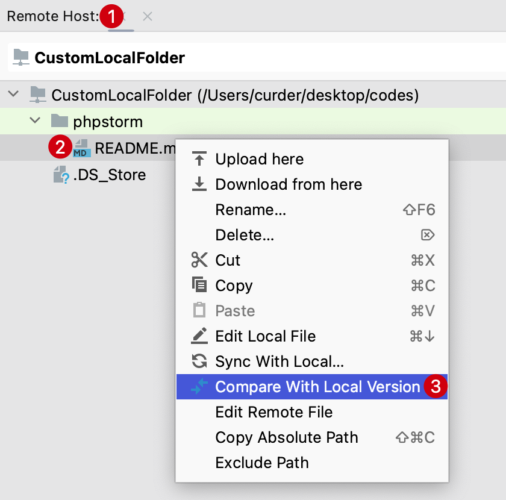

PhpStorm 将打开差异查看器。

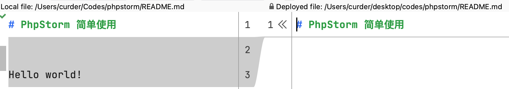

### 下载

在 `Remote Host` 工具窗口中，右键单击文件或者目录，然后在上下文菜单中选择 `Download form here`。PhpStorm显示警告：

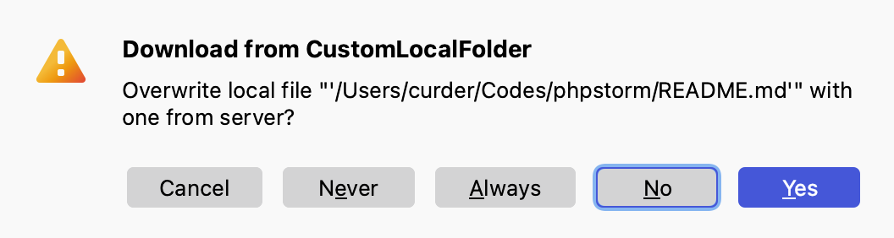

点击 `Yes` 可以将文件或者目录同步到本地。

::: tip 注意
下载的文件或者目录需要在配置 `connection` 中的目录下的文件或者目录，配置目录之外的目录将不会追踪文件。
:::

## 同步代码

实际开发过程中经常会需要用到代码同步更新功能，就是修改了本地代码自动同步到服务器。

演示同步代码之前将 `README.md` 文件本地内容回到最初本地添加 `Hello world!` 而远程服务器没有 `Hello world!` 的版本。

单击 `README.md` 文件，然后在主菜单上选择 `Tools` -> `Deployment` -> `Sync with Deployed to CustomLocalFolder`

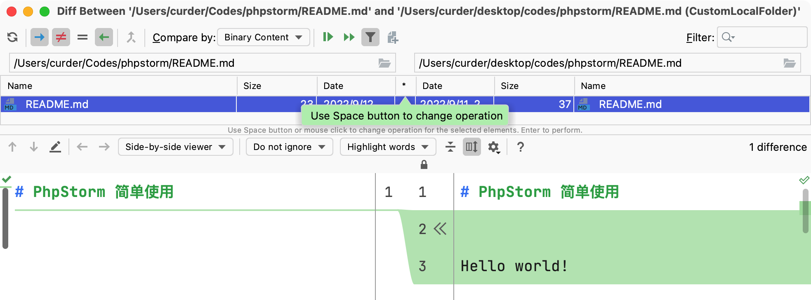

可以在PhpStorm 显示差异查看器中接受单个更改或拒绝它们。

## 自动上传到默认服务器

如果需要服务器上的文件与 PhpStorm 项目中的文件完全相同，则自动上传会有所帮助。

自动上载意味着，只要 IDE 中发生更改，它就会被部署到默认的部署服务器。

由于部署服务器的设置在默认情况下自动上传更改文件，需要设置默认部署服务器，所以接下来先看下如何将服务器定义为默认服务器。

### 将服务器定义为默认服务器

要将部署服务器定义为默认服务器，请按照下列步骤操作：

1. 在 `Deployment` 页面上选择所需的服务器（在当前的示例中为 `CustomLocalFolder` ）。可以通过两种可能的方式打开此页面：
    - 按 `⌘ + ,` 打开设置/首选项对话框 -> `Build, Execution, Deployment` -> `Deployment`
    - 主菜单选择 `Tools` -> `Deployment` -> `Configuration...`
      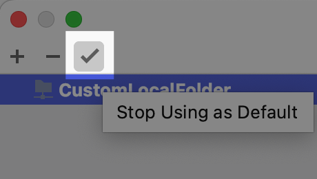

2. 请点击`Using as default` 按钮。

### 启用自动上传

设置默认服务器后，就可以自动上传到该服务器。

可以通过以下两种方式完成：

- 按 `⌘ + ,` 打开设置/首选项对话框 -> `Build, Execution, Deployment` -> `Deployment`，然后在 `Upload changed files automatically to the default server` 字段中，选择始终、执行保存操作或者从不。
    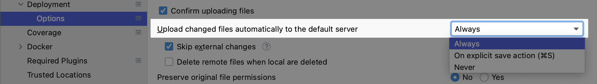
- 在主菜单中，选择 `Tools` -> `Deployment` -> `Automatic upload`。
  ::: warning 注意
  请注意，在这种情况下，自动上传是在始终模式下执行的。
  :::

::: warning 值得注意
不建议始终模式部署到生产环境，因为在开发过程中可能会上传不完整的代码，从而可能破坏生产应用程序。
:::

## 外部变更忽略上传

默认情况下，如果通过某些外部过程（例如， VCS分支更改，SASS或LESS的编译或File Watcher）更改了文件，PhpStorm 还将上传文件。

若要更改此行为并跳过外部更改，需要将 `Upload changed files automatically to the default server` 设置为 `always`，然后选中 `Skip extrnal changes` 复选框：

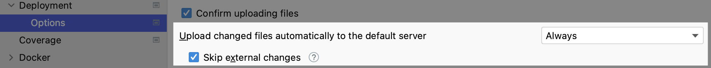

## 总结

- 创建并配置了自己的服务器。

- 上载和下载文件和文件夹。

- 比较本地和远程版本。

- 将服务器配置为默认服务器。

- 启用了自动上传外部更改。

更多用法请参考官方文档 [Deploy your application](https://www.jetbrains.com/help/phpstorm/deploying-applications.html)。
