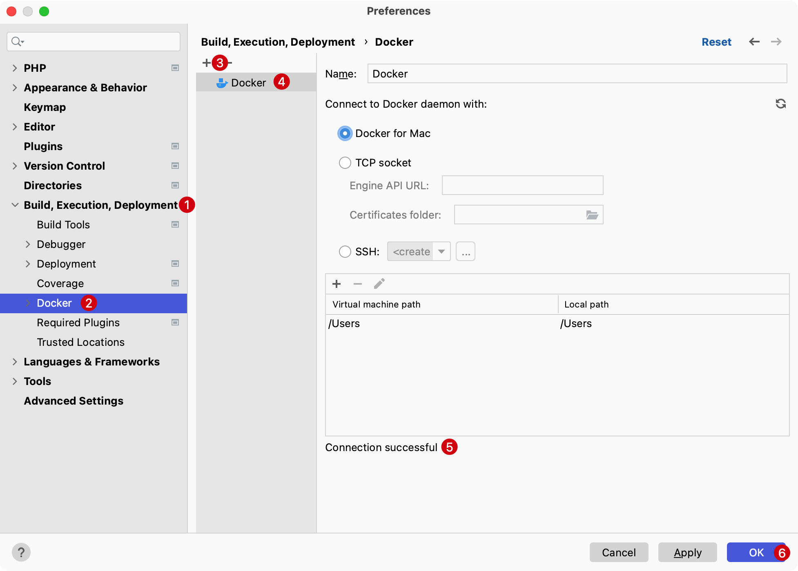

# Docker 和 Docker Compose

[Docker](https://www.docker.com/what-docker) 使开发人员能够在容器内部署应用程序，以便在与生产环境相同的环境中测试代码。

PhpStorm 使用 [Docker插件](https://plugins.jetbrains.com/plugin/7724-docker) 提供 Docker 支持。

默认情况下，Docker 插件已下载并启用。如果插件被禁用，在 `设置/首选项` -> `插件` 页面的 `已安装` 选项卡上启用它。

## 启用 Docker 支持

1. 安装并启动 Docker，[点这里查看文档](https://docs.docker.com/get-docker/)
2. 配置 Docker 守护程序连接设置
    - 使用快捷键 `Command + ,`打开系统偏好设置，选择 `Build, Execution, Deployment` -> `Docker`
    - 点击 `+` 添加 Docker 配置并指定如何连接到 Docker 守护程序
      
    - 连接到 Docker 守护程序
      配置的 Docker 连接会出现在服务工具窗口中（使用快捷键 `Command + 8`切换显示和隐藏）。 选择 `Docker`
      节点并单击连接按钮，或从上下文菜单中选择连接。
      
      要编辑 `Docker` 连接设置，可以选择 `Docker` 节点并单击工具栏上的编辑配置按钮，或从上下文菜单中选择编辑配置。

      在 Services 工具窗口（使用快捷键 `Command + 8`）中，可以拉取和推送镜像、创建和运行容器、管理 Docker Compose 服务等。
      也可以与其他工具窗口一样，输入镜像或容器的名称以突出显示匹配的项目。
      

## 镜像管理

### 配置镜像地址

1. 输入快捷键 `Command + ,` 打开 IDE 设置并选择 `Build, Execution, Deployment` -> `Docker` -> `Docker Registry`
2. 单击添加按钮以添加 `Docker Registry` 配置并指定如何连接到注册表。如果指定授权凭证，PhpStorm
   将自动检查与注册表的连接，连接成功消息应出现在对话框底部。

   

   更多 Docker Registry 配置可以[查看这里](https://www.jetbrains.com/help/phpstorm/settings-docker-registry.html)

### 从 Docker Registry 获取镜像

1. 在服务工具窗口中，选择图像节点

2. 在镜像的控制台下，输入要拉取的图像的名称，例如 `curder/laravel-docker`

   

3. 按 `Command + Enter` 拉取镜像到本地。

   

### 将镜像推送到 Docker Registry 仓库

1. 在服务 `Services` 工具窗口中（使用快捷键 `Command + 8`），选择要上传的镜像并单击 `push image` 按钮或从上下文菜单中选择 `push image` 

   

2. 选择 Docker Registry 并指定名称和版本标签（镜像的名称和版本，例如 `my-laravel-docker:v2`）

   

3. 单击 `OK` 运行 docker 推送命令

更多镜像和容器相关操作可以查看官方文档，地址：[Docker | PhpStorm](https://www.jetbrains.com/help/phpstorm/docker.html#run-containers)
