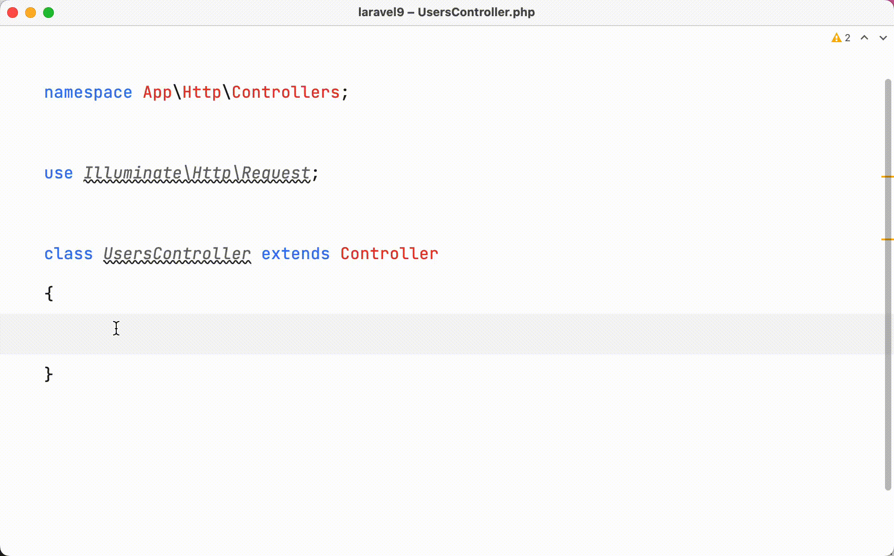
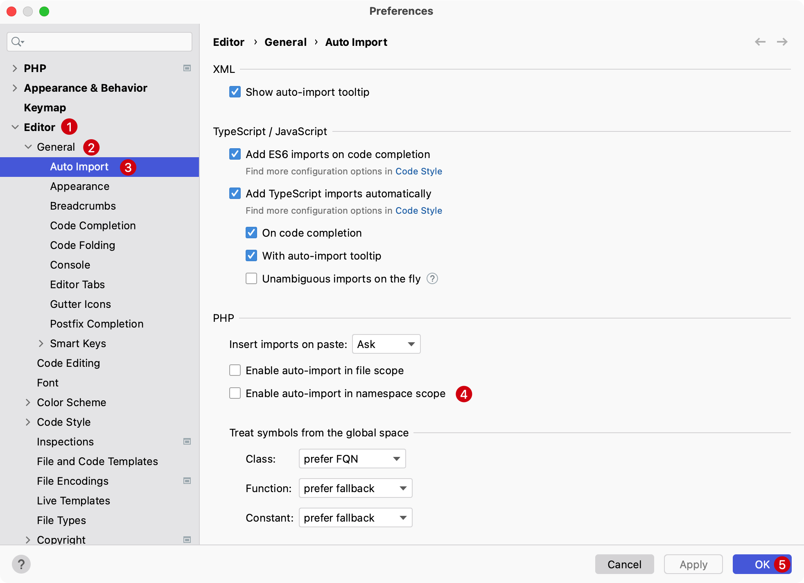
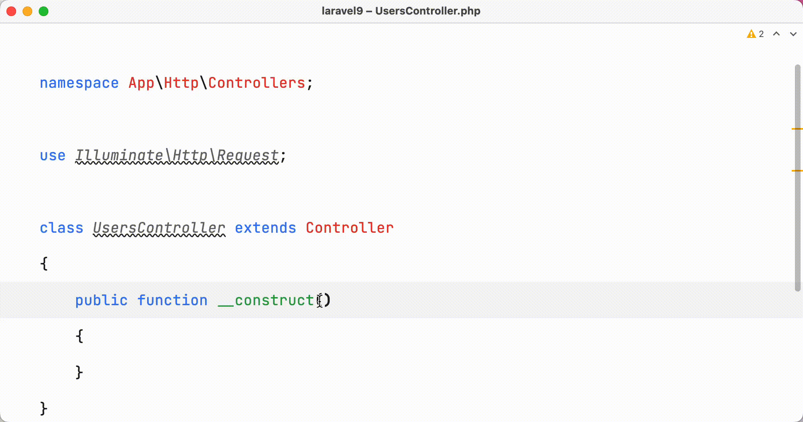

# 快速编写构造函数

在新建一个类构造函数 `__construct` 时会一步一步编写，比如：

1. 输入 `public function __construct()`
2. 在构造函数中注入依赖的类
3. 导入类命名空间（优化）
   ::: details 点击展示或隐藏gif演示图
   
   :::

## 添加构造函数

使用快捷键 `Command + N` 可以在下拉菜单中选择 `Construct...`（或者直接输入 Construct 进行过滤）

::: details 点击展示或隐藏gif演示图

:::

## 自动导入命名空间

1. 在系统便好设置中选择 `Editor` -> `General` -> `Auto Import`
2. 勾择 `Enable auto-import in namespace scope`
3. 点击 `OK` 保存变更

::: details 点击展示或隐藏gif演示图

:::

这样就可以在编写类时自动导入命名空间，如下：

::: details 点击展示或隐藏gif演示图

:::
