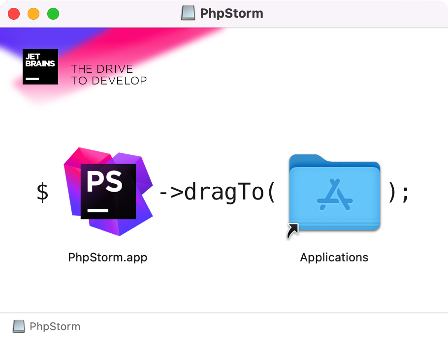
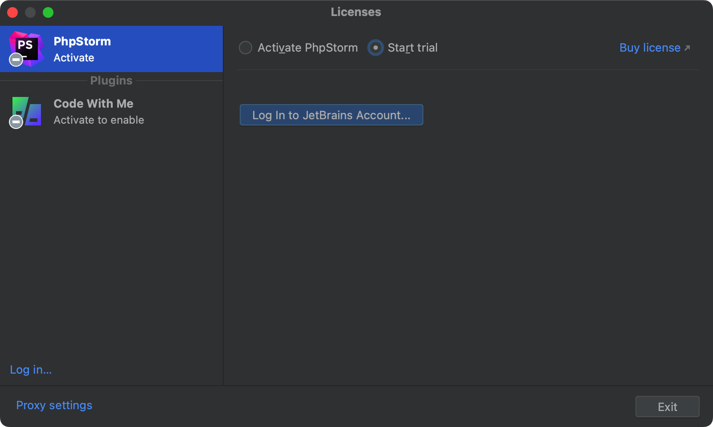
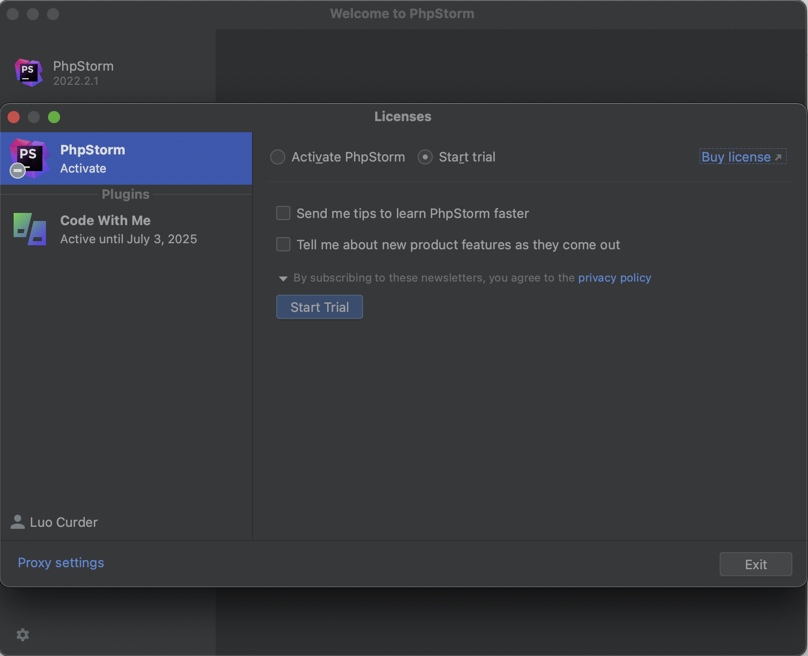
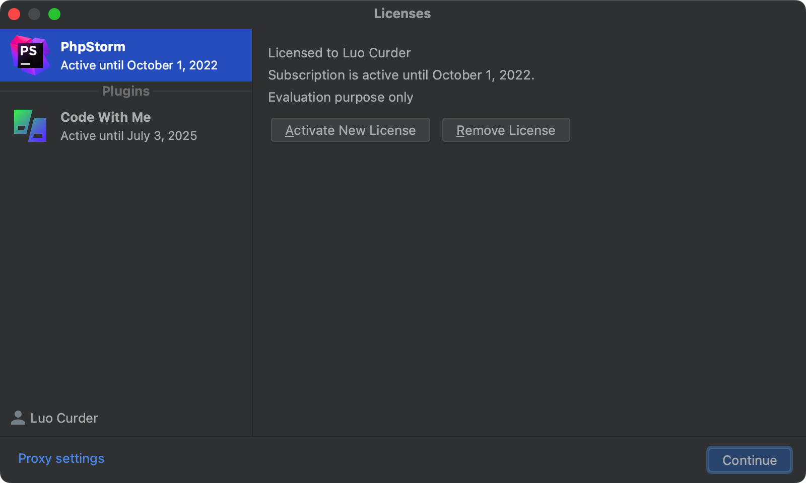

# 下载和安装

## 下载

有两种下载方式：一种是在官网直接下载安装包，一种安装并使用 JetBrains Toolbox 下载。

下面以在 Mac 系统上安装举例，当前安装的 PhpStorm 版本为：**2022.2.1**。

两种方式都能正常安装上 PhpStorm，区别在于：

1. 两种方式安装到系统的位置不同
   1. 直接下载并安装的方式软件被安装到了 `/Applicaitons/PhpStorm.app`
   2. 使用 Toolbox 安装方式软件被安装到了 `/Users/COMPUTER_USERNAME/Applicaitons/JetBrains Toolbox/PhpStorm.app`
2. 直接下载并安装的 PhpStorm 不能自动更新，使用 Toolbox 可以方便的进行软件的更新
3. 使用 Toolbox 需要登录后才能下载并管理 PhpStorm

## 直接下载并安装

PhpStorm 是跨平台的编辑器软件，来到 [官方下载地址](https://www.jetbrains.com/phpstorm/download/) 对应当前平台下的软件包，比如使用的是 Mac 系统，提供了 `Intel` 和 `Apple Silicon` 两个不同版本，根据不同系统版本进行选择。

点击下载按钮就可以将 PhpStorm 下载到本地磁盘。

将 `PhpStorm.app` 拖拽到右边的 **Applications** 文件夹里。

拖拽完成之后，来到电脑的启动台中找到 PhpStorm 编辑器图标，单击打开它。

来到授权页面会提示需要登录账号才能使用。可以到[这里登录](https://account.jetbrains.com/login)。

登录账号后，提供我们需要购买授权，如果当前没有授权，可以选择 `Start trial` 试用 30 天。

提交完毕后如果登录了 JetBrains 账号的话会来到授权的确认界面。

修改完毕后，点击 continue 就可以接下来的配置了。

## 使用 JetBrains Toolbox

1. [点击地址下载](https://www.jetbrains.com/toolbox-app/)并安装好 JetBrains Toolbox
2. 在下拉列表的 Available 中可以看到 PhpStorm 点击 `install` 按钮等待安装完成
