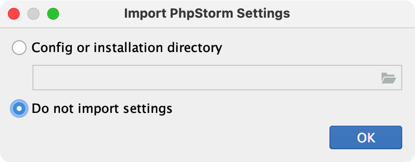

# 下载和安装

::: tip 温馨提示
下载 PhpStorm 之前默认您已在本地安装好 PHP 解释器。
:::

## 下载

有两种下载方式：一种是在官网直接下载安装包，一种安装并使用 JetBrains Toolbox 下载。

下面以在 Mac 系统上安装举例，当前安装的 PhpStorm 版本为：**2022.2.1**。

## 直接下载并安装

PhpStorm 是跨平台的编辑器软件，来到 [官方下载地址](https://www.jetbrains.com/phpstorm/download/) 对应当前平台下的软件包，比如使用的是 Mac 系统，提供了 `Intel` 和 `Apple Silicon` 两个不同版本，根据不同系统版本进行选择。

点击下载按钮就可以将 PhpStorm 下载到本地磁盘。

将 `PhpStorm.app` 拖拽到右边的 **Applications** 文件夹里。

拖拽完成之后，来到电脑的启动台中找到 PhpStorm 编辑器图标，单击打开它。

初次打开 PhpStorm 弹出提示，是否需要导入设置，由于是第一次使用，这里选择 `Do not import settings`。

来到授权页面会提示需要登录账号才能使用。可以到[这里登录](https://account.jetbrains.com/login)。

登录账号后，提示需要购买授权，如果当前没有授权，可以选择 `Start trial` 试用 30 天。

提交完毕后如果登录了 JetBrains 账号的话会来到授权的确认界面。

修改完毕后，点击 `Continue` 就可以进入到编辑器。

## 使用 JetBrains Toolbox

1. [点击地址下载](https://www.jetbrains.com/toolbox-app/)并安装好 JetBrains Toolbox
2. 在下拉列表的 Available 中可以看到 PhpStorm 点击 `install` 按钮等待安装完成
