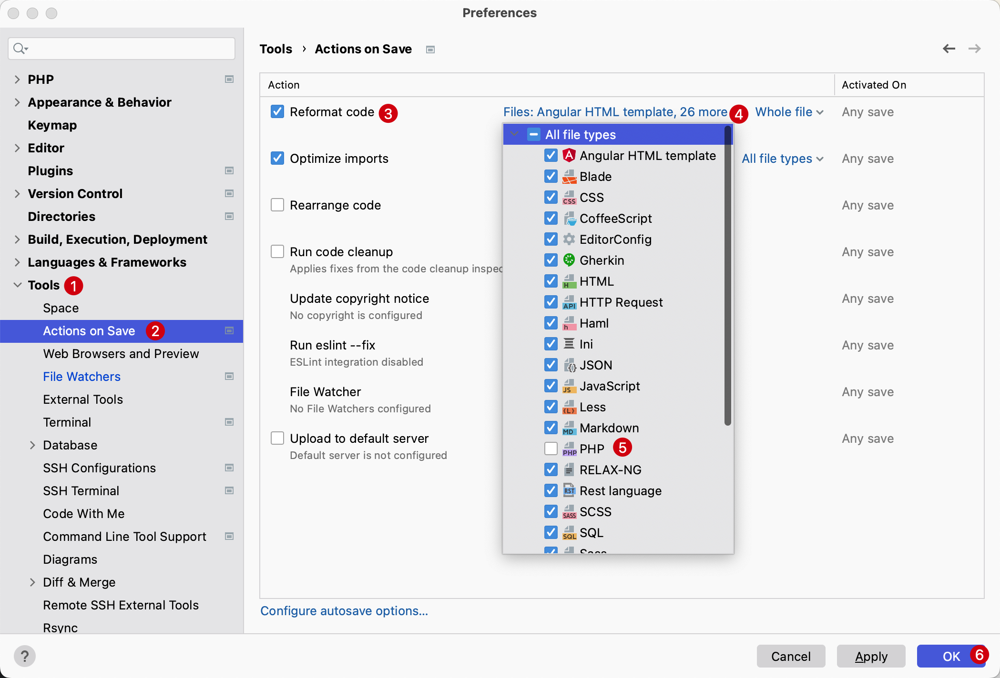
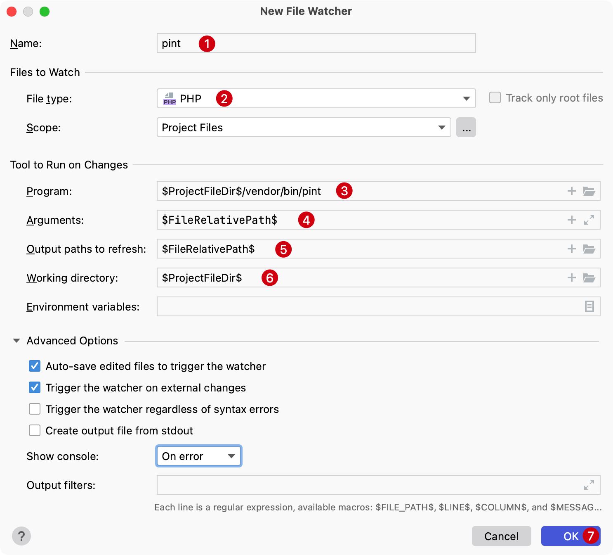
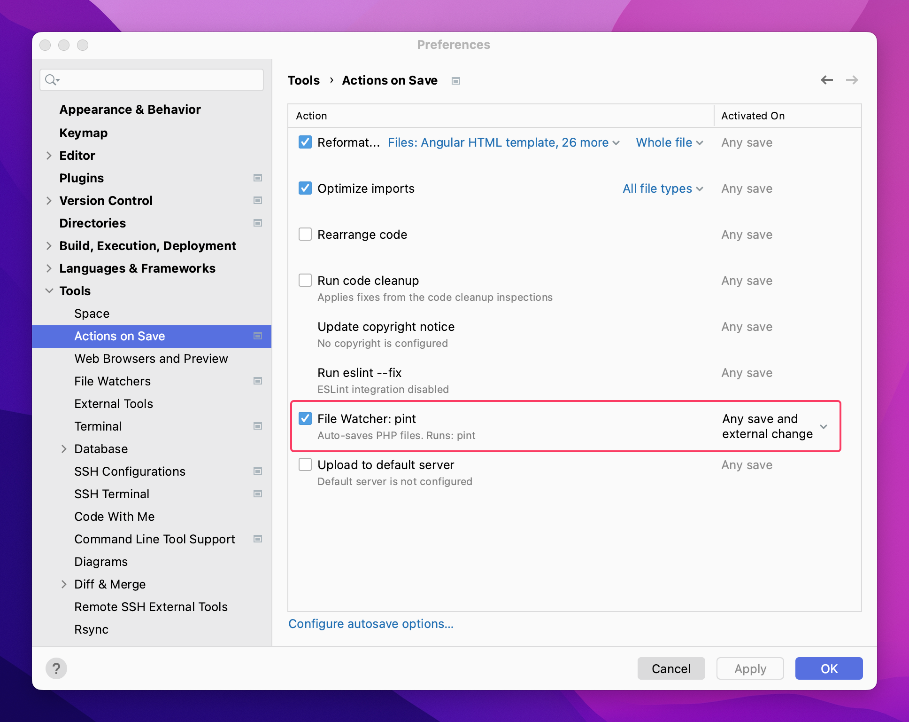

# Laravel Pint 

Laravel Pint 是一个针对极简主义的 PHP 代码风格修复程序。

它构建在 [PHP-CS-Fixer](https://github.com/FriendsOfPHP/PHP-CS-Fixer) 之上，它可以简单地确保代码风格保持干净和一致。

Pint会自动安装所有新的Laravel应用程序，因此可以立即开始使用它。

默认情况下，Pint不需要任何配置，并将通过遵循 Laravel 的编码风格来修复代码风格问题。

> **注意：** Laravel Pint 需要PHP版本最低 8.0

## 安装 Pint

Pint 包含在 Laravel 框架的最新版本中，因此通常不需要安装。

但是，对于较旧的应用程序，可以通过 Composer 安装Laravel Pint：

```bash
composer require laravel/pint --dev
```

## 运行 Pint


可以通过调用项目的 `vendor/bin` 目录中的 `pint` 二进制文件来查看当前项目中代码样式问题：

```bash
./vendor/bin/pint
```

通过在调用 Pint 时提供 `-v` 选项，可以查看关于Pint更改的更多详细信息

```bash
./vendor/bin/pint -v
```


如果希望 Pint 仅检查代码中的样式错误而不实际修改文件，可以使用 `--test` 选项：

```bash
./vendor/bin/pint --test
```

更多自定义配置可以参考[Laravel Pint 官方文档](https://laravel.com/docs/pint)

## PhpStorm 中集成 Pint

让 [Laravel Print](https://github.com/laravel/pint) 在 PhpStorm 中保存时自动格式化 PHP 代码，可以通过下面的配置进行。

1. 如果开启了 `Refactor Code` 配置，需要关闭 PhpStorm 的 PHP 内置代码格式化
    
    `Command + ,` 系统偏好设置 -> `Tools` -> `Refactor codes` -> 点击 `All file types` 下拉框，反选 `PHP` 即可。

    

2. 为 Laravel Pint 创建一个新的 File Watcher

    `Command + ,` 系统偏好设置 -> `Tooles` -> `File Watchers` -> Add `Command + N` -> 选择 `Custom`，在弹窗中输入如下配置

    


    - `Program`: `$ProjectFileDir$/vendor/bin/pint`
    - `Arguments`: `$FileRelativePath$`
    - `Output paths to refresh`: `$FileRelativePath$`
    - `Working directory`: `$ProjectFileDir$`

3. 检查配置是否正确

    


4. 在 PHP 文件中测试 pint 是否能正确生效