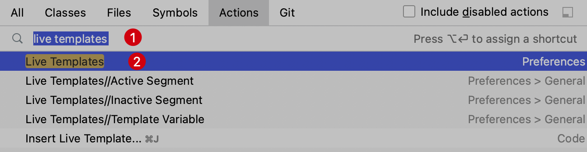
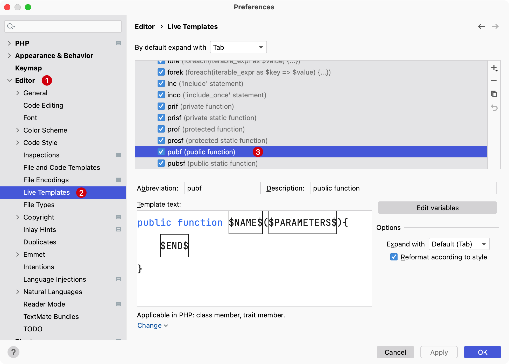
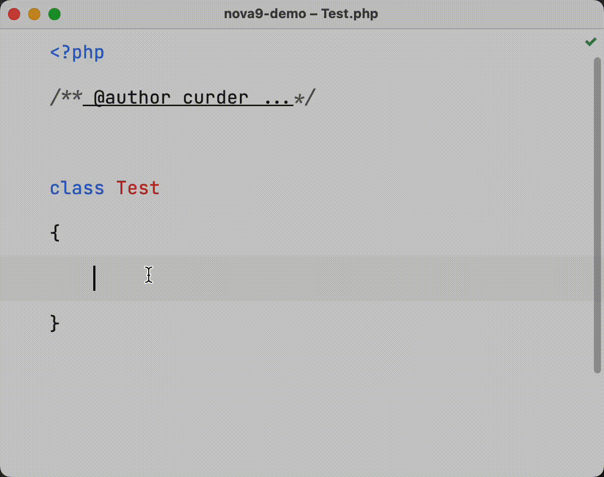
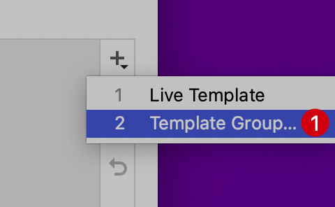
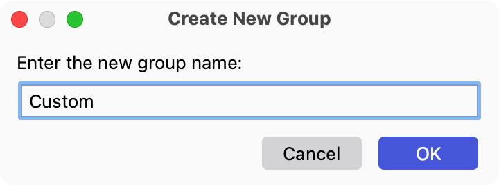
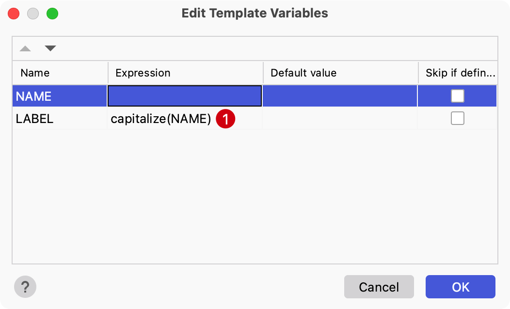
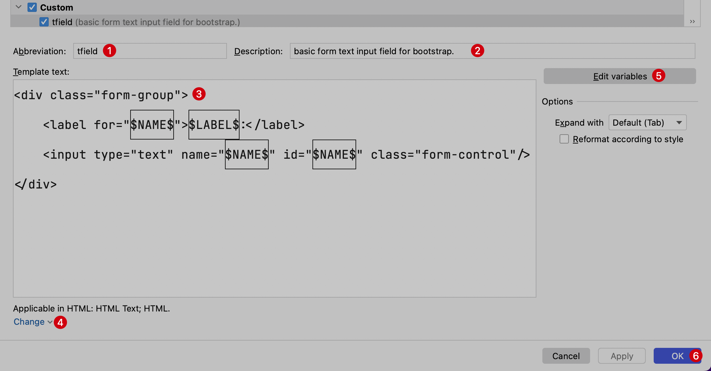

# 代码片段

PhpStorm 支持通过 `Live Templates` 功能在编写具体业务代码时快速生成模板代码，比如控制结构、异常捕获、外部静态资源的引用、Vue 组件模块等。

下面以系统默认的 `pubf` 代码片段为例：

- 在 PhpStorm 的 `Preferences` 偏好设置中选择 `Editor` -> `Live Templates`

- 或者通过快捷键 `Command + Shift + A` 呼出 `Action` 导航界面，在输入框输入 `live templates`，在下拉列表中选中 `Live Templates`：
    ::: details 点击切换展示与隐藏
    
    :::

进入文件代码片段界面，在这里可以看到 PhpStorm 内置支持的所有语言的代码片段：

::: details 点击切换展示与隐藏

:::

可以在 PHP 类或 Trait 文件中通过 `pubf` 然后输入 `Tab` 键（或者在键入的地方选择下拉框中第一个列出的代码提示按回车确认）并使用 `Tab` 按键将光标移动到下一个位置，来快速生成 `public function` 函数模板代码。

::: details 点击切换展示与隐藏

:::

## 自定义代码片段

### 新建 `Template Group`

> **注意：** 这一步不是必须的，为了后期方便管理，将所有自定义的代码片段都放在这个新建的分组下。

点击右侧的 `+` 或者使用快捷键 `Command + N`，在弹出的下拉选项中选择 `2. Template Group...`

::: details 点击切换展示与隐藏

:::

在接下来的弹出层中输入自定义的代码片段分组名称 `Custom`。

::: details 点击切换展示与隐藏

:::

如果后续需要添加的自定义代码片段放在自定义的代码片段分组 Custom 中。

### 新建代码片段

使用快捷键 `Command + N` 在自定义分组新建代码片段，在输入表单中提供如下值：

- 1. Abbreviation: 代码片段缩写，通过这个缩写可以呼出定义的代码片段内容
- 2. Description: 代码片段描述
- 3. Template Text: 代码片段具体内容
  
    模板代码中定义了一些变量（通过 `$变量名$` 定义），以便为不同的文本输入框定义对应的属性和文本。

- 4. Change 选项: 选择代码片段的应用上下文环境，比如有的代码片段是在 HTML 中使用，有的代码片段仅在 PHP 文件中使用，默认不选择上下文的代码片段不会生效

- 5. 编辑变量
  
  可以点击这个按钮对定义的变量进行一些配置，比如对 `$LABEL$` 变量使用表达式 `capitalize`处理 `$NAME$` 变量，表示将 `NAME` 变量值首字母大写为 `LABEL` 变量赋值
  
  ::: details 点击切换展示与隐藏
  
  :::

- 6. 确认保存

::: details 点击切换展示与隐藏

:::

### 使用自定以代码片段

在代码编辑器中选取一个表单片段，尝试输入 `tfield`，然后点击 `Tab` 键自动生成对应模板代码，在红色光标处输入 `name` ，可以看到其它变量位置都会自动填充对应的字符串。如下：

在日常使用 PhpStorm 进行编码的过程中，灵活创建和定义代码模板可以极大提高编码效率。

