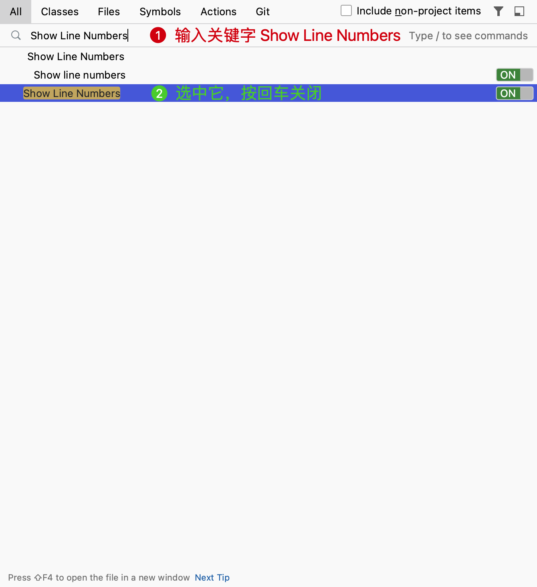
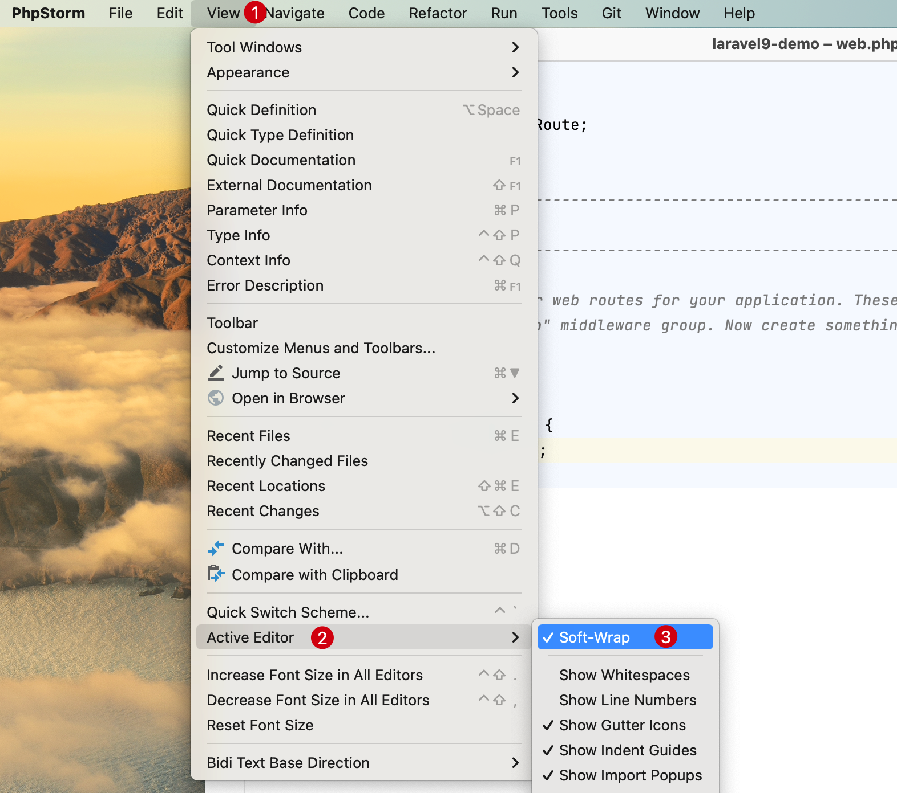

# 极简配置

安装并启用主题后，我们需要对编辑界面做一些简单，以使我们更加专注于编码工作。

## 工具栏 Toolbar

默认在顶部有一个工具栏，编程中大多数时候不太会用到，或者在需要用到时使用快捷键来提高效率，所以这里选择隐藏它。

下面是编辑器的工具栏 Toolbar 截图：

* 方式一：在菜单栏依次选择的 `Views` -> `Appearance` -> `Toolbar`，点击反选隐藏。

    ::: details 点击切换截图展示与隐藏
    
    :::

* 方式二：使用快捷键 `Shift` + `Shift` 在弹出的搜索中输入 `Toolbar` 关键字后，按 `Enter` 回车选择隐藏工具栏

    ::: details 点击切换截图展示与隐藏
    
    :::

## 导航栏 Navigation Bar

默认在顶部有一个文件导航栏，编程中大多数时候不太会用到，或者在需要用到时使用快捷键来提高效率，所以这里选择隐藏它。

下面是编辑器的导航栏 Navigation Bar 截图：

::: details 点击切换截图展示与隐藏

:::

* 方式一：在菜单栏依次选择的 `Views` -> `Appearance` -> `Toolbar`，点击反选隐藏。

    ::: details 点击切换截图展示与隐藏
    
    :::

* 方式二：使用快捷键 `Shift` + `Shift` 在弹出的搜索中输入 `Toolbar` 关键字后，按 `Enter` 回车选择隐藏工具栏

    ::: details 点击切换截图展示与隐藏
    
    :::

## 标签位置 Tab placement

默认在顶部有一个标签位置，可以看到我们当前打开的文件，在大多数时候我们不会使用鼠标点选的方式去切换文件的打开，那样效率不高。

下面是编辑器的标签 Tab placement 截图：

* 方式一：在 PhpStorm 的 `Preferences` 偏好设置中选择 `Editor` -> `General` -> `Editor Tabs` 中选择 `Tab placement: None` 后点击 **OK** 保存即可

    ::: details 点击切换截图展示与隐藏
    
    :::

* 方式二：使用快捷键 `Shift` + `Shift` 在弹出的搜索中输入 `Tab placement` 关键字后，按 `Enter` 回车选择隐藏标签
    
    ::: details 点击切换截图展示与隐藏
    
    :::

## 工具窗口栏 Tool Window Bars

默认在编辑器周围会存在一些快捷功能的按钮，比如：项目、提交历史、书签、结构、数据库、通知等。

下面是编辑器的工具窗口栏 Tool Window Bars 截图：

::: details 点击切换截图展示与隐藏

:::

* 方式一：在菜单栏依次选择的 `Views` -> `Appearance` -> `Toolbar`，点击反选隐藏。

    ::: details 点击切换截图展示与隐藏
    
    :::

* 方式二：使用快捷键 `Shift` + `Shift` 在弹出的搜索中输入 `Tool Window Bars` 关键字后，按 `Enter` 回车选择隐藏工具栏

    ::: details 点击切换截图展示与隐藏
    
    :::

## 状态栏 Status Bar

默认在编辑器底部会有一些系统状态信息展示，比如：最后一次日志信息、PHP版本、代码版本库信息等。

下面是编辑器的状态栏 Status Bar 截图：

* 方式一：在菜单栏依次选择的 `Views` -> `Appearance` -> `Status bar`，点击反选隐藏。

    ::: details 点击切换截图展示与隐藏
    
    :::

* 方式二：使用快捷键 `Shift` + `Shift` 在弹出的搜索中输入 `Status bar` 关键字后，按 Enter 回车选择隐藏工具栏

    ::: details 点击切换截图展示与隐藏
    
    :::

## 文件面导航 Show Breadcrumbs

在打开一些文件时，默认在编辑器底部会有该文件的导航信息展示，比如：

* 方式一：在 PhpStorm 的 `Preferences` 偏好设置中选择 `Editor` -> `General` -> `Breadcrumbs` 中反选 `Show breadcrumbs` 后，点击 **OK** 保存即可

    ::: details 点击切换截图展示与隐藏
    
    :::

* 方式二：使用快捷键 `Shift` + `Shift` 在弹出的搜索中输入 `Status bar` 关键字后，按 Enter 回车选择隐藏工具栏

    ::: details 点击切换截图展示与隐藏
    
    :::

## 行号 Line Numbers

默认情况下打开文件时，在编辑器左侧会看到对应文件的行号。如下图：

::: details 点击切换截图展示与隐藏

:::

- 方式一：在菜单栏依次选择的 `Views` -> `Active Editor` -> `Show Line Numbers`，点击反选隐藏。
    ::: details 点击切换截图展示与隐藏
    
    :::

- 方式二：使用快捷键 `Shift` + `Shift` 在弹出的搜索中输入 `Show Line Numbers` 关键字后，按 Enter 回车选择隐藏工具栏

    ::: details 点击切换截图展示与隐藏
    
    :::

## 浏览器 Web Browsers

默认打开PHP文件时，在编辑器右侧会出现浏览器。比如：

大多数时候开发的都是单入口项目，这些浏览器对开发可能没什么帮助，使用下面的方式可以关闭它：

在 PhpStorm 的 `Preferences` 偏好设置中选择 `Tools` -> `Web Browsers and Preview` -> `Show browser popup in the editor` 中**不勾选** `For HTML files` 和 `For XML files` 后，点击 **OK** 保存即可

::: details 点击切换截图展示与隐藏

:::

## 自动换行 Soft-Wrap

在我们编写代码或者编写注释时，会在一行写入大段代码或者文本，此时建议开启自动换行以预览更多代码或注释文本。

::: details 点击切换截图展示与隐藏

:::

- 方式一：在菜单栏依次选择的 `Views` -> `Active Editor` -> `Soft-Wrap`，点击反选隐藏。

    ::: details 点击切换截图展示与隐藏
    
    :::

* 方式二：使用快捷键 `Shift` + `Shift` 在弹出的搜索中输入 `Soft-Wrap` 关键字后，按 Enter 回车选择隐藏工具栏

    ::: details 点击切换截图展示与隐藏
    
    :::

## 代码折叠 Show code folding outline

在一些代码中会出现代码折叠操作按钮，如下：

::: details 点击切换截图展示与隐藏

:::

可以通过下面的方式对其进行隐藏：

- 方式一：在 PhpStorm 的 `Preferences` 偏好设置中选择 `Editor` -> `General` -> `Code Folding` 中不勾选 `Show code folding outline` 后，点击 **OK** 保存即可

    ::: details 点击切换截图展示与隐藏
    
    :::

* 方式二：使用快捷键 `Shift` + `Shift` 在弹出的搜索中输入 `Show code folding outline` 关键字后，按 `Enter` 回车选择隐藏代码折叠

    ::: details 点击切换截图展示与隐藏
    
    :::

## 空白字符 WhiteSpaces

默认开启了空白字符展示使用小点点 `･`占位，比如：

使用下面的方式可以关闭它，例如：

- 方式一：在菜单栏依次选择的 `Views` -> `Active Editor` -> `Show whitespaces`，点击反选隐藏。

    ::: details 点击切换截图展示与隐藏
    
    :::

- 方式二：使用快捷键 `Shift` + `Shift` 在弹出的搜索中输入 `Show Whitespaces` 关键字后，按 Enter 回车选择隐藏代码折叠

    ::: details 点击切换截图展示与隐藏
    
    :::

## 右侧分割线 right margin

默认编辑器右侧有一条竖线分割代码和右侧边栏，如下：

::: details 点击切换截图展示与隐藏

:::

可以使用如下方式进行关闭：

使用快捷键 `Shift` + `Shift` 在弹出的搜索中输入 `Show right margin` 关键字后，按 `Enter` 回车选择关闭右侧分割线

::: details 点击切换截图展示与隐藏

:::

## 显示方法分隔符 Show method separators

默认编辑器在每个方法定义上方有一条横线，如下：

::: details 点击切换截图展示与隐藏

:::

可以使用如下方式进行关闭：

- 方式一：在 PhpStorm 的 `Preferences` 偏好设置中选择 `Editor` -> `General` -> `Appearance` 中不勾选 `Show method separators` 后，点击 **OK** 保存即可

    ::: details 点击切换截图展示与隐藏
    
    :::

* 方式二：使用快捷键 `Shift` + `Shift` 在弹出的搜索中输入 `Show method separators` 关键字后，按 `Enter` 回车选择关闭右侧方法分割线

    ::: details 点击切换截图展示与隐藏
    
    :::

## 无干扰模式 distraction free mode

默认情况下编辑器的代码是居左对齐的，编辑器提供了一种无干扰模式，可以让代码居中展示，让我们更加集中在编码工作。开启方法如下：

* 方式一：使用快捷键 `Command + ~`，在弹出层选择 `4 View Mode` 按回车后再选择 `2 Enter Distraction Free Mode`，即可快速切换无干扰模式
    > **注意：** `~` 在数字 `1` 左侧的按键。
    ::: details 点击切换截图展示与隐藏
    
    :::

* 方式二：在菜单栏依次选择的 `Views` -> `Appearance` -> `Enter Distraction Free Mode`，点击启用。
    
    ::: details 点击切换截图展示与隐藏
    
    :::

* 方式三：使用快捷键 `Shift` + `Shift` 在弹出的搜索中输入 `distraction free mode` 关键字后，按 `Enter` 回车选择关闭右侧方法分割线

    ::: details 点击切换截图展示与隐藏
    
    :::