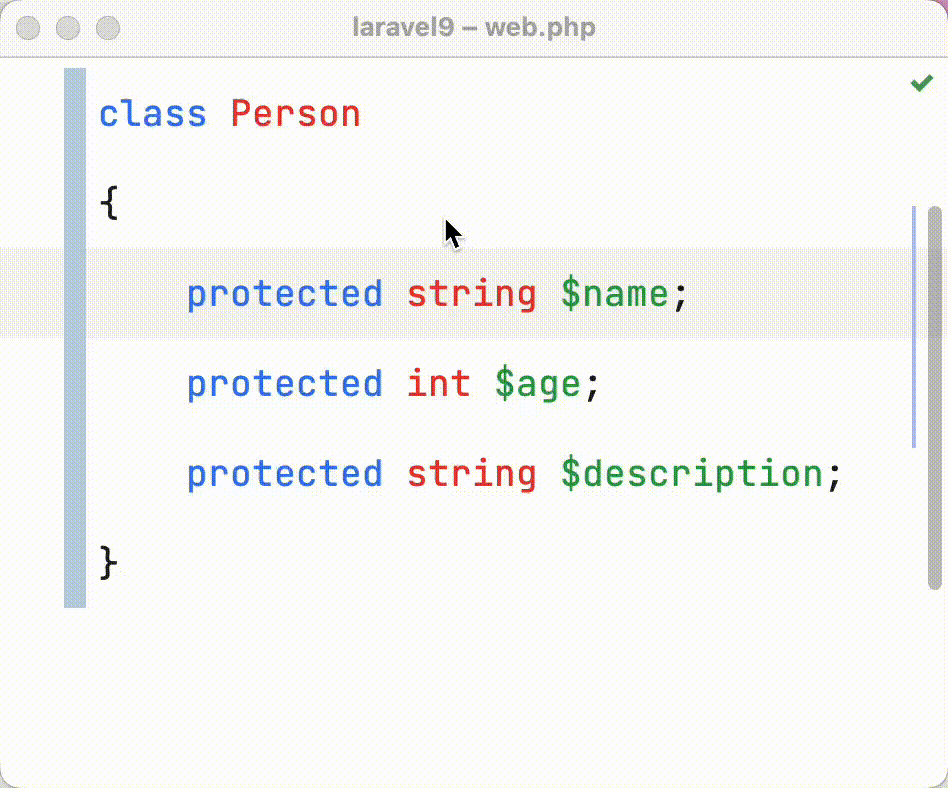
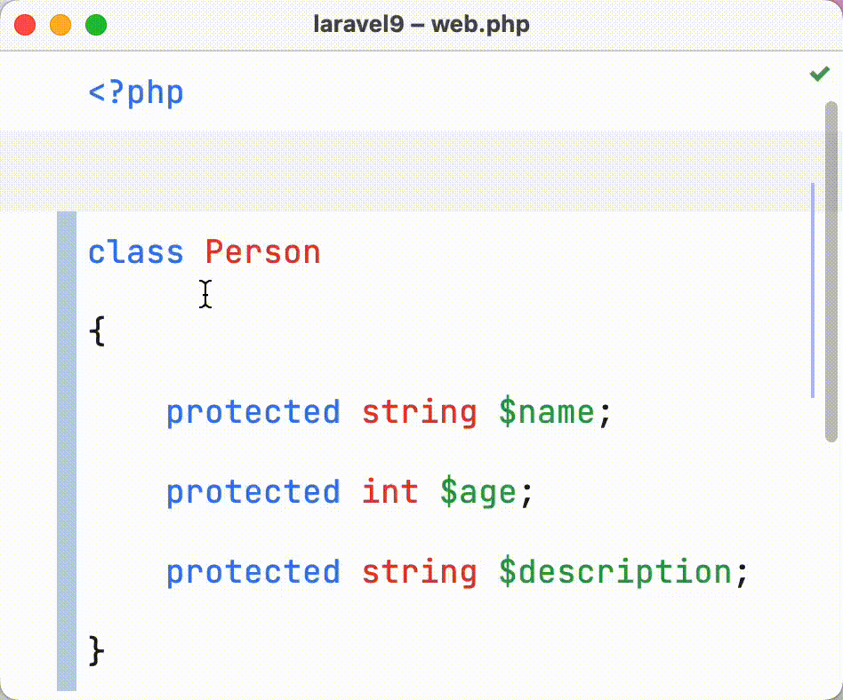
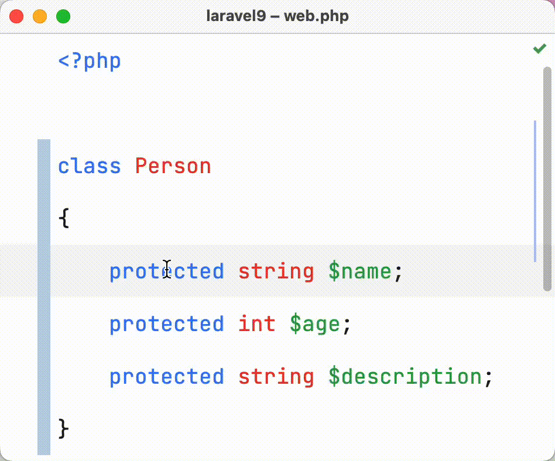
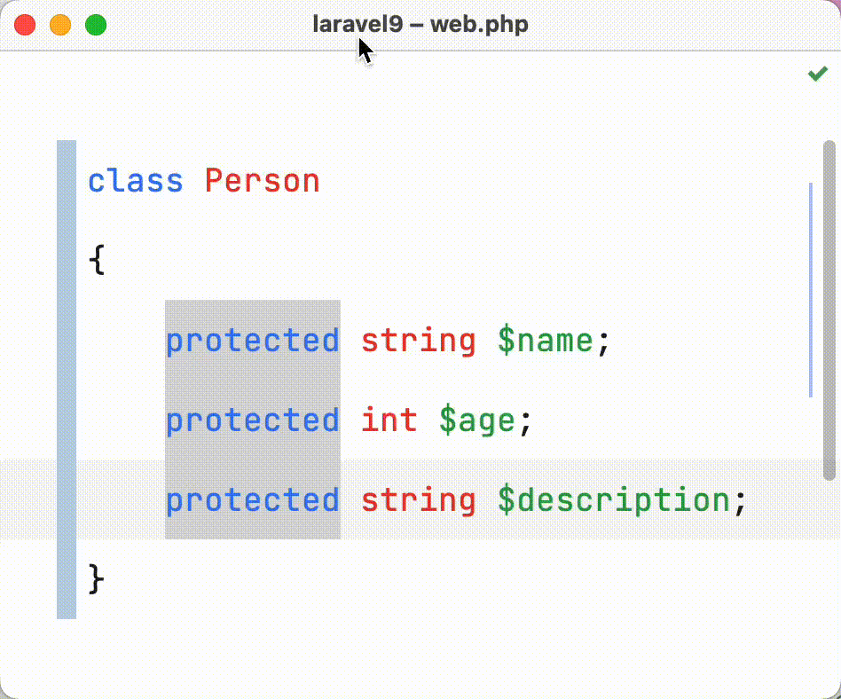
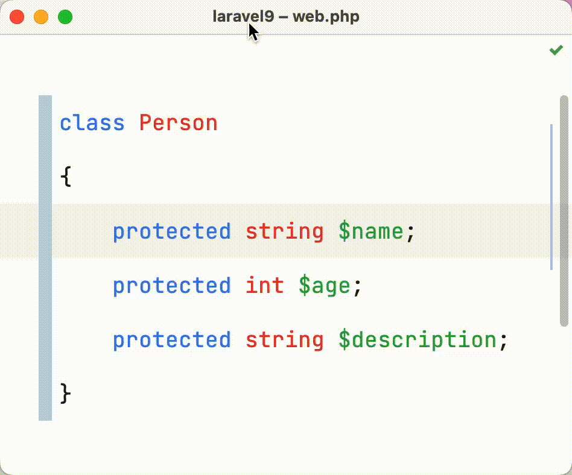

# 多点编辑

在 PhpStorm 编辑器中键入、复制或粘贴时，可以切换多个光标，以便操作同时应用于多个位置。

假如有如下代码，需要修改类属性的可见行为 `public`：

```php
<?php

class Person
{
    protected string $name;
    protected int $age;
    protected string $description;
}
```

在 PhpStorm 中有如下几种操作方式。

## 使用鼠标

按住键盘的 `Option（或 Alt）⌥` 配合鼠标左键点击光标，可以多选编辑器代码。



## 使用快捷键

1. 如果要选择单词，请将插入符号设置在所需单词的出现处。或者使用鼠标或键盘快捷键选择所需范围。
2. 执行以下操作之一：
    - 连续按 `⌃ + G` 查找并选择下一个匹配大小写匹配的单词或文本范围

      

    - 按 `⌃ + ⌘ + G` 选择文档中所有区分大小写匹配的单词或文本范围

      

3. 要从上次选择的项目中删除选择，按快捷键 `⌃ + ⇧ + G`

   

4. 在使用 `⌃ + G` 添加第二个或任何连续选择后，也可以跳过它并使用 `⌘ + G`
   选择下一个匹配项。要将选择返回到最后跳过的匹配项，请按 `⇧ + ⌘ + G`

   
