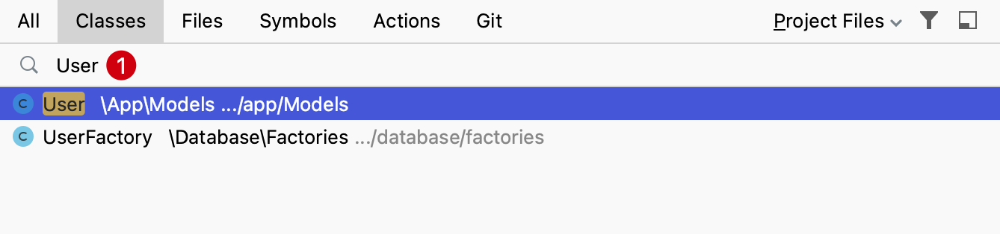
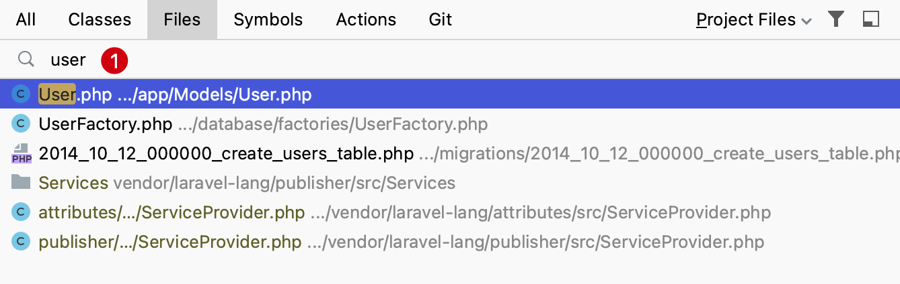

# 导航到类或文件

在开发中经常需要定位并跳转到指定名称类文件或指定文件名的文件。

PhpStorm 提供匹配所查找名称的列表，从中可以选择目标名称，然后打开它进行编辑，可以快速定位到目标文件。

下面我们分别通过类名称和文件名称查找文件，演示在 PhpStorm 中快速导航到类或者文件的流程。

## 通过类查找

在 PhpStorm 的主菜单选择 `Navigate` -> `Class...`，可以看到有弹出对应文件类的搜索弹出层：

或者可以使用快捷键 `Command O` 也可以呼出上面的搜索弹出层。

在弹出层中输入需要查找的类名称，会对其模糊匹配并列出到下拉列表。

## 通过文件名查找

在 PhpStorm 的主菜单选择 `Navigate` -> `File...`，可以看到有弹出对应文件名的搜索弹出层：

或者可以使用快捷键 `Command Shift O` 也可以呼出上面的搜索弹出层。

在弹出层中输入需要查找的文件名称，会对其模糊匹配并列出到下拉列表。

