# PSR-12 代码风格

PSR-12 是 [PHP-FIG](https://www.php-fig.org/) 组织为 PHP 制定的编码风格标准。

如果要让 PHP 项目遵循 PSR-12 标准，可以通过 [PHP-CS-Fixer](https://packagist.org/packages/friendsofphp/php-cs-fixer) 这类的第三方扩展对 PHP 项目代码进行自动检测，可以将这些代码风格检测逻辑放到提交代码到代码仓库的钩子函数中，如果不符合指定编码风格（不限于 PSR-12，还可以是自定义的编码风格等），则拒绝提交代码，这样就可以保证代码仓库中维护的代码都是符合特定编码风格的。

在 PhpStorm 中，可以通过集成外部安装的这些代码检查工具非常方便的对代码进行自动检测和修复，从而让最终提交到版本库中的代码都是符合特定代码风格的。

## 下载 php-cs-fixer

建议使用 [Composer](https://getcomposer.org/download/) 命令在全局进行安装：

```bash
composer global require friendsofphp/php-cs-fixer
```

通过命令获取 `php-cs-fixer` 命令的执行路径：

```bash
which php-cs-fixer
```

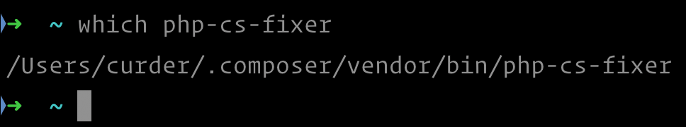

## 配置 php-cs-fixer

1. 配置 php-cs-fixer 路径

    1. 在 PhpStorm 的 `Preferences` -> `PHP` -> `Quality Tools` 配置界面中，目前还没有配置任何 PHP CS Fixer 路径：
    
        ::: details 点击切换截图展示与隐藏
        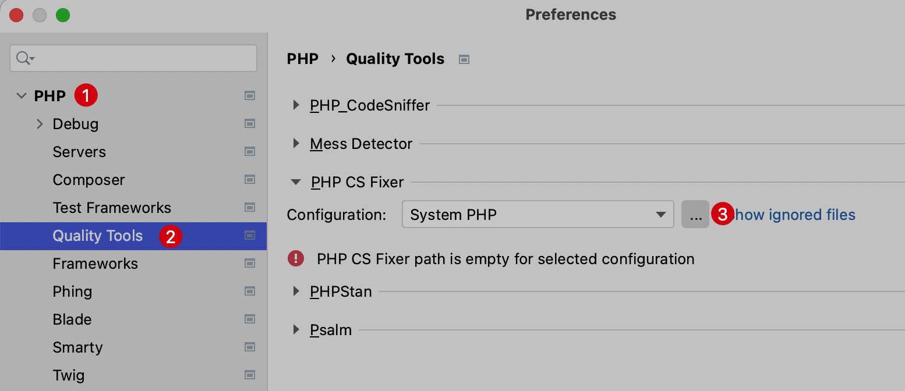
        :::
 
    
    2. 点击上图的 `...` 新增一个配置，在新增的弹出层输入如下配置：
        
        - 1. 新增一个PHP配置 2. 在弹出层的下拉选项选择一个PHP版本 3. 点击 `OK` 确认选择
        
            ::: details 点击切换截图展示与隐藏
            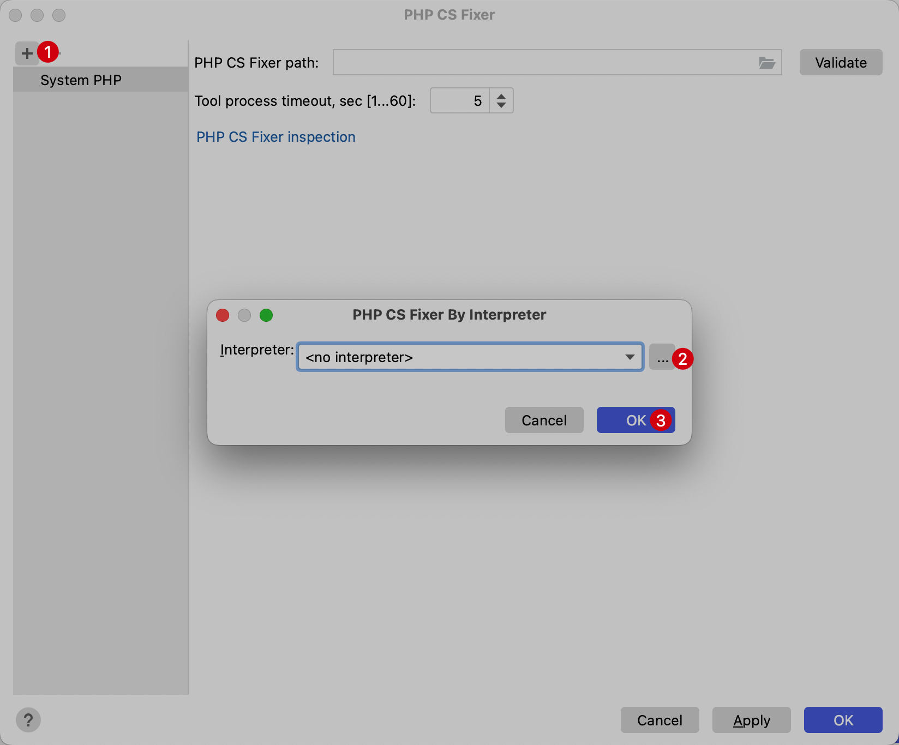
            :::

        - 2. 在新增的PHP配置中将 phpcs 路径提供
            
            ::: details 点击切换截图展示与隐藏
            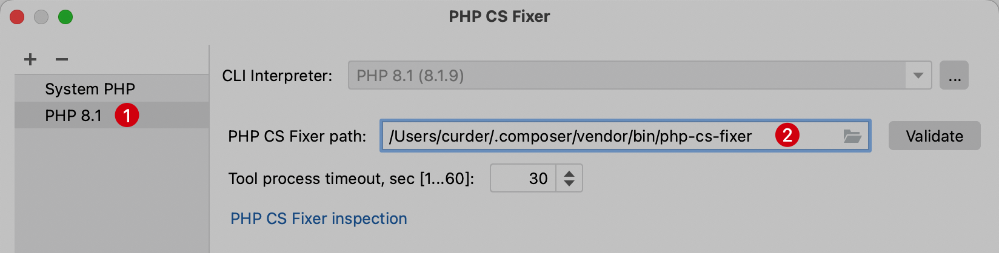
            :::

        - 3. 点击 OK 保存配置

2. 启用 PHP CS Fixer

    PHP CS Fixer 默认是关闭的，在 PhpStorm 的 `Preferences` -> `Editor` -> `Inspections` 配置界面中，找到右侧 **PHP** | **Quality Tools** | **PHP CS Fixer validation**，并将右侧的 Ruleset 中选择 PSR12 标准。
    
    ::: details 点击切换截图展示与隐藏
    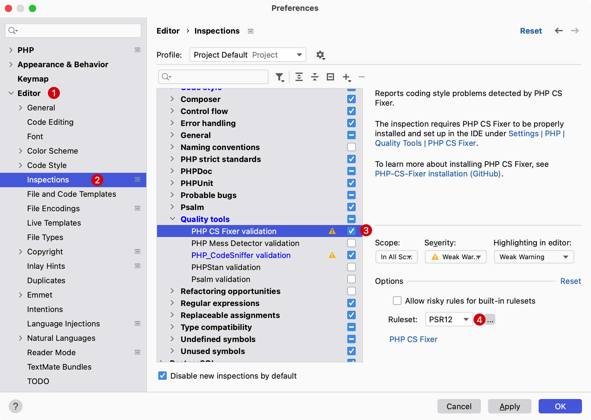
    :::

## 修复代码 php-cs-fixer

### 针对单个文件

还是以上面提到的代码风格不正确的文件内容为例：

```php
<?php

use App\Models\User;
use Illuminate\Support\Facades\Route;

Route::get('/', function () {return view('welcome');});
```

代码下面出现波浪线，这意味着 `PHP CS Fixer` 检查到不符合系统设置编码风格的代码（当前为PSR-12），将光标移动到出现问题的代码位置处，使用快捷键 `Option（或 Alt）⌥ + Enter`，弹出快捷修复弹出层，选择 `PHP CS Fixer: fix the whole file`后回车确认

::: details 点击切换截图展示与隐藏
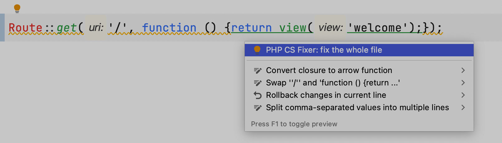
:::

### 批量修正

对于整个项目来说，可以在 PhpStorm 中通过配置外部工具来实现批量修正指定目录的代码风格。

在 `Preferences` -> `Tools` -> `External Tools` 界面点击 `+` 新建一个外部工具：

::: details 点击切换截图展示与隐藏
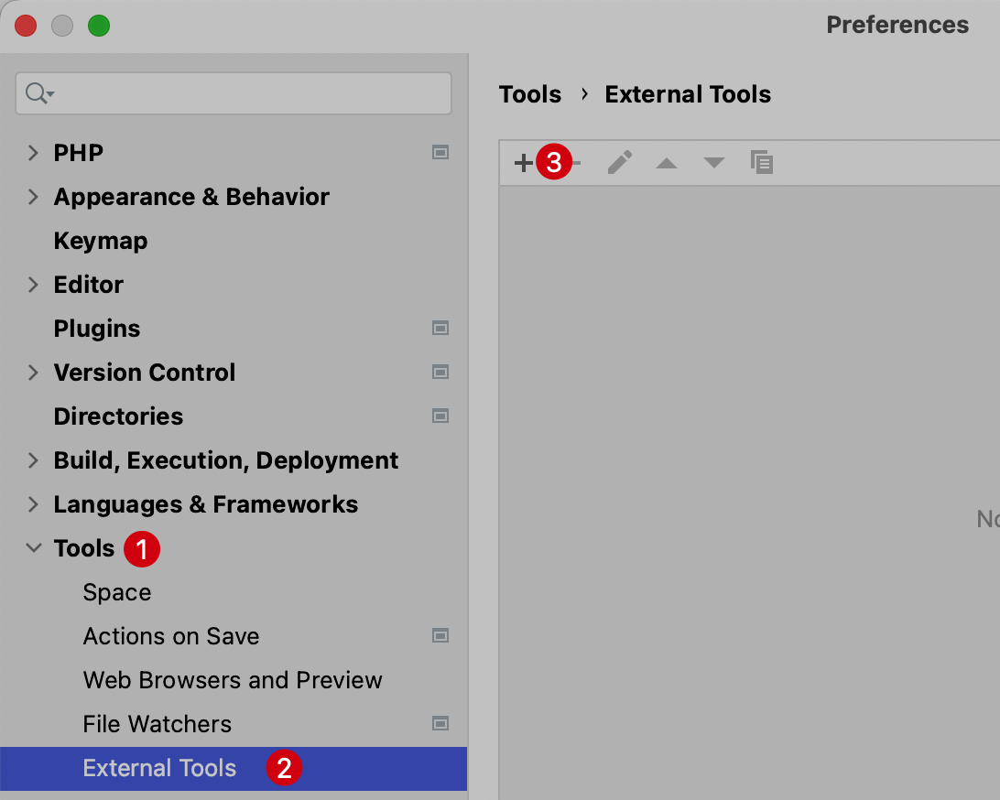
:::

在弹出窗中输入如下内容：

- Name: `PHP CS Fixer`
- Description: `Apply php-cs-fixer to files.`
- Program: `/Users/curder/.composer/vendor/bin/php-cs-fixer`
- Arguments: `fix $FileDir$ --rules=@PSR12`
- Working directory: `$ProjectFileDir$`

::: details 点击切换截图展示与隐藏
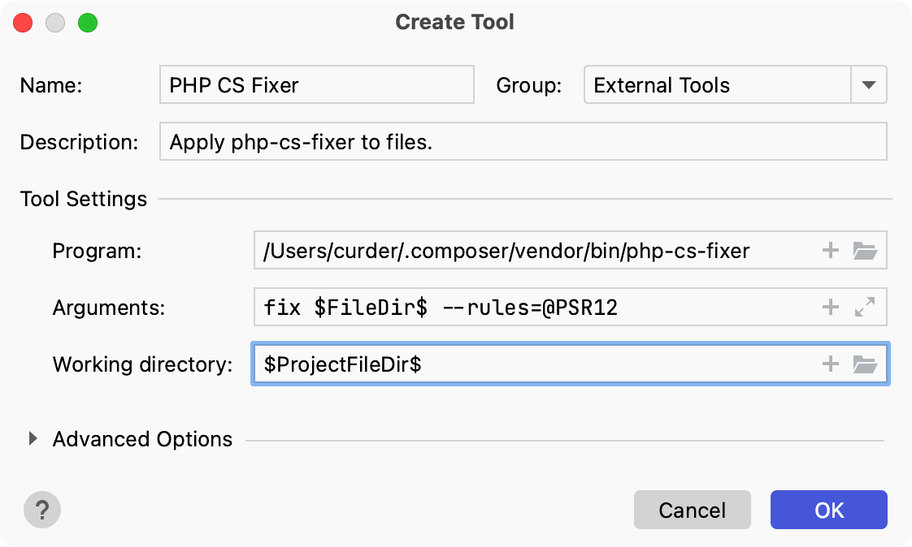
:::

将这个外部工具命名为 `PHP CS Fixer`，在 Paragam 输入 `php-cs-fixer` 所在系统绝对路径，参数中输入修复指令，这里我们指定路径为当前目录，验证规则为 `PSR-12`，最后点击 `OK` 保存。


接下来，就可以在 PhpStorm 的 Project 区域选中某个目录，点击右键，在下拉菜单看到 `External Tools` -> `  PHP CS Fixer` 选项：

::: details 点击切换截图展示与隐藏
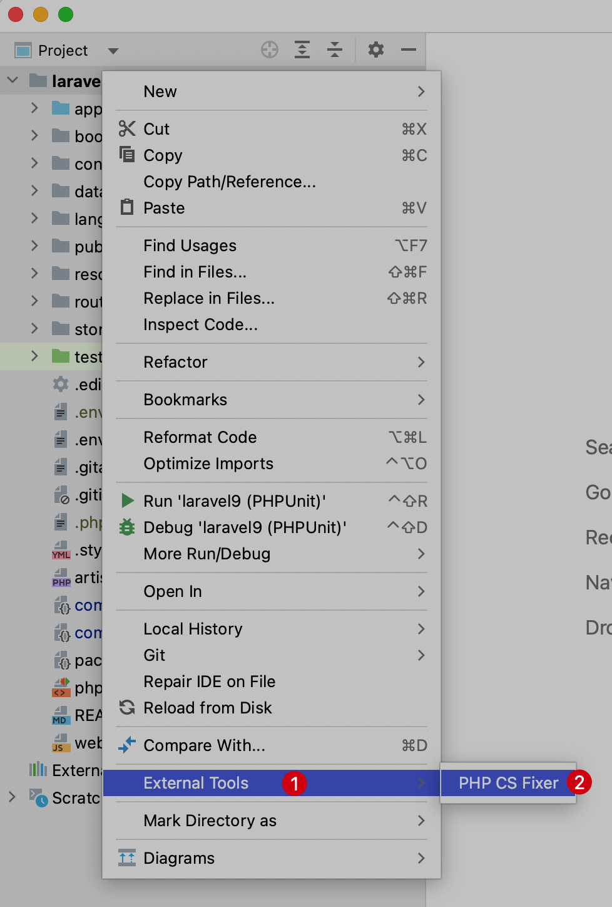
:::

点击 PHP CS Fixer 就可以对选中目录进行进行代码检查和修复了，实际上指定的是前面配置的 `php-cs-fixer fix` 指令，执行结果会输入到 PhpStorm 下方 Run 区域：

::: details 点击切换截图展示与隐藏
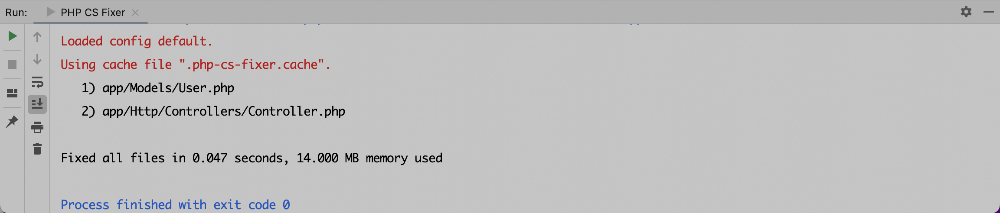
:::

如果有代码被修正，会列在控制台输出日志中。可以直接在指定目录下执行对应 fix 指令，只不过在 PhpStorm 中通过这种配置外部工具的方式更加直观更加便捷，还可以为这个 PHP CS Fixer 外部工具配置一个快捷键，这样就更加方便。


## 自定义风格配置

php-cs-fixer 支持将项目配置保存在项目根目录中的 `.php-cs-fixer.dist.php` 文件中，而不是使用命令行选项自定义规则和规则集。

该文件必须返回 `PhpCsFixer\ConfigInterface` 的实例，该实例允许您配置需要分析的规则、文件和目录。

还可以创建 `.php-cs-fixer.php` 文件，这是将使用的本地配置，而不是项目配置。

将该文件添加到 `.gitignore` 忽略。使用 `--config` 选项，可以指定指向 `.php-cs-fixer.php` 文件。

- 在项目根目录下新建自定义规则，并命名为`.php-cs-fixer.dist.php`，内容如下：

    ```php
    <?php

    $finder = Symfony\Component\Finder\Finder::create()
        ->in([
            __DIR__ . '/app',
            __DIR__ . '/routes',
            __DIR__ . '/tests',
        ])
        ->name('*.php')
        ->notName('*.blade.php')
        ->ignoreDotFiles(true)
        ->ignoreVCS(true);

    return (new PhpCsFixer\Config())
        ->setRules([
            '@PSR12' => true,
            'array_syntax' => ['syntax' => 'short'],
            'ordered_imports' => ['sort_algorithm' => 'alpha'],
            'no_unused_imports' => true,
            'not_operator_with_successor_space' => true,
            'trailing_comma_in_multiline' => true,
            'phpdoc_scalar' => true,
            'unary_operator_spaces' => true,
            'binary_operator_spaces' => true,
            'blank_line_before_statement' => [
                'statements' => ['break', 'continue', 'declare', 'return', 'throw', 'try'],
            ],
            'phpdoc_single_line_var_spacing' => true,
            'phpdoc_var_without_name' => true,
            'class_attributes_separation' => [
                'elements' => [
                    'method' => 'one',
                ],
            ],
            'method_argument_space' => [
                'on_multiline' => 'ensure_fully_multiline',
                'keep_multiple_spaces_after_comma' => true,
            ],
            'single_trait_insert_per_statement' => true,
        ])
        ->setFinder($finder);
    ```

    > 更多代码风格配置可以查看 [PHP-CS-Fixer配置](https://mlocati.github.io/php-cs-fixer-configurator/)

- 重新配置外部工具来实现批量修正指定目录的代码风格
    在 `Preferences` -> `Tools` -> `External Tools` 界面点击 `+` 新建一个外部工具：
    ::: details 点击切换截图展示与隐藏
    
    :::

    在弹出窗中输入如下内容：

    - Name: `PHP CS Fixer`
    - Description: `Apply php-cs-fixer to files.`
    - Program: `/Users/curder/.composer/vendor/bin/php-cs-fixer`
    - **Arguments: `fix $FileDir$ --config=.php-cs-fixer.dist.php --allow-risky=yes`**
    - Working directory: `$ProjectFileDir$`

    ::: details 点击切换截图展示与隐藏
    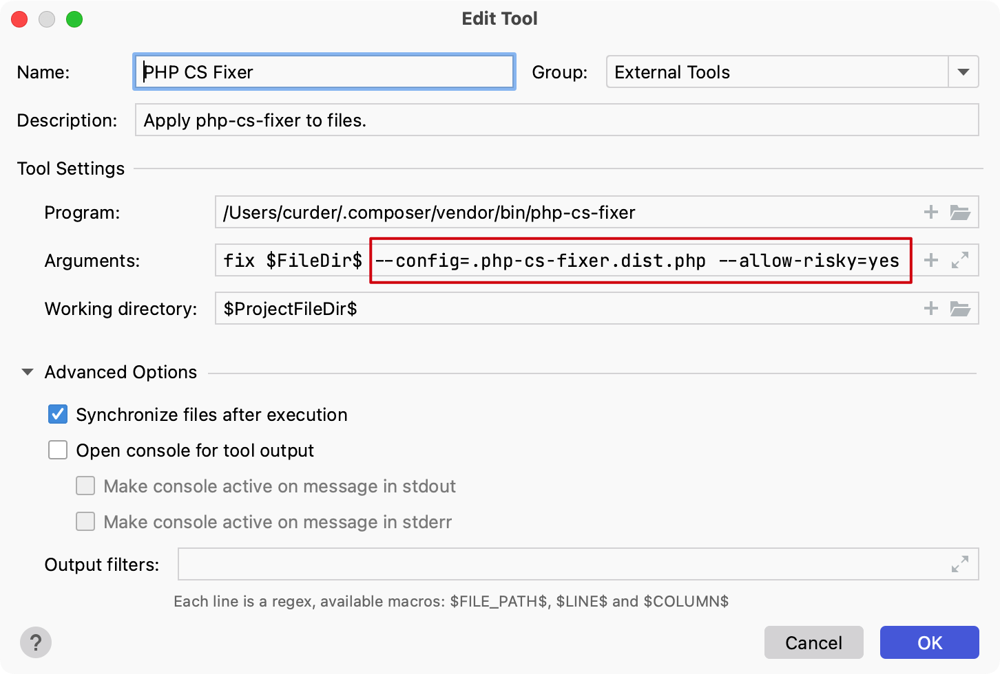
    :::

    将这个外部工具命名为 `PHP CS Fixer`，在 Paragam 输入 `php-cs-fixer` 所在系统绝对路径，参数中输入修复自定义配置，这里我们指定路径为当前目录，验证规则为 `PSR-12`，最后点击 `OK` 保存。


## 关闭修复输出

如果不想每次都查看修复后的结果打印，可以在配置工具是将 `Advanced Options` -> `Open console for tool output` 关闭即可。

::: details 点击切换截图展示与隐藏
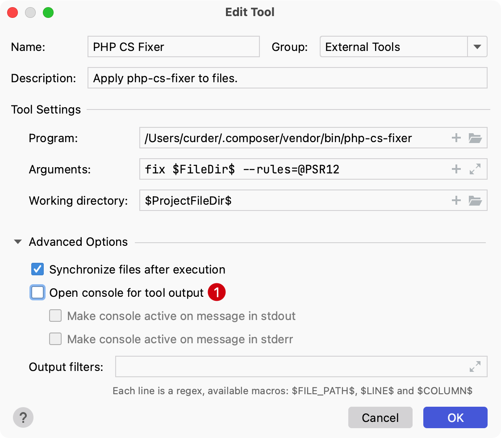
:::