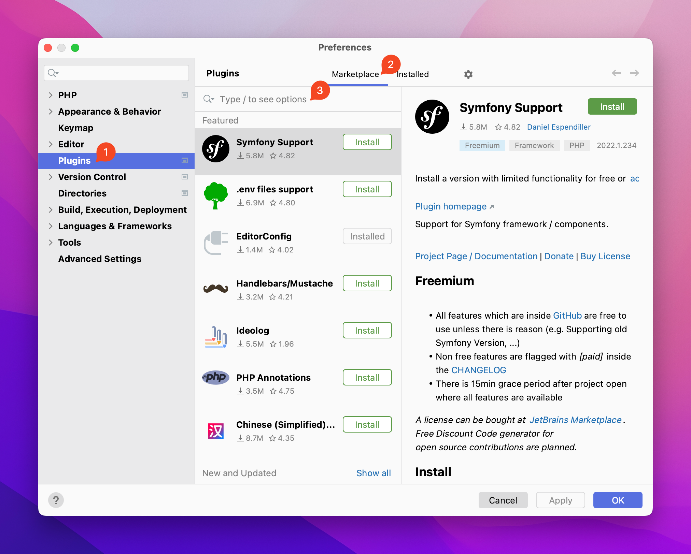
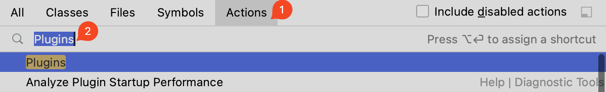
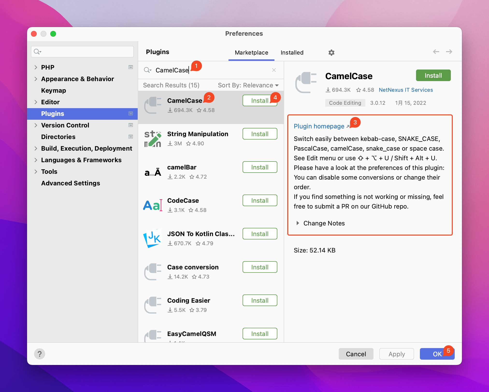
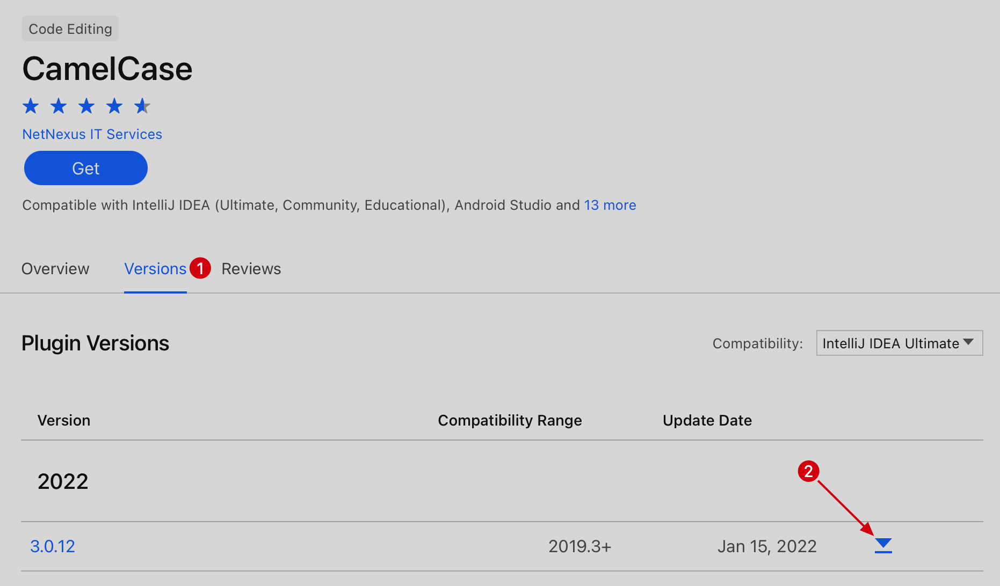
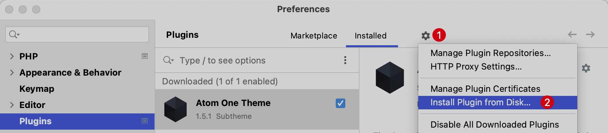
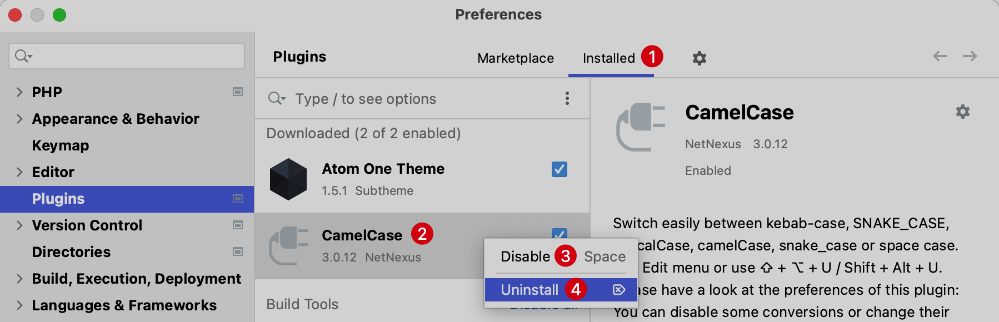

# 插件管理

除了 PhpStorm 自带的功能，还可以通过安装第三方插件的方式来扩展编辑器功能。

PhpStorm 插件安装、卸载管理是在系统偏好设定的 `Plugins` 里。可以通过下列方式打开  `Plugins`：

- 方式一：可以使用快捷键 `Command + ,` 在偏好设置 `Preferences` -> `Plugins` 菜单栏打开插件安装界面：

    

- 方式二：使用快捷键 `Shift + Shift` 或 `Command + Shift + A`后，输入 **Plugins** 来打开插件安装界面：

    

## 搜索安装

在 `Plugins` 的功能界面包含了两个标签页，左侧对应插件市场 `Marketplace`，用户可以在这里搜索并选择安装的第三方插件。

比如想要在 PhpStorm 中安装 `CamelCase` 插件，输入插件名会自动搜索，在下拉列表选择正确的插件，右侧会显示对应插件的简单介绍和使用方法，点击 `Install` 即可安装到本地，最后记得点击 **OK** 保存。

::: info 注意
有的插件需要重启 PhpStorm 才能生效，具体以插件使用说明为准。
:::

## jar存档安装

当使用上面的方式下载由于网络等原因无法完成安装可以尝试在[官网插件市场](https://plugins.jetbrains.com/)找到对应插件的 **.jar** 包。

1. 下载jar安装包
    还是以安装 `CamelCase` 插件为例，搜索并来到插件的详情页面的 `Versions` 选择符合编辑器版本的软件进行下载：

    

2. 在 PhpStorm 中启用
    - 单击齿轮图标的设置按钮，然后选择 `Install Plugin from disk...`
    - 选择上一步下载的插件jar文件并单击确定
    - 单击确定以应用更改并在出现提示时重新启动 PhpStorm
    

## 卸载

在 Plugins 的功能界面包含了两个标签页，右侧编辑器预设和用户安装的第三方插件，可以在这里对插件禁用和卸载。

1. 选中右侧的 `Installed` 来到已安装的插件
2. 选中需要操作的插件
3. 使用空格禁用
4. 右键点击选择 `Uninstall` 卸载插件
5. 点击 **OK** 确认操作
    

## 插件推荐

- [**CamelCase**](https://plugins.jetbrains.com/plugin/7160)

    允许用户通过快捷键 `Alt + Shift + U` 在 `kebab-case`、`SNAKE_CASE`、`PascalCase`、`camelCase`、`snake_case` 或 `space case` 之间轻松切换

- [**Translation**](https://plugins.jetbrains.com/plugin/8579)
    
    选中单词进行翻译，支持谷歌、有道、阿里巴巴和百度的翻译接口。除了谷歌翻译之外，其它的提供商都需要授权。
    

    插件配置在系统偏好设定的 `Tools` -> `Translation`。注意：在**常规**处的主要语言选择 `中文简体`

    使用方式：1. 选中单词或段使用快捷键 `Command + Ctrl + U` 就可以呼出翻译弹层 2. 选择单词或段后右键点击选择 `Translate`

- [**Chinese ​(Simplified)​ Language Pack / 中文语言包**](https://plugins.jetbrains.com/plugin/13710)

    下载并安装后，重启 PhpStorm 编辑器外观可以看到支持中文操作界面。

- [**Chinese PHP Document**](https://plugins.jetbrains.com/plugin/12734)
    
    光标悬浮在 PHP 系统函数上，可以在代码上快速查看其中文文档。

- [**.env files support**](https://plugins.jetbrains.com/plugin/9525)
    
    `.env` 文件的高亮显示插件