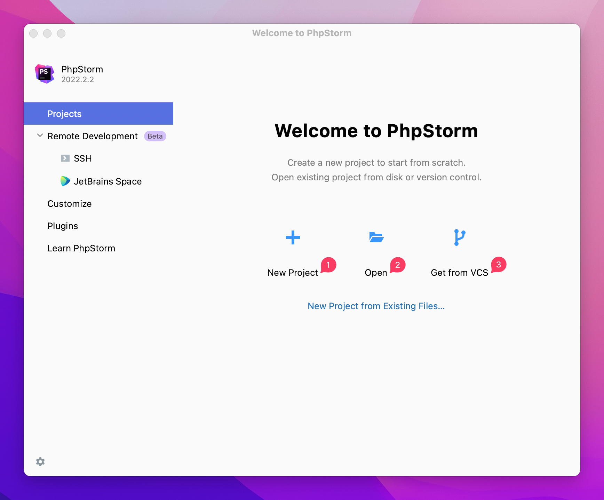
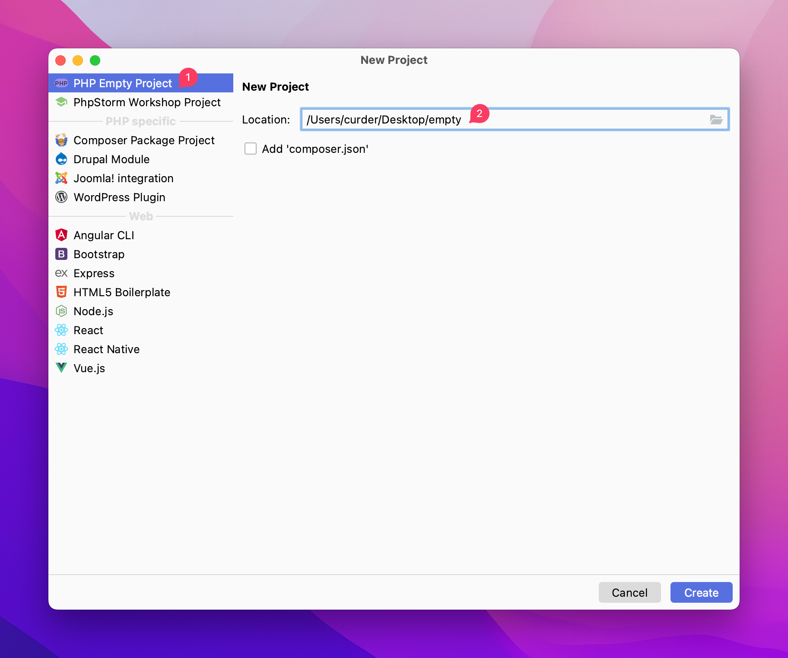
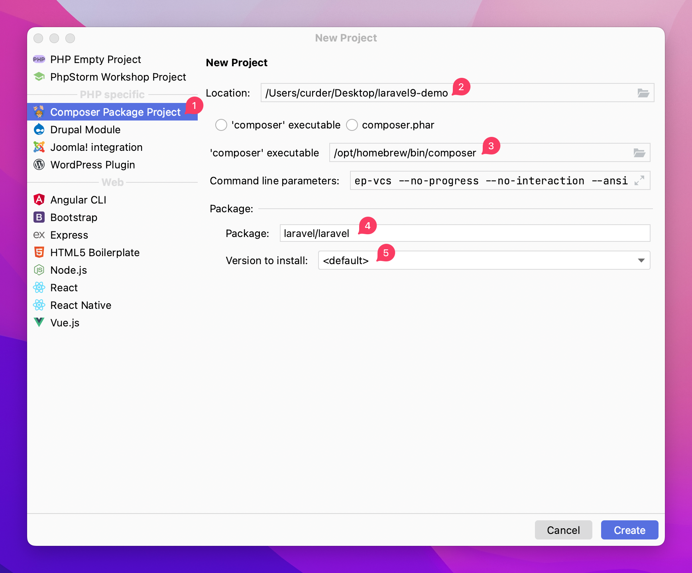
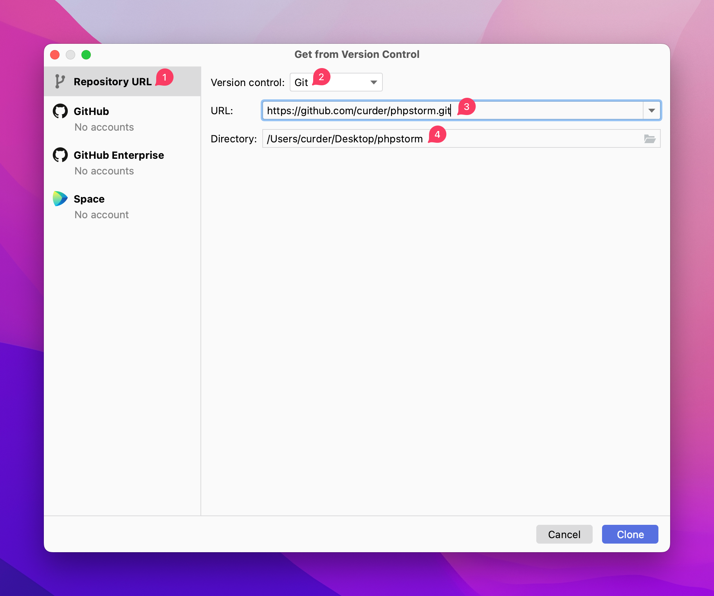
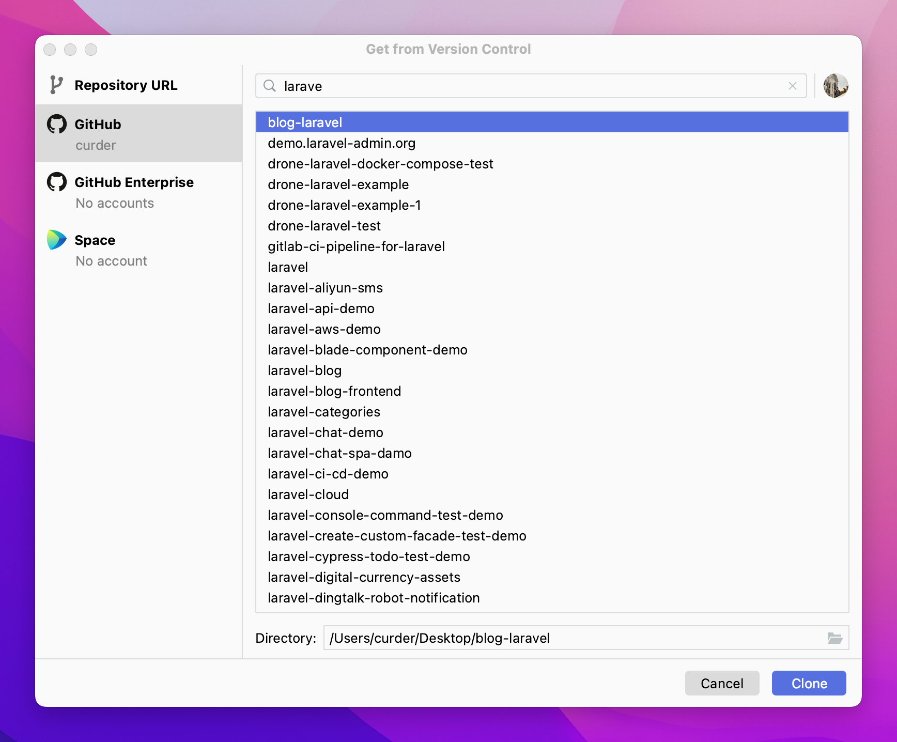

# 项目文件

PhpStorm 支持使用常用的脚手架来创建一个新项目，或者直接打开本地已经存在或远程版本库中的项目文件。



## 创建新项目

PhpStorm 可以直接打开新项目，只需要提供一个存储路径和项目名，如果新项目不存在会给我们创建一个对应的目录。



PhpStorm 也支持使用例如 Composer 或 Vue 、 React 、Angular 等脚手架直接创建项目。

这里以创建一个Laravel项目为例：

1. 选择 `Composer Package Project`
2. 输入项目存储路径和项目名称，这里是 `/Users/curder/Desktop/laravel9-demo`
3. 确定 composer 路径，这里是 `/opt/homebrew/bin/composer`
4. 搜索并确认使用的软件包，这里是 `laravel/laravel`
5. 选择合适的软件版本



## 本地或版本库打开项目

如果本地已经存在项目文件的话，可以在编辑器中直接打开。

点击 `Open` -> 在弹出层中找到需要打开的文件目录，点击 `Open` 就可以在 PhpStorm 中打开对应的项目。

另外，也可以给 PhpStorm 添加一个命令行终端，然后直接在终端执行命令打开项目。

```bash
phpstorm /Users/curder/Desktop/laravel9-demo
```

具体使用操作界面操作还是通过命令行终端打开已存在的项目可以根据使用习惯自行选择。

如果项目存在于远程版本库中，可以通过打开项目时可以选择从 VCS 打开，PhpStorm 目前支持 Git、Mercurial 和 SVN，默认使用
Git 作为版本控制，输入远程仓库地址后，选择对应的存储路径后，点击 **Clone** 就会将远程仓库代码拉取到本地。



当然，PhpStorm 也支持直接链接 GitHub 账号，登录后，可以方便快捷的对账号下的仓库进行筛选并进行 **Clone** 操作。



至此，大概过了一遍 PhpStorm 常用的项目管理，包括使用脚手架创建项目，打开已经存在的项目，还可以从已有的版本库获取项目文件到本地。

具体使用那种方式创建本地项目根据实际情况自行选择。