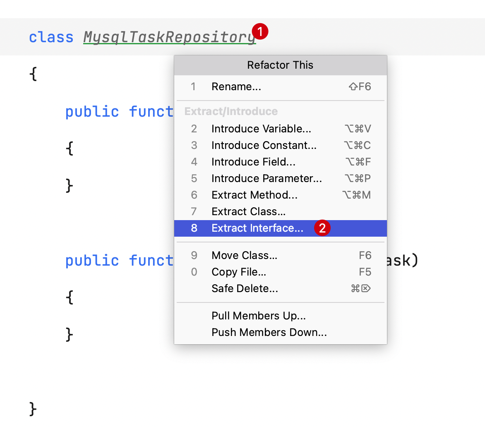
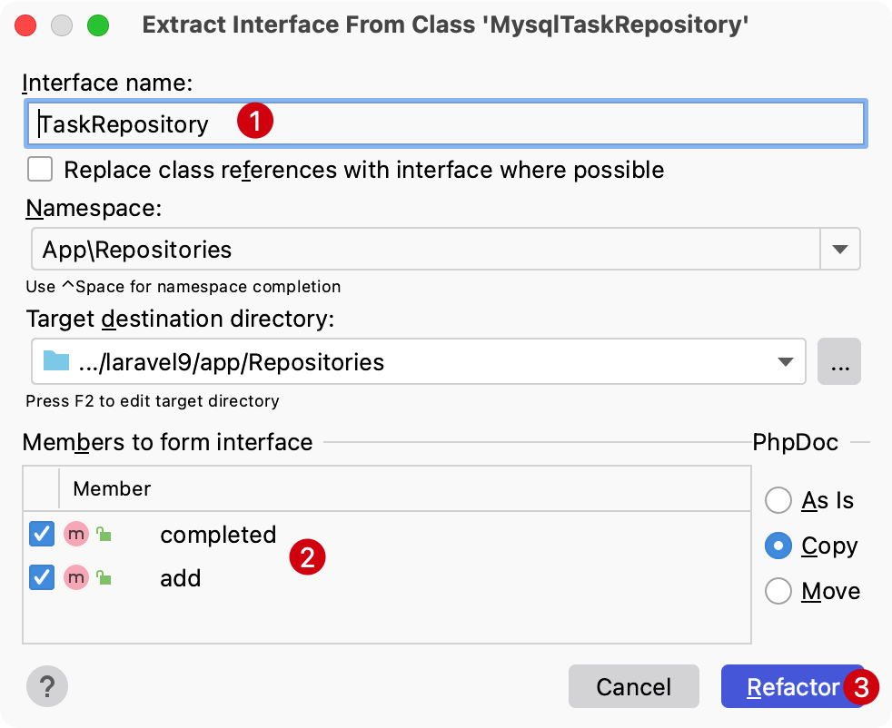
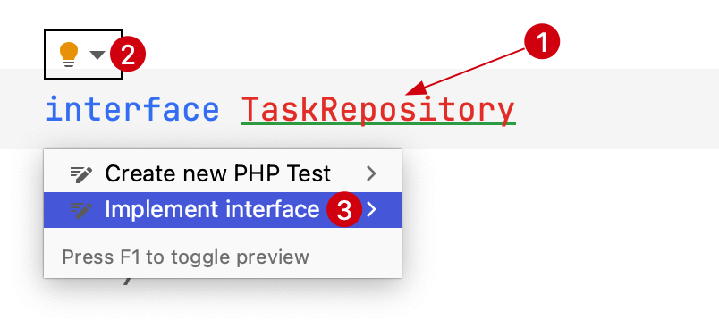
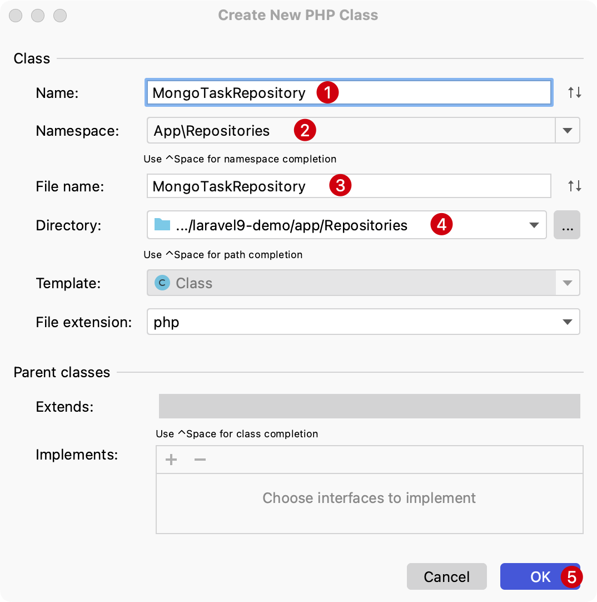

# 重构接口

PhpStorm 可以将一组实现类似功能的类方法抽象出来构建一个接口。

这一节我们一起来通过类方法抽象出一个接口文件，以及通过接口文件创建一个实现它的类。

## 提取类方法到接口

想象有一个 `MysqlTaskRepository` 实现类有 `add()` 和 `completed()` 方法，假设在这个基础上将其抽象成接口`TaskRepository`
，也就是说 `add`、`completed` 方法抽象出来构建一个 `TaskRepostory` 接口。

要完成这个重构，通过 PhpStorm 进行如下操作：

1. 选中对应的类名 `MysqlTaskRepository`，在主菜单界面选中 `Refactor` -> `Refactor This...`
   ，或者直接使用快捷键 `Control（或 Ctrl）⌃ + T`，选择 `Extra Interface...`

   ::: details 点击展示或隐藏截图
   
   :::

2. 在随后弹出窗口编辑接口名和选择接口包含的抽象方法

   ::: details 点击展示或隐藏截图
    1. 自定义接口类名
    2. 选择接口包含的抽象方法
    3. 以上信息确认无误后，点击 `Refactor` 确认操作
       
       :::

3. 检查接口 `TaskRepository` 定义，并可以看到原始类 `MysqlTaskRepository` 自动实现了接口定义的方法

    - 接口 `TaskRepository`
   ```php
   <?php
   
   namespace App\Repositories;
   
   interface TaskRepository
   {
       public function add(string $name);
   
       public function completed(string $task);
   }
   ```
    - `MysqlTaskRepository`
   ```php {5}
   <?php

   namespace App\Repositories;

   class MysqlTaskRepository implements TaskRepository
   {
        public function add(string $name)
        {
        }

        public function completed(string $task)
        {
        }
   }
   ```

## 通过接口定义新建类

1. 通过鼠标光标悬浮在接口名上，等待一下，在左侧出现的 `Show context Actions` 选择 `Implement interface`，或者也可以直接使用快捷键 `Alt + 回车`：

   


2. 在随后弹出窗口输入对应类名、检查类命名空间以及文件名和存储路径，如果没有问题，则可以点击 `OK` 确认通过接口创建类。

   

