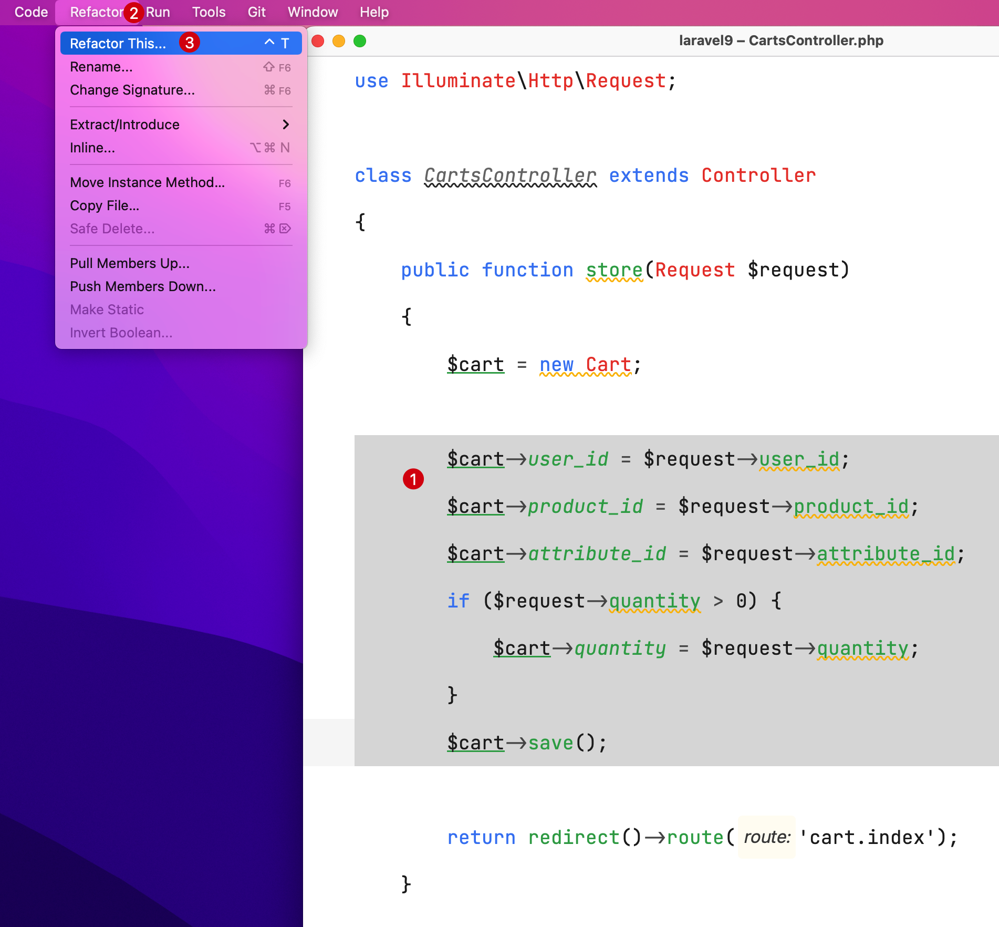
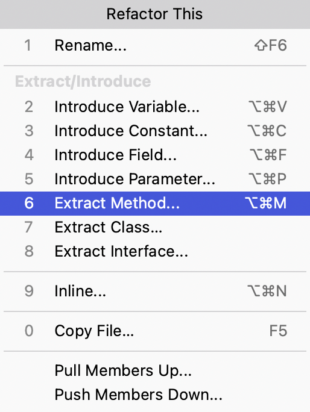

# 重构方法

在 PhpStorm 中，可以通过重构功能（Refactor）非常方便地对代码进行重构，从而提升代码复用性，下面通过实际代码演示一下方法重构。

重构方法的目的是将某个代码块重构为一个函数或方法来提高代码的复用性。

## 重构方法

比如有如下代码，可以发现 `store()` 和 `update()` 方法中有大量相同的代码逻辑，可以对其重构，将公用的代码重构成 `save()` 方法：

```php {14-20,29-35}
<?php

namespace App\Http\Controllers;

use App\Models\Cart;
use Illuminate\Http\Request;

class CartsController extends Controller
{
    public function store(Request $request)
    {
        $cart = new Cart;
        
        $cart->user_id = $request->user_id;
        $cart->product_id = $request->product_id;
        $cart->attribute_id = $request->attribute_id;
        if ($request->quantity > 0) {
            $cart->quantity = $request->quantity;
        }
        $cart->save();

        return redirect()->route('cart.index');
    }

    public function update(Request $request, $id)
    {
        $cart = Cart::find($id);

        $cart->user_id = $request->user_id;
        $cart->product_id = $request->product_id;
        $cart->attribute_id = $request->attribute_id;
        if ($request->quantity > 0) {
            $cart->quantity = $request->quantity;
        }
        $cart->save();

        return redirect()->route('cart.index');
    }
}
```

具体重构方法的步骤如下：

1. 选中待重构的代码逻辑，在主菜单界面选中 `Refactor` -> `Refactor This...`
   ，或者直接使用快捷键 `Control（或 Ctrl）⌃ + T`

   ::: details 点击展示或隐藏演示图
   1. 将待重构的代码逻辑选中
   2. 点击主菜单界面选中 `Refactor` -> 并选择 `Refactor This...`
      
      :::

2. 在随后弹出的选项列表中选择 `Extract Method...`，并确认选择

   ::: details 点击展示或隐藏演示图
   
   :::

3. 可以看到重构的代码逻辑已经被重构到 PhpStorm 编辑器默认提供的 `extracted` 方法中，此时可以通过滚动光标查看重构后的代码逻辑

   ::: details 点击展示或隐藏演示图
   1. 重构后方法名
   2. 重构后代码逻辑
   
   :::

4. 可以修改默认的方法，比如这里将方法名修改为 `save`

   ::: details 点击展示或隐藏演示图
   1. 修改为目标方法 `save`
   2. 弹出层提示"PhpStorm 在此文件中检测到 1 个代码片段，可以替换为对提取方法的调用"，这里选择 **Yes** 同时替换另一个代码片段的逻辑
   
   :::

5. 弹出提示并且高亮相同片段的代码逻辑

   ::: details 点击展示或隐藏演示图
   
   :::

6. 自此控制器中 `store` 和 `update` 方法中重复的代码就被重构完毕

   ::: details 点击展示或隐藏代码
   ```php {14,23,28-42}
   <?php
   
   namespace App\Http\Controllers;
   
   use App\Models\Cart;
   use Illuminate\Http\Request;
   
   class CartsController extends Controller
   {
       public function store(Request $request)
       {
           $cart = new Cart;
   
           $this->save($request, $cart);
   
           return redirect()->route('cart.index');
       }
   
       public function update(Request $request, $id)
       {
           $cart = Cart::find($id);
   
           $this->save($request, $cart);
   
           return redirect()->route('cart.index');
       }
   
       /**
        * @param Request $request
        * @param Cart $cart
        * @return void
        */
       public function save(Request $request, Cart $cart): void
       {
           $cart->user_id = $request->user_id;
           $cart->product_id = $request->product_id;
           $cart->attribute_id = $request->attribute_id;
           if ($request->quantity > 0) {
               $cart->quantity = $request->quantity;
           }
           $cart->save();
       }
   }
   ```
   :::
