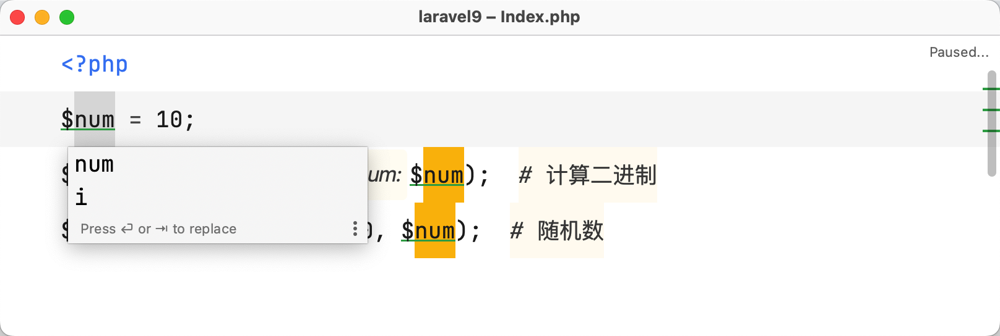

# 重构变量

## 提取变量

以下面这段代码为例进行演示：

```php
<?php

$binary_num = decbin(10);  # 计算二进制
$random_num = mt_rand(0, 10);  # 随机数
```

需求要将上述代码中的数字 `10` 重构为变量。可以这样操作：

1. 选中或者将光标悬浮在待重构的数字 `10` 上，在主菜单界面选中 `Refactor` -> `Refactor This...`
   ，或者直接使用快捷键 `Control（或 Ctrl）⌃ + T`

   ::: details 点击展示或隐藏演示图
    1. 将光标悬浮在变量上
    2. 点击主菜单界面选中 `Refactor` -> 并选择 `Refactor This...`
       
       :::
2. 在随后弹出的选项列表中选择 `Introduce Variable...`

   ::: details 点击展示或隐藏演示图
   
   :::

3. 如果使用的是鼠标悬浮在重构的变量上，可能会出现下面的提示层，确认重构变量的范围

   ::: details 点击展示或隐藏演示图
   
   :::

4. 如果当前有多个变量，会继续弹出弹层提示是否需要全部替换，这里选择替换全部变量后，点击回车确认选择

   ::: details 点击展示或隐藏演示图
   
   :::

5. 可以发现代码中的 2 个数字 10 就被重构成了变量 `$num`，且光标还停留在这个变量 `$num` 上

   ::: details 点击展示或隐藏演示图
   
   :::

6. 如果生成的变量名称不满意，可以对变量进行修改，编辑完成后按回车确认

   ::: details 点击展示或隐藏演示图
   
   :::

也可以将上面的值提取为 **常量** 、**类属性**等，操作流程和上面类似。

## 释放变量

以下面这段代码作为演示：

```php
<?php

$number = 10;
$binary_num = decbin($number);  # 计算二进制
$random_num = mt_rand(0, $number);  # 随机数
```

需求要将上述代码中的变量 `$number` 释放。可以这样操作：

1. 选中或者将光标悬浮在待重构的变量 `$number` 上，在主菜单界面选中 `Refactor` -> `Refactor This...`
   ，或者直接使用快捷键 `Control（或 Ctrl）⌃ + T`

   ::: details 点击展示或隐藏演示图
    1. 将光标悬浮在变量 `$number` 上
    2. 点击主菜单界面选中 `Refactor` -> 并选择 `Refactor This...`
       
       :::

2. 在随后弹出的选项列表中选择 `Introduce Variable...`

   ::: details 点击展示或隐藏演示图
   
   :::

3. 可以发现代码中的变量 `$number` 就被释放了，且有改动的地方高亮展示

   ::: details 点击展示或隐藏演示图
   
   :::
