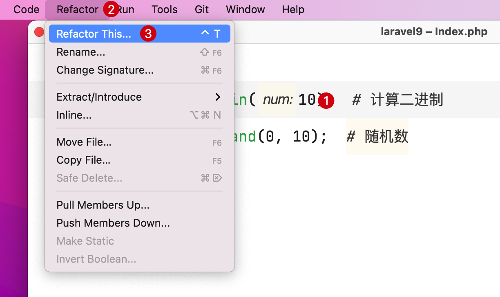
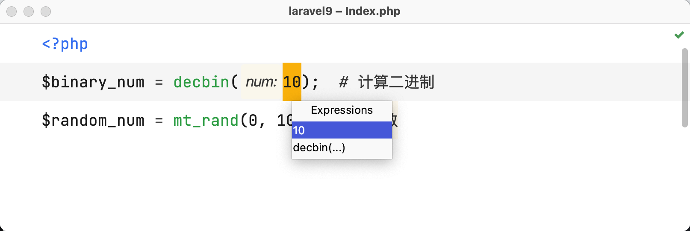
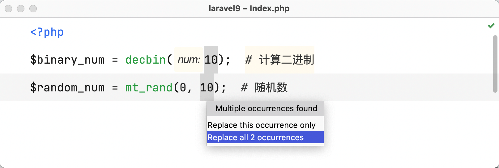
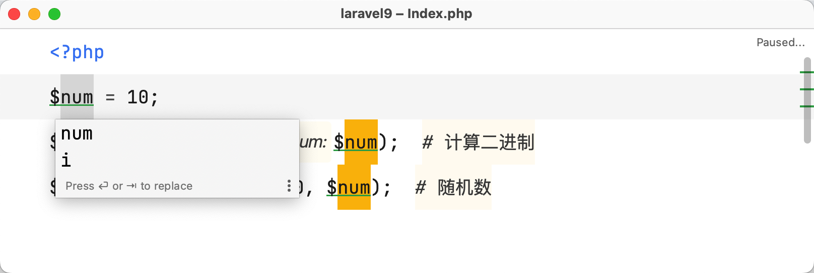
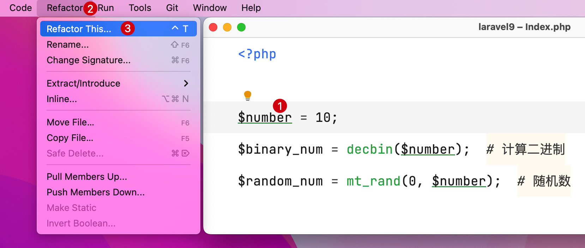
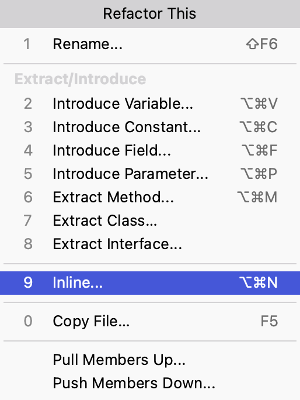
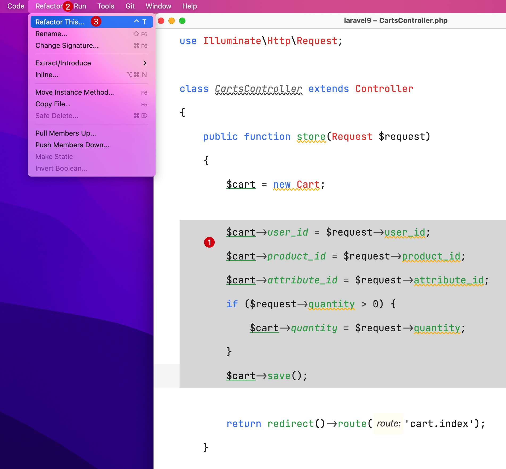
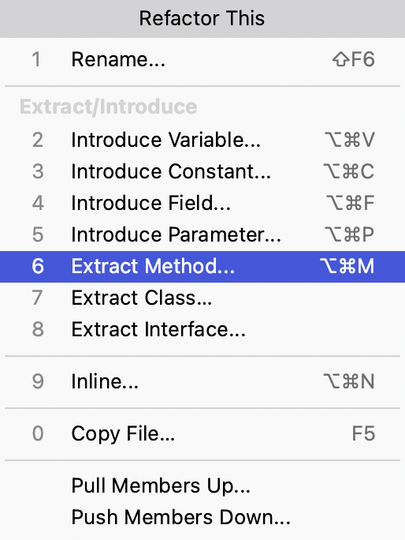
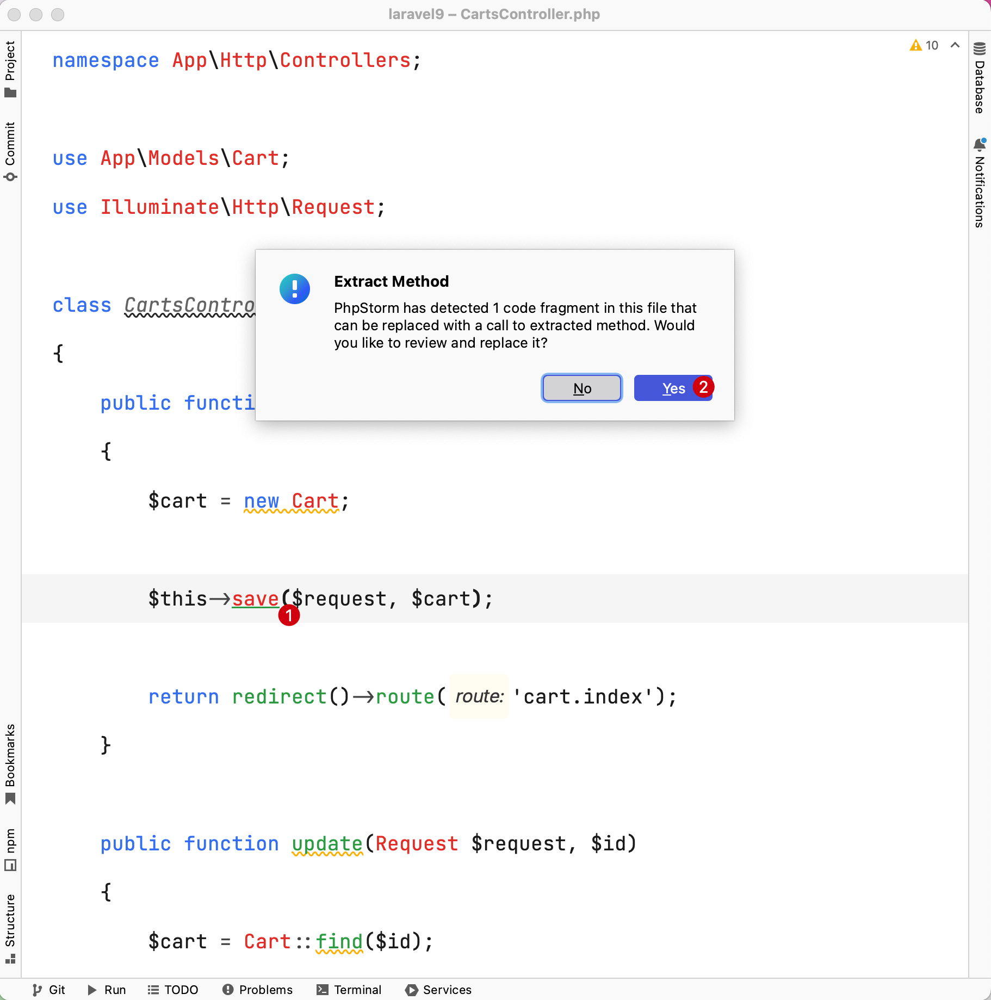

# 重构变量名和方法

在 PhpStorm 中，可以通过自带的重构功能（Refactor）非常方便地对代码进行重构，从而提升代码复用性。

下面通过实际代码演示一下变量名重构和方法重构。

## 重构变量名

### 提取变量

以下面这段代码为例进行演示：

```php
<?php

$binary_num = decbin(10);  # 计算二进制
$random_num = mt_rand(0, 10);  # 随机数
```

需求要将上述代码中的数字 `10` 重构为变量。可以这样操作：

1. 选中或者将光标悬浮在待重构的数字 `10` 上，在主菜单界面选中 `Refactor` -> `Refactor This...`
   ，或者直接使用快捷键 `Control（或 Ctrl）⌃ + T`

   ::: details 点击展示或隐藏演示图
    1. 将光标悬浮在变量上
    2. 点击主菜单界面选中 `Refactor` -> 并选择 `Refactor This...`
       
       :::
2. 在随后弹出的选项列表中选择 `Introduce Variable...`

   ::: details 点击展示或隐藏演示图
   
   :::

3. 如果使用的是鼠标悬浮在重构的变量上，可能会出现下面的提示层，确认重构变量的范围

   ::: details 点击展示或隐藏演示图
   
   :::

4. 如果当前有多个变量，会继续弹出弹层提示是否需要全部替换，这里选择替换全部变量后，点击回车确认选择

   ::: details 点击展示或隐藏演示图
   
   :::

5. 可以发现代码中的 2 个数字 10 就被重构成了变量 `$num`，且光标还停留在这个变量 `$num` 上

   ::: details 点击展示或隐藏演示图
   
   :::

6. 如果生成的变量名称不满意，可以对变量进行修改，编辑完成后按回车确认

   ::: details 点击展示或隐藏演示图
   
   :::

也可以将上面的值提取为 **常量** 、**类属性**等，操作流程和上面类似。

### 释放变量

以下面这段代码作为演示：

```php
<?php

$number = 10;
$binary_num = decbin($number);  # 计算二进制
$random_num = mt_rand(0, $number);  # 随机数
```

需求要将上述代码中的变量 `$number` 释放。可以这样操作：

1. 选中或者将光标悬浮在待重构的变量 `$number` 上，在主菜单界面选中 `Refactor` -> `Refactor This...`
   ，或者直接使用快捷键 `Control（或 Ctrl）⌃ + T`

   ::: details 点击展示或隐藏演示图
    1. 将光标悬浮在变量 `$number` 上
    2. 点击主菜单界面选中 `Refactor` -> 并选择 `Refactor This...`
       
       :::

2. 在随后弹出的选项列表中选择 `Introduce Variable...`

   ::: details 点击展示或隐藏演示图
   
   :::

3. 可以发现代码中的变量 `$number` 就被释放了，且有改动的地方高亮展示

   ::: details 点击展示或隐藏演示图
   
   :::

### 重构方法

将某个代码块重构为一个函数或方法来提高复用性。

比如有如下代码，可以发现 `store()` 和 `update()` 方法中有大量重复的代码，可以对其重构，将公用的代码抽取成 `save()` 方法：

```php {14-20,29-35}
<?php

namespace App\Http\Controllers;

use App\Models\Cart;
use Illuminate\Http\Request;

class CartsController extends Controller
{
    public function store(Request $request)
    {
        $cart = new Cart;
        
        $cart->user_id = $request->user_id;
        $cart->product_id = $request->product_id;
        $cart->attribute_id = $request->attribute_id;
        if ($request->quantity > 0) {
            $cart->quantity = $request->quantity;
        }
        $cart->save();

        return redirect()->route('cart.index');
    }

    public function update(Request $request, $id)
    {
        $cart = Cart::find($id);

        $cart->user_id = $request->user_id;
        $cart->product_id = $request->product_id;
        $cart->attribute_id = $request->attribute_id;
        if ($request->quantity > 0) {
            $cart->quantity = $request->quantity;
        }
        $cart->save();

        return redirect()->route('cart.index');
    }
}
```

具体重构步骤如下：

1. 选中待重构的代码逻辑，在主菜单界面选中 `Refactor` -> `Refactor This...`
   ，或者直接使用快捷键 `Control（或 Ctrl）⌃ + T`

   ::: details 点击展示或隐藏演示图
   1. 将待重构的代码逻辑选中
   2. 点击主菜单界面选中 `Refactor` -> 并选择 `Refactor This...`
      
      ::: 

2. 在随后弹出的选项列表中选择 `Introduce Variable...`，并确认选择

   ::: details 点击展示或隐藏演示图
   
   :::

3. 可以看到重构的代码逻辑已经被重构到默认提供的 `extracted` 方法中，此时可以通过滚动光标查看重构后的代码逻辑 

   ::: details 点击展示或隐藏演示图
   1. 重构后方法名
   2. 重构后代码逻辑
   
   :::

4. 可以修改默认的方法，比如这里将方法名修改为 `save` 

   ::: details 点击展示或隐藏演示图
   1. 修改为目标方法 `save`
   2. 弹出层提示"PhpStorm 在此文件中检测到 1 个代码片段，可以替换为对提取方法的调用"，这里选择 **Yes** 同时替换另一个代码片段的逻辑
   
   :::

5. 弹出提示并且高亮相同片段的代码逻辑

   ::: details 点击展示或隐藏演示图
   
   :::

6. 自此控制器中 `store` 和 `update` 方法中重复的代码就被重构完毕

   ::: details 点击展示或隐藏代码
   ```php {14,23,28-42}
   <?php
   
   namespace App\Http\Controllers;
   
   use App\Models\Cart;
   use Illuminate\Http\Request;
   
   class CartsController extends Controller
   {
       public function store(Request $request)
       {
           $cart = new Cart;
   
           $this->save($request, $cart);
   
           return redirect()->route('cart.index');
       }
   
       public function update(Request $request, $id)
       {
           $cart = Cart::find($id);
   
           $this->save($request, $cart);
   
           return redirect()->route('cart.index');
       }
   
       /**
        * @param Request $request
        * @param Cart $cart
        * @return void
        */
       public function save(Request $request, Cart $cart): void
       {
           $cart->user_id = $request->user_id;
           $cart->product_id = $request->product_id;
           $cart->attribute_id = $request->attribute_id;
           if ($request->quantity > 0) {
               $cart->quantity = $request->quantity;
           }
           $cart->save();
       }
   }
   ```
   :::
