# 重构父子类方法转移

通过成员方法重构，如果子类具有执行相似工作的方法，则可以移动方法，这可以帮助摆脱重复的代码。

假如有如下代码，分析代码发现在 `store` 和 `update`
方法中有一些代码逻辑是相似的，可以将其提取到公共方法并放到父类 `Controller` 中：

- 子类 `CartsController`
    ```php
    <?php
    
    namespace App\Http\Controllers;
    
    use Illuminate\Support\Facades\Redirect;
    
    class CartsController extends Controller
    {
        public function store()
        {
            // Some logic...
            return Redirect::back()
                ->withInput()
                ->withErrors($validation->messages());
        }
    
        public function update()
        {
            // Some logic...
            return Redirect::back()
                ->withInput()
                ->withErrors($validation->messages());
        }
    }
    ```

- 父类 `Controller`
    ```php
    <?php
      
    namespace App\Http\Controllers;
      
    use Illuminate\Foundation\Auth\Access\AuthorizesRequests;
    use Illuminate\Foundation\Bus\DispatchesJobs;
    use Illuminate\Foundation\Validation\ValidatesRequests;
    use Illuminate\Routing\Controller as BaseController;
    use Illuminate\Support\Facades\Redirect;
      
    class Controller extends BaseController
    {
        use AuthorizesRequests, DispatchesJobs, ValidatesRequests;
    }
    ```

## 重构代码并转移到父类

1. 将鼠标悬浮在 `store` 方法的结构体待重构的代码上，在主菜单界面选中 `Refactor` -> `Refactor This...`
   ，或者直接使用快捷键 `Control（或 Ctrl）⌃ + T`

   ::: details 点击展示或隐藏演示图
   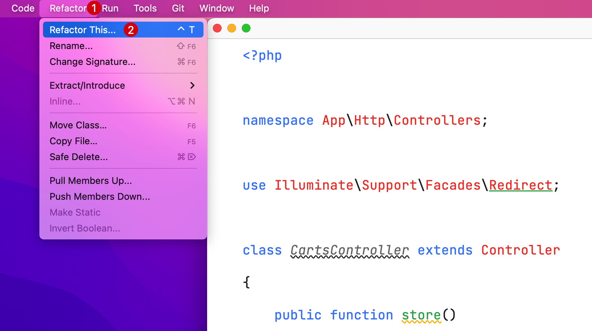
   :::
2. 在下拉列表中选择要重构的类型 `Extract Method...`

   ::: details 点击展示或隐藏演示图
   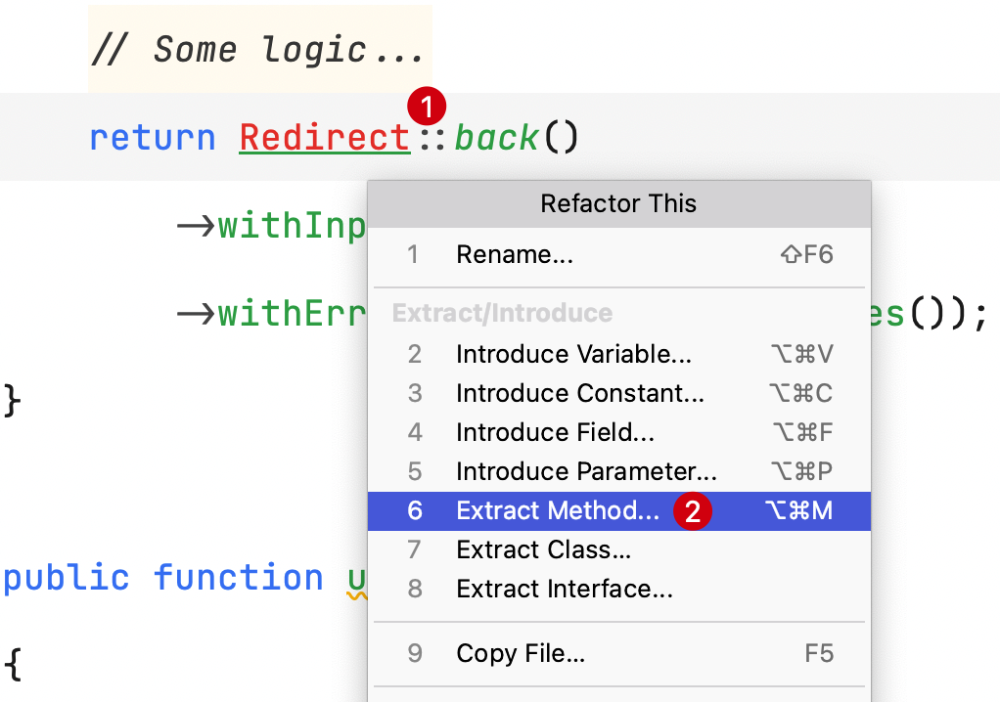
   :::

3. 选择 `Redirect::back()->withInput()->withErrors(...)`

   ::: details 点击展示或隐藏演示图
   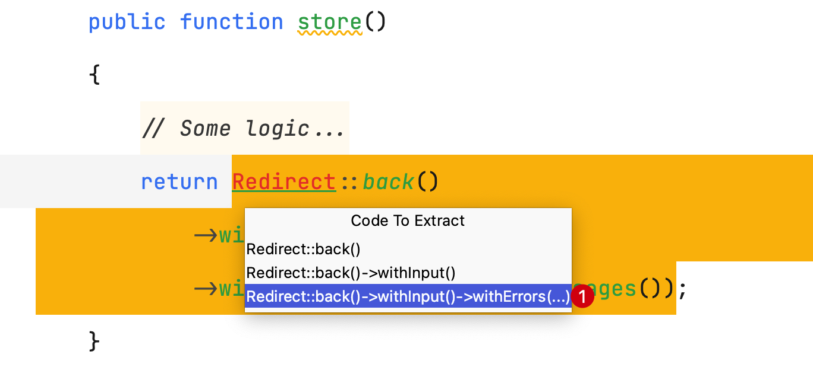
   :::

4. 回车后看到代码被重构成了方法

   ::: details 点击展示或隐藏演示图
   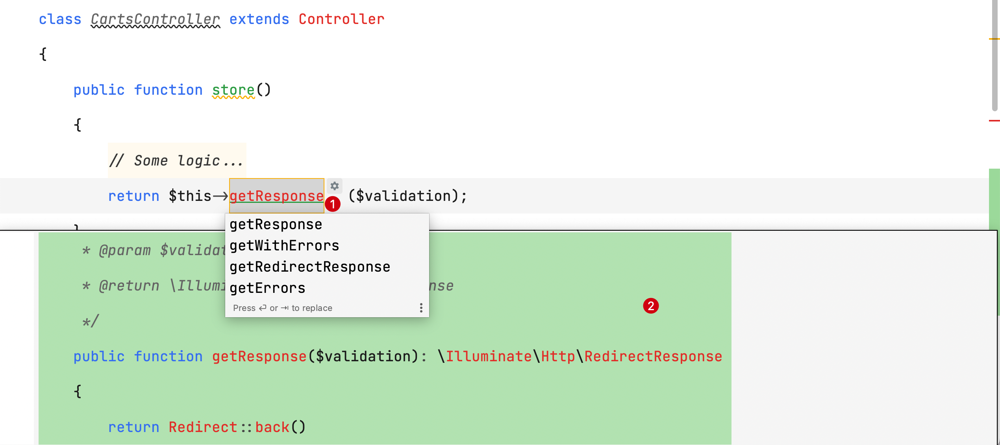
   :::

5. 默认方法名为 `getResposne`，可以改为 `redirectBackWithErrors`

   ::: details 点击展示或隐藏演示图
   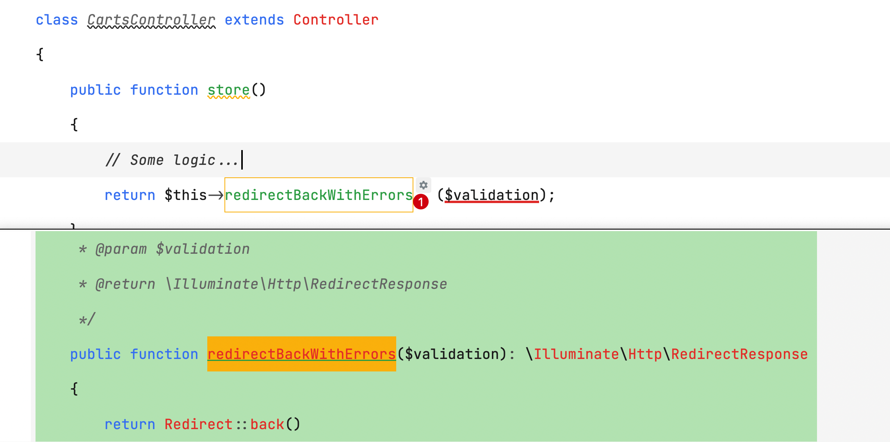
   :::

6. 如果当前类中重构的代码逻辑有存在相同的逻辑代码，会出现提取方法的确认弹出提示，这里点击 `Yes`，确认需要提取到方法

   ::: details 点击展示或隐藏演示图
   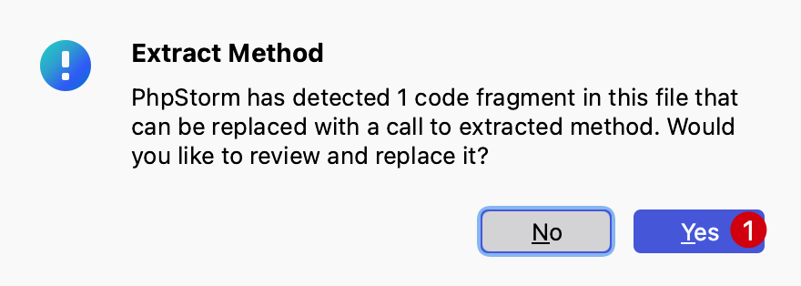
   :::

7. 选择 `Replace` 进行替换，可以看到`store` 和 `update` 方法中相同的代码逻辑均提取到了 `redirectBackWithErrors` 方法中

   ::: details 点击展示或隐藏演示图
   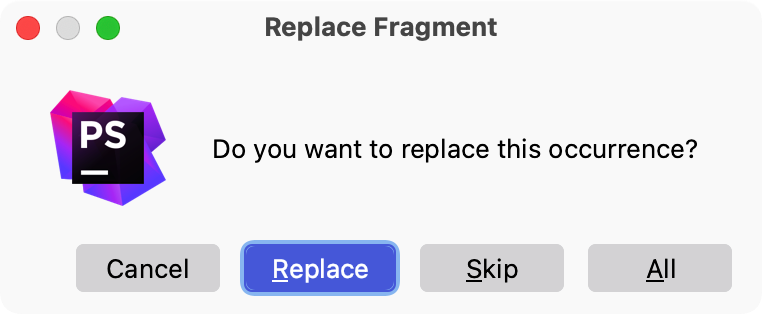
   :::

8. **将 `redirectBackWithErrors` 转移到父类 `Controller`**

    1. 光标停留在类的结构内部或待操作的方法上，在主菜单界面选中 `Refactor` -> `Refactor This...`
       ，或者直接使用快捷键 `Control（或 Ctrl）⌃ + T`
       ，选择 `Pull Members Up...`

       ::: details 点击展示或隐藏演示图
       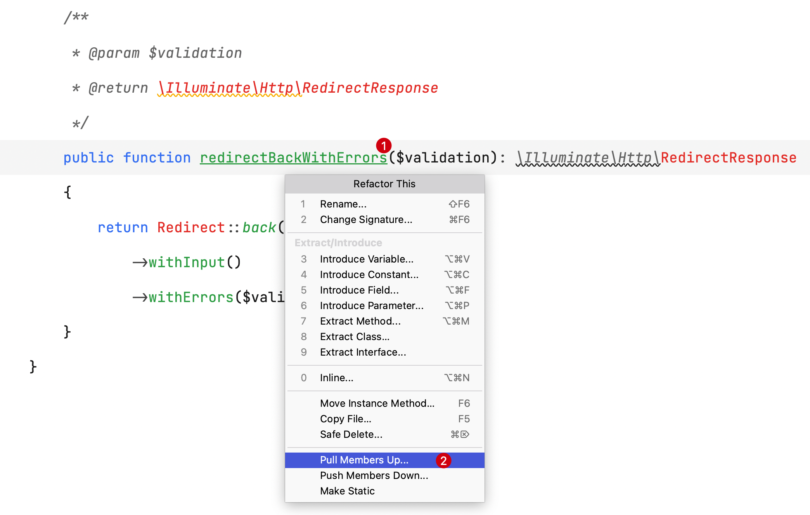
       :::

    2. 在确认弹出层中查看要转移到的父类和要转移的成员方法，如果没有问题可以点击 `Refactor` 确认转移

       ::: details 点击展示或隐藏演示图
       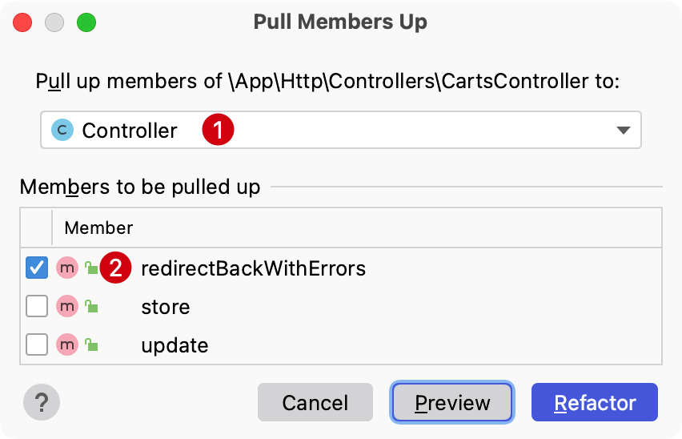
       :::

    3. 此时可以看到子类的方法 `redirectBackWithErrors` 被转移到父类 `Controller` 中

       ::: details 点击展示或隐藏源代码
        - 父类 `Controller`
            ```php
            <?php
            
            namespace App\Http\Controllers;
            
            use Illuminate\Foundation\Auth\Access\AuthorizesRequests;
            use Illuminate\Foundation\Bus\DispatchesJobs;
            use Illuminate\Foundation\Validation\ValidatesRequests;
            use Illuminate\Routing\Controller as BaseController;
            use Illuminate\Support\Facades\Redirect;
            
            class Controller extends BaseController
            {
                use AuthorizesRequests, DispatchesJobs, ValidatesRequests;
            
                /**  //  [!code focus:10]
                 * @param $validation
                 * @return \Illuminate\Http\RedirectResponse
                 */
                public function redirectBackWithErrors($validation): \Illuminate\Http\RedirectResponse
                {
                    return Redirect::back()
                        ->withInput()
                        ->withErrors($validation->messages());
                }
            }
            ```

        - 子类 `CartsController`

            ```php
            <?php
            
            namespace App\Http\Controllers;
            
            use Illuminate\Support\Facades\Redirect;
            
            class CartsController extends Controller
            {
                public function store()
                {
                    // Some logic...
                    return $this->redirectBackWithErrors($validation); // [!code focus]
                }
            
                public function update()
                {
                    // Some logic...
                    return $this->redirectBackWithErrors($validation); // [!code focus]
                }
            }
            ```
       :::

## 将方法从父类转移到子类

假如有如下父子类 `Controller`，现需要将 `redirectBackWithErrors` 方法转移到子类：

- 父类 `Controller`

```php
<?php

namespace App\Http\Controllers;

use Illuminate\Foundation\Auth\Access\AuthorizesRequests;
use Illuminate\Foundation\Bus\DispatchesJobs;
use Illuminate\Foundation\Validation\ValidatesRequests;
use Illuminate\Routing\Controller as BaseController;
use Illuminate\Support\Facades\Redirect;

class Controller extends BaseController
{
    use AuthorizesRequests, DispatchesJobs, ValidatesRequests;

    /** // [!code focus:10]
     * @param $validation
     * @return \Illuminate\Http\RedirectResponse
     */
    public function redirectBackWithErrors($validation): \Illuminate\Http\RedirectResponse
    {
        return Redirect::back()
            ->withInput()
            ->withErrors($validation->messages());
    }
}
```

可以执行如下操作：

1. 光标停留在类的结构内部或待操作的方法上，在主菜单界面选中 `Refactor` -> `Refactor This...`
   ，或者直接使用快捷键 `Control（或 Ctrl）⌃ + T`
   ，选择 `Pull Members ...`

   ::: details 点击展示或隐藏演示图
   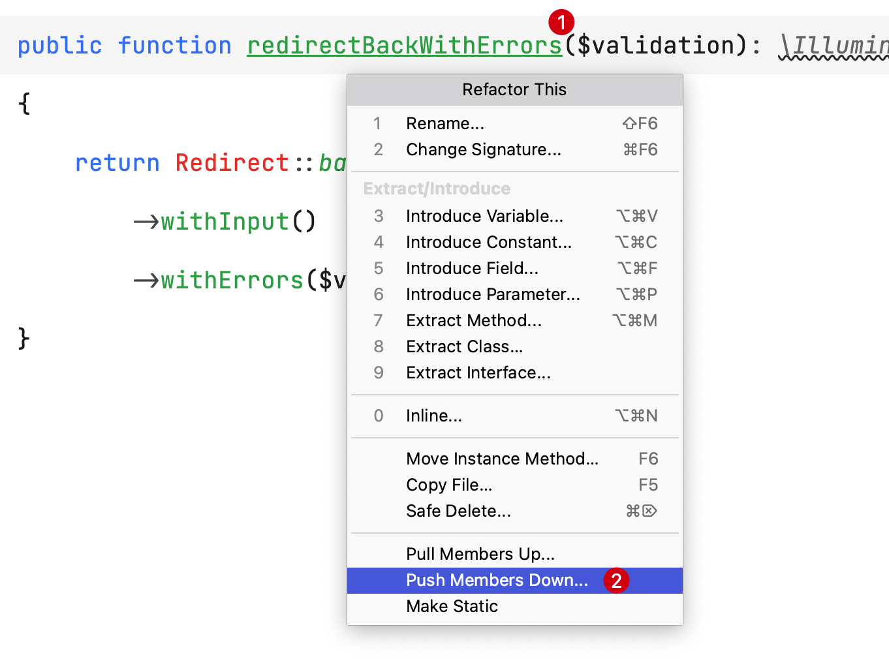
   :::

2. 在确认弹出层中查看要转移到子类的成员方法，如果没有问题可以点击 `Refactor` 确认转移

   ::: details 点击展示或隐藏演示图
   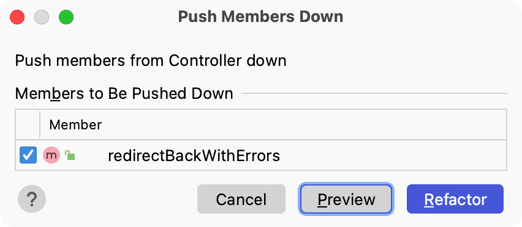
   :::

3. 此时可以看到父类的方法 `redirectBackWithErrors` 被转移到**所有继承自它的子类**

   ::: details 点击展示或隐藏源代码
    - 父类 `Controller`
        ```php {15-24}
        <?php
        
        namespace App\Http\Controllers;
        
        use Illuminate\Foundation\Auth\Access\AuthorizesRequests;
        use Illuminate\Foundation\Bus\DispatchesJobs;
        use Illuminate\Foundation\Validation\ValidatesRequests;
        use Illuminate\Routing\Controller as BaseController;
        use Illuminate\Support\Facades\Redirect;
        
        class Controller extends BaseController
        {
            use AuthorizesRequests, DispatchesJobs, ValidatesRequests;
        }
        ```

    - 子类 `CartsController`

        ```php
        <?php
        
        namespace App\Http\Controllers;
        
        use Illuminate\Support\Facades\Redirect;
        
        class CartsController extends Controller
        {
            public function store()
            {
                // Some logic...
                return $this->redirectBackWithErrors($validation);
            }
        
            public function update()
            {
                // Some logic...
                return $this->redirectBackWithErrors($validation);
            }          
      
            /** // [!code focus:10]
             * @param $validation
             * @return \Illuminate\Http\RedirectResponse
             */
            public function redirectBackWithErrors($validation): \Illuminate\Http\RedirectResponse
            {
                return Redirect::back()
                    ->withInput()
                    ->withErrors($validation->messages());
            }
        }
        ```
   :::

值得注意的是，由于 PHP 中父类能被多个子类继承，所以父类执行转移方法时候会转移到所有子类。
