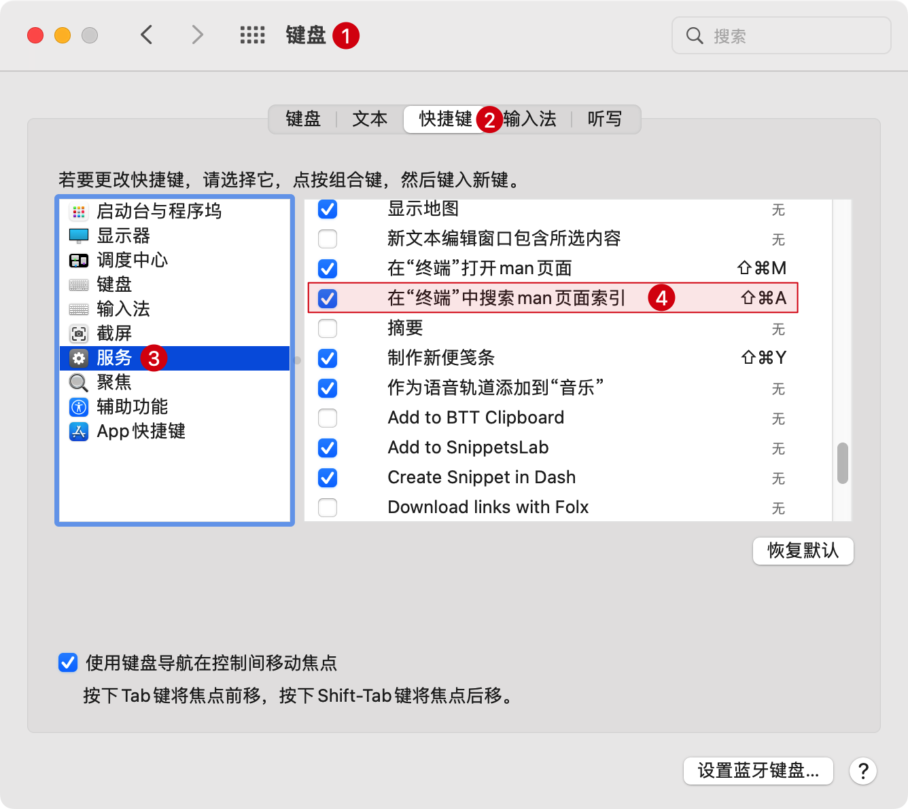

# 常用快捷键

经过极简配置后的 PhpStorm 编辑器在主编辑界面几乎看不到操作按钮，此时使用快捷键操作能显著提升开发效率。

以下以 **macOS** 快捷键配置做演示，比如：

- 查找操作：`Command + Shift + A`
- 文件查找：`Command + Shift + O`
- 查看函数或方法定义：`Command + B`
- 切换文件定义：`Command + E`
- 查看文件包含属性或方法：`Command + F12`

## 查找操作 `Command + Shift + A`

该命令在编辑器的 主菜单 -> `Help` -> `Find Action...` 后，可以在菜单的后面看到快捷键为：`Command + Shift + A`。

> 如果执行上面的命令打开带有 `apropos` 搜索而不是 `查找操作`
>
对话框的终端，请[参考这里](https://intellij-support.jetbrains.com/hc/en-us/articles/360005137400-Cmd-Shift-A-hotkey-opens-Terminal-with-apropos-search-instead-of-the-Find-Action-dialog)
> 
> :::  details 点击切换截图展示与隐藏
> 1. 打开 `苹果系统菜单` | `系统偏好设置` | `键盘` | `快捷键` | `服务`
> 2. 禁用或 Search man Page Index in Terminal (or change the shortcut)
     > 
     > :::

在上一节 **极简配置** 中介绍的对应配置如：标签位置 `Tab placement` 、工具窗口栏 `Tool Window Bars`、行号 `Line Numbers`
等等就可以通过这个快捷键进行搜索后切换显示配置。

## 文件查找 `Command + Shift + O`

该命令在编辑器的 主菜单 -> `Navigate` -> `File...` 后，可以在菜单的后面看到快捷键为：`Command + Shift + O`。

在实际开发编码时，经常会需要打开不同目录的不同文件。通过命令 `Command + Shift + O`
命令后输入对应文件所在目录/文件名称，或者直接输入文件名后在下拉列表处找到对应文件后点击回车确认打开文件即可。

## 查看函数或方法定义 `Command + B`

该命令在编辑器的 主菜单 -> `Navigate` -> `Declaration or Usages` 后，可以在菜单的后面看到快捷键为：`Command + B`。

1. 在 PHP 文件中遇到函数或方法定义，想进入到函数或方法的定义处查看函数或方法运行的逻辑；
2. 或想看下定义的方法在那些地方有调用。

可以使用 `Command + B` 进入到对应的函数或者方法定义或者跳转到对应调用处。

## 切换打开的文件记录 `Command + E`

该命令在编辑器的 主菜单 -> `View` -> `Recent Files` 后，可以在菜单的后面看到快捷键为：`Command + E`。

PhpStorm中默认会记录打开的文件，以便我们快速检索，可以使用 `Command + E` 快捷键快速跳转到近期打开的文件，选中文件后按回车重新打开之前打开过的文件。

这在我们频繁切换文件操作时非常高效。

## 查看文件包含属性或方法 `Commnad + F12`

该命令在编辑器的 主菜单 -> `Navigate` -> `File Structure` 后，可以在菜单的后面看到快捷键为：`Command + F12`。

针对PHP类和函数文件，可以使用 `Commnad + F12` 可以查看该类文件的成员变量和方法，再次按 `Command + F12`
可以一并列出父类的成员变量和方法。这个功能在查看源码时使用非常频繁。

## 其他快捷操作

在编写代码逻辑时，常常会需要打印一些变量或者编写条件判断，可以使用 PhpStorm 的快捷操作：

```php
<?php
$name = 'Curder';
$bool = true;
$user = ['name' => $name, 'hobbies' => ['coding', 'music']];

$name.echo # 按tab就会自动补全为 echo $name;
$bool.if # 按tab就会自动补全为 if 条件判断
$user.var_dump # 按tab会自动补全为 var_dump($user);
$isset.isset # 按tab就会自动补全为if (isset($isset)) 条件判断
```

::: tip 更多快捷键操作参考
选择主菜单上的 `Help` -> `Keyboard Shortcuts PDF` 打开快捷键操作PDF文件预览
:::
