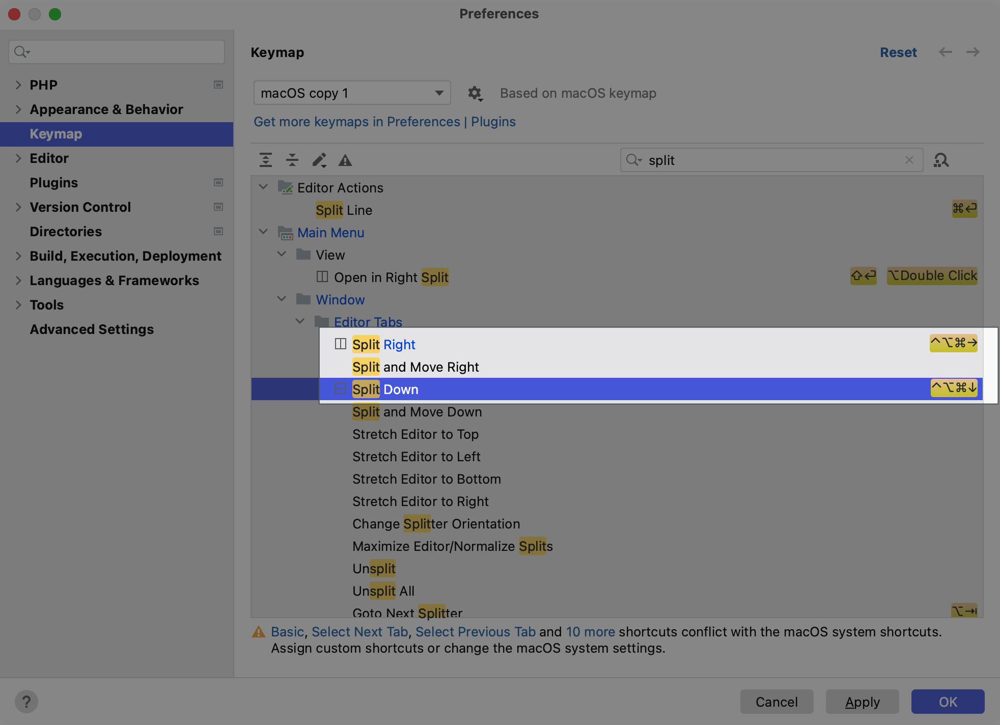

# 拆分屏幕

PhpStorm 中提供了各种操作，开发者可以从主菜单工具窗口调用这些操作来拆分编辑器屏幕。

## 拆分屏幕

当主编辑内容区域打开了一个编辑的文件，在主菜单中选择 `Window` -> `Editor Tabs` -> `Split Right`拆分并向右移动
或 `Split Down` 拆分并向下移动的选项。

1. 选择 `Split Right` 则会在主屏幕右侧打开一个拆分的窗口,将主屏幕左右一分为二，内容跟拆分前的屏幕内容保持一致，如下截图：
   ::: details 点击展示或隐藏截图
   
   :::
2. 选择 `Split Down` 则会在屏幕主屏幕下方拆分一个窗口，将主屏幕上下一分为二，内容跟拆分前的屏幕内容保持一致，如下截图：
   ::: details 点击展示或隐藏截图
   
   :::

## 设置快捷键

每次使用鼠标通过在主菜单点击的方式拆分屏幕相对费时，可以通过设置自定义快捷键完成快速拆分屏幕。

1. 通过快捷键 `Command + ,` 呼出系统偏好设置，选择 `Keymap`
2. 在搜索框中输入 `split`
3. 选中要添加的快捷键条目，比如这里的 `Split Right`
4. 右键点击，并在弹出层中选中 `Add Keyboard Shotcut`
   ::: details 点击展示或隐藏截图
   
   :::
5. 在弹出层中输入 `Ctrl + Opt + Command + ->` 设置这个快捷键组合
   ::: details 点击展示或隐藏截图
   
   :::
6. 添加完成后的截图如下：
   ::: details 点击展示或隐藏截图
   
   :::

7. 展示快捷键设置效果
   ::: details 点击展示或隐藏截图
   
   :::    

