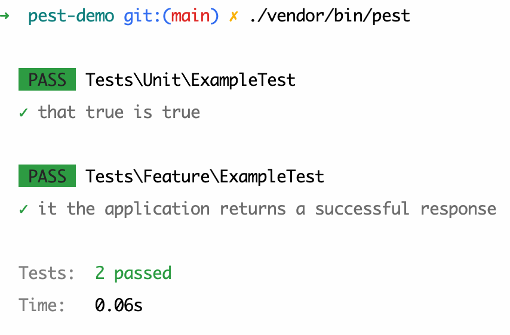
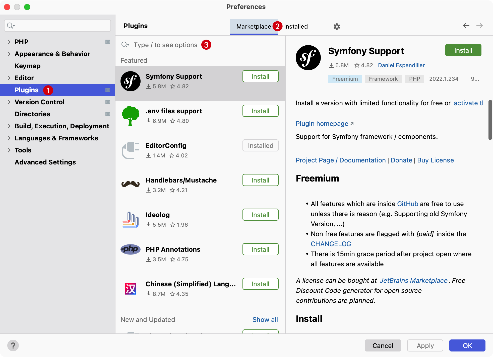
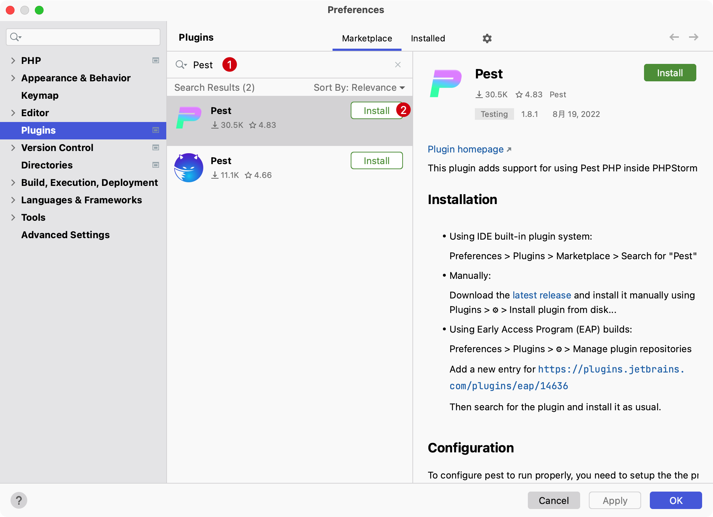
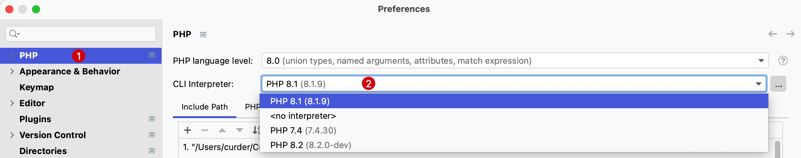
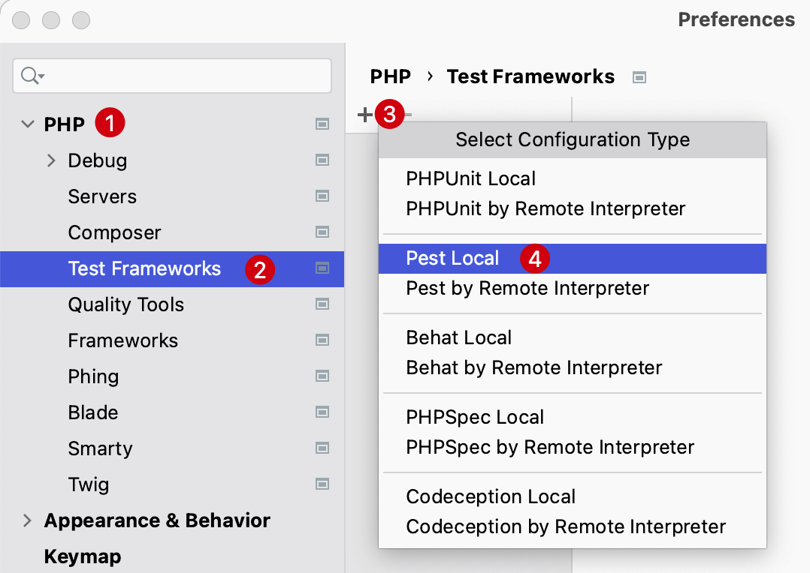
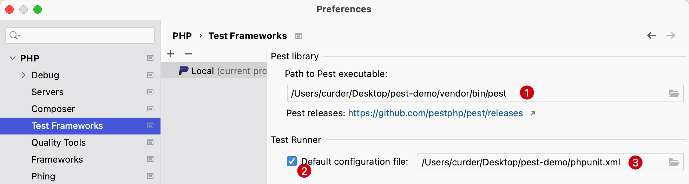
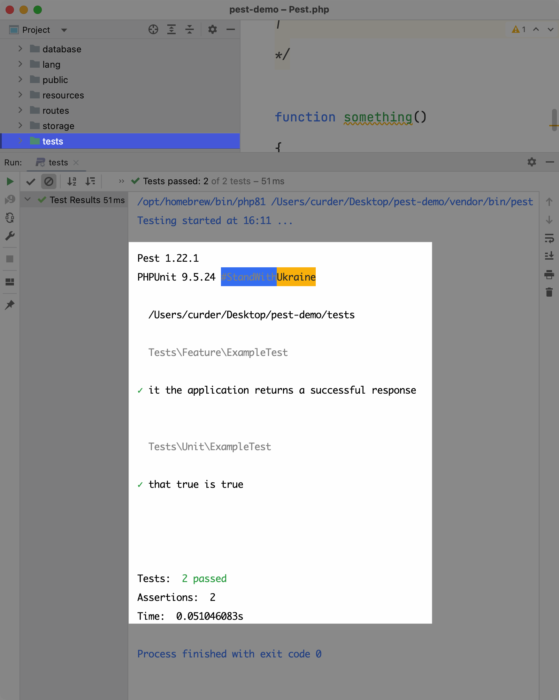

# Pest 单元测试

[Pest](https://pestphp.com/) 是 [Nuno Maduro](https://twitter.com/enunomaduro) 开发的一个新的测试 PHP 框架。

虽然 `Pest` 本身是建立在流行的PHP测试框架 `PHPUnit` 之上，但 `Pest` 旨在为编写测试提供更好的体验，哲学很简单。

通过提供富有表现力的界面，使 `TDD` 体验简单而优雅。

接下来带大家了解如何在 `Laravel` 项目中开始使用 `Pest` 。

## 技术要求

- `PHP 8.0` 或更高版本。`Pest` 需要 `PHP 7.3+` 才能运行。
- `Laravel 9` 需要 `PHP 8.0+`
- `Composer`
- 对 `PHPUnit` 的基本了解

## 安装 Pest 到 Laravel 项目

来到 Pest 的[官方文档](https://pestphp.com/docs/installation)，可以看到在 Laravel 项目路径所在的命令行终端执行如下命令：

```bash
composer require pestphp/pest-plugin-laravel --dev
php artisan pest:install
```

执行完上面的命令将 pest 集成到 Laravel 项目中，会生成一个 `tests/Pest.php` 的文件。

## 修改 Laravel 默认测试用例

- `tests/Unit/ExampleTest.php`

    - **修改前**

      ```php
        <?php
        
        namespace Tests\Unit;
        
        use PHPUnit\Framework\TestCase;
        
        class ExampleTest extends TestCase
        {
            /**
             * A basic test example.
             *
             * @return void
             */
            public function test_that_true_is_true()
            {
                $this->assertTrue(true);
            }
        }
        ```

    - **修改后**

        ```php
        <?php

        test('that true is true')->assertTrue(true);
        ```

- `tests\Feature\ExampleTest.php`
    - **修改前**
        ```php
        <?php

        namespace Tests\Feature;

        // use Illuminate\Foundation\Testing\RefreshDatabase;
        use Tests\TestCase;

        class ExampleTest extends TestCase
        {
            /**
            * A basic test example.
            *
            * @return void
            */
            public function test_the_application_returns_a_successful_response()
            {
                $response = $this->get('/');

                $response->assertStatus(200);
            }
        }
        ```
    - **修改后**

        ```php
        <?php
        
        it('the application returns a successful response')->get('/')->assertOk(); 
        ```

将 PHPUint 代码逻辑修改为 Pest，可以看到明显简化了代码，代码一目了然。



但是，使用 PhpStorm 运行测试，需要安装插件才能正常集成。

## PhpStorm 集成 Pest

Pest 当前支持 PhpStorm 和 VSCode，可以在这里查看：[docs/ide-plugins](https://pestphp.com/docs/ide-plugins)，PhpStorm 安装插件的流程如下：

1. 使用快捷键 `⌘ +` ,，打开 IDE 设置并选择 `Plugins` -> `Marketplace` 

    

2. 输入 `Pest` 进行搜索 -> 安装插件
    

3. 使用快捷键 `⌘ + ,`，打开 IDE 设置并选择 **PHP**

4. 检查当前所选 PHP 解释器
   

   在 PHP 页面上，从 CLI Interpreter 列表中选择相关的 PHP 版本，如果没有请添加。

5. 点开 PHP 解释器，选择 `Test Frameworks`

    1. 点击 New（或者使用快捷键 `Control（或 Ctrl）⌃ + N`） 新建一个 `Pest Local`。

       ::: details 点击切换截图展示与隐藏
       
       :::

    2. 输入如下内容：

        1. 在 **Path to Pest executable:** 输入当前项目的绝对路径 + `vendor/bin/pest` 

        2. 在 `Test Runner` 分组勾选上 **Default configuration file:** 输入当前项目的绝对路径 + `phpunit.xml`
        
        ::: details 点击切换截图展示与隐藏
        
        :::

    至此，已将 Pest 集成到了 PHPStorm 中。

下面是使用 pest 集成到 PhpStorm 中运行后的结果：



