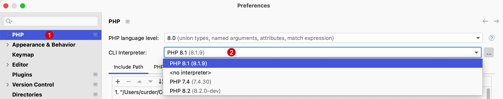

# PHPUnit 单元测试

PhpStorm 通过与 [PHPUnit](https://phpunit.de/) 测试框架的集成支持 PHP 应用程序的单元测试。

使用 PHPUnit 之前需要安装到本地。安装 PHPUnit 有两种方式，一种是 PHP 档案包，另一种是通过 Composer脚本。关于 PHPUnit 的安装[参考 PHPUnit 官网](https://phpunit.de/getting-started/phpunit-9.html)

## 将 PHPUnit 与 PhpStorm 项目集成

这里依然以一个 Laravel 项目为例，将 PHPUnit 与 PhpStorm 编辑的 Laravel 项目集成。

1. 使用快捷键 `⌘ + ,`，打开 IDE 设置并选择 **PHP**
2. 检查当前所选 PHP 解释器
    

    在 PHP 页面上，从 CLI Interpreter 列表中选择相关的 PHP 版本，如果没有请添加。

3. 点开 PHP 解释器，选择 `Test Frameworks`

    1. 点击 New（或者使用快捷键 `Control（或 Ctrl）⌃ + N`） 新建一个 `PHPUnit Local`。

        ::: details 点击切换截图展示与隐藏
        
        :::

    2. 输入如下内容：

        1. 在 **PHPUnit library** 分组中选择 `Use Composer autoloader`

        2. 并在 `Path to script:` 输入当前项目的 `autoload.php` 文件路径，一般为当前项目绝对路径 + `/vendor/autoload.php`

            <!-- markdownlint-disable MD013 -->
        3. 在 **Test Runner** 分组勾选上 `Default configuration file:` 后添加 `phpunit.xml` 或者 `phpunit.xml.dist` 文件路径，一般为当前项目绝对路径 + `phpunit.xml` 或 项目绝对路径 + `phpunit.xml.dist`
            <!-- markdownlint-enable MD013 -->

        ::: details 点击切换截图展示与隐藏
        
        :::

至此，已将 PHPUnit 集成到了 PHPStorm 中。

## 执行全部单元测试

通常在代码交付到测试或线上环境部署时，会对全部单元测试用例的执行测试。

- 使用系统终端执行测试

    如果使用了 iTerm2 等命令终端，可以打开终端并来到项目目录下，执行 `./vendor/bin/phpunit`

    ::: details 点击切换截图展示与隐藏
    
    :::

- 使用 PHPStorm 终端执行测试

    同时也可以使用 PHPStorm 终端，使用键盘快捷键 `Option（或 Alt）⌥ + F12` 打开终端，执行 `./vendor/bin/phpunit`

    ::: details 点击切换截图展示与隐藏
    
    :::

- 使用 PHPStorm 快捷键执行测试
    在 PHPStorm 任意文件位置使用快捷键 `Control（或 Ctrl）⌃ + R` 即可完成所有单元测试的执行。
    > **注意：** 这个快捷键会记录上一次执行的单元测试，再次使用快捷键时会执行上次单元测试的用例。随着单元测试用例越写越多，这对需要对单个文件或者方法的测试非常友好。

## 执行部分单元测试

通常在完成某个功能或者关联功能时需要对单个文件的所有单元测试用例执行测试。

- 使用系统终端执行测试

    如果使用了 iTerm2 等命令终端，可以打开终端并来到项目目录下，执行 `./vendor/bin/phpunit --filter + 文件名/测试方法名`

    ::: details 点击切换截图展示与隐藏

    

    > **说明：**
    > 1. 由于 `Laravel` 默认的 `Unit` 和 `Feature` 目录下的两个类名称均为 `ExampleTest` 所以执行命令 1 时运行了 2 个单元测试
    > 2. 命令 2 的`--filter` 后面的参数为测试用例的方法名

    > 总结：通过 `--filter` 参数后面可以指定测试的类名称或方法名称，当类名称或方法名相同时均会执行
    :::

- 使用 PHPStorm 终端执行测试

    同时也可以使用 PHPStorm 终端，使用键盘快捷键 `Option（或 Alt）⌥ + F12` 打开终端，执行 `./vendor/bin/phpunit`

    ::: details 点击切换截图展示与隐藏
    

    > **说明：**
    > 1. 由于 `Laravel` 默认的 `Unit` 和 `Feature` 目录下的两个类名称均为 `ExampleTest` 所以执行命令 1 时运行了 2 个单元测试
    > 2. 命令 2 的`--filter` 后面的参数为测试用例的方法名

    > 总结：通过 `--filter` 参数后面可以指定测试的类名称或方法名称，当类名称或方法名相同时均会执行
    :::

- 使用 PHPStorm 快捷键执行测试

    - 如果要执行某个类下的所有单元测试用例，可以将光标停留在该用例类代码内部（非方法内部），输入快捷键 `Control（或 Ctrl）⌃ + Shift + R` 即可。
    > **温馨提示：** 也可以将光标停留在文件夹或者类名上执行快捷键 `Control（或 Ctrl）⌃ + Shift + R` 来快速执行 N+1个文件的单元测试

    - 如果要执行某个类的方法的单元测试用例，可以将光标停留在该测试用例内部，同样输入快捷键 `Control（或 Ctrl）⌃ + Shift + R` 即可。

## 监控测试结果

PhpStorm 在 Run 工具窗口的 Test Runner 选项卡中显示测试执行结果。

::: details 点击切换截图展示与隐藏

:::

该选项卡分为 2 个主要区域：

- 左侧区域可深入了解所有单元测试以查看成功和失败的测试。 可以过滤测试、导出结果并使用上下文菜单命令运行特定测试或导航到源代码。

- 右侧区域显示原始 PHPUnit 输出。

## 重新执行错误的测试

如果我们一次跑了很多测试用例，有一部分成功和一部分失败，当再次跑测试时，仅仅需要跑之前失败的测试用例，可以使用下面的方法完美解决这个问题。

::: details 点击切换截图展示与隐藏

:::

## 切换自动测试

当受影响的代码更改时，可以让 PhpStorm 自动重新运行测试。

此选项根据运行/调试配置进行配置，并可应用于测试、测试文件、文件夹或测试的组合选择，具体取决于此运行/调试配置中指定的测试范围。

1. 运行测试

2. 在 `Test Runner` 选项卡上，按工具栏上的 `Toggle Auto-Test` 按钮

    ::: details 点击切换截图展示与隐藏
    
    :::

3. 单击设置按钮，设置代码更改时启动测试的时间延迟（可选）

    ::: details 点击切换截图展示与隐藏
    
    :::
