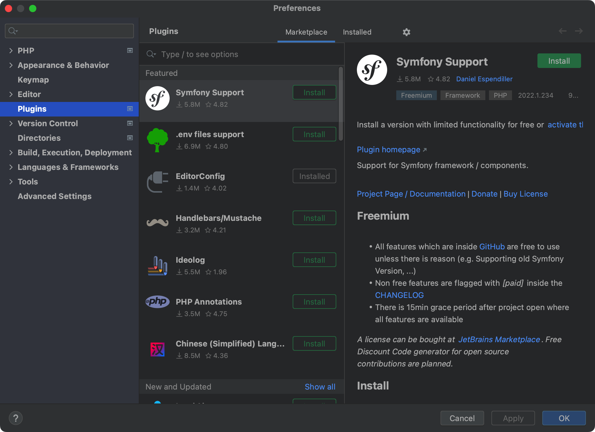
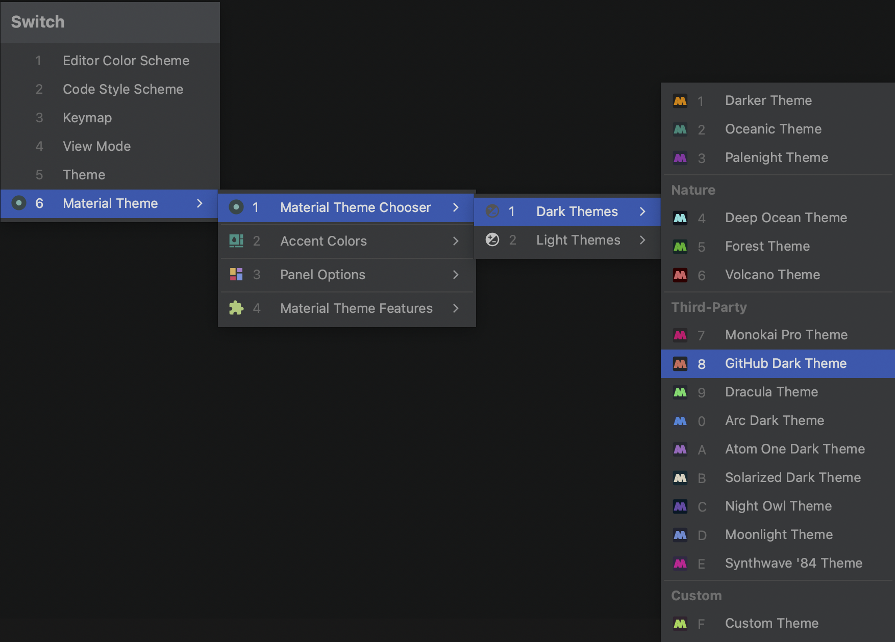

# 选择主题

编辑器默认自带的主题比较简陋，最快速美化的方式是下载主题插件解决。

下面以安装 [Material Theme UI](https://plugins.jetbrains.com/plugin/8006-material-theme-ui) 主题和 [Atom One Theme](https://plugins.jetbrains.com/plugin/14799-atom-one-theme) 为例，列举主题的安装和启用流程。

## 安装 Material Theme UI 主题

1. 使用快捷键 `Command + ,`（或者点击 `PhpStorm` -> `Preferences...`） 进入到偏好设置后，选择 `Plugins`
   
2. 输入 `Material Theme UI` 进行搜索
3. 点击 Install 完成安装
4. 重启 PhpStorm

## 启用 Material Theme UI 主题

需要激活主题可以使用快捷键 `Command + ~`，在弹出层选择喜好的主题配色。

选中上面的主题后按回车确认选择。

> **注意：** `~` 在数字 `1` 左侧的按键。

## 安装 Atom One Theme

1. 使用快捷键 `Command + ,`（或者点击 `PhpStorm` -> `Preferences...`） 进入到偏好设置后，选择 `Plugins`
   
2. 输入 `Atom One Theme` 进行搜索
3. 点击 Install 完成安装
4. 重启 PhpStorm

## 启用 Atom One Theme 主题

需要激活主题可以使用快捷键 `Command + ~`，在弹出层选择喜好的主题配色。

选中上面的主题后按回车确认选择。

> **注意：** `~` 在数字 `1` 左侧的按键。
