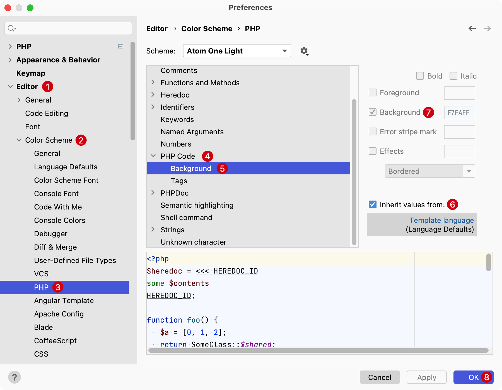

# 选择主题

编辑器默认自带的主题是 `Darcula`，如果不喜欢或者想换一种配色风格，最快速的方式是下载主题插件解决，也可以导入别人贡献的主题配色。

下面以安装 [Material Theme UI](https://plugins.jetbrains.com/plugin/8006-material-theme-ui) 主题、[Atom One Theme](https://plugins.jetbrains.com/plugin/14799-atom-one-theme) 和导入自定义主题配色为例，列举主题的安装和启用流程。

站在巨人的肩膀上让我们事半功倍，感谢开源。

## Material Theme UI

Material Theme UI 提供了较多风格的主题配色供用户选择，可以方便的切换，但是一些高级配置功能需要购买订阅。

下面介绍一下它的安装和启用：

### 安装

1. 使用快捷键 `Command + ,`（或者点击 `PhpStorm` -> `Preferences...`） 进入到偏好设置后，选择 `Plugins`
   
2. 输入 `Material Theme UI` 进行搜索
3. 点击 Install 完成安装
4. 重启 PhpStorm

### 启用

需要激活主题可以使用快捷键 `Ctrl + ~`，在弹出层选择喜好的主题配色。

选中上面的主题后按回车确认选择。

> **注意：** `~` 在数字 `1` 左侧的按键。

## Atom One Theme

Atom One Theme 主题拥有两种颜色搭配，分别是 **Atom One Dark** 和 **Atom One Light**。

### 安装

1. 使用快捷键 `Command + ,`（或者点击 `PhpStorm` -> `Preferences...`） 进入到偏好设置后，选择 `Plugins`

   

2. 输入 `Atom One Theme` 进行搜索
3. 点击 Install 完成安装
4. 重启 PhpStorm

### 启用

需要激活主题可以使用快捷键 `Ctrl + ~`，在弹出层选择喜好的主题配色。

选中上面的主题后按回车确认选择。

> **注意：** `~` 在数字 `1` 左侧的按键。

### 修改 Atom One Theme 背景色

针对PHP文件的代码会有一个背景色，可以通过下面的步骤将其修正。

在 PhpStorm 的 `Preferences` 偏好设置中选择 `Editor` -> `Color Scheme` -> `PHP` -> `PHP Code` -> 选中 `Backgroud` 后，点击 `inherit values from:` 反选它，再将上面的 `Backgroud` 复选框取消选择后，点击 **OK** 保存即可。

::: details 点击切换截图展示与隐藏

:::

## 自定义主题

自定义主题相比上面安装插件的方式有所不同，可以在类似这里[选择别人搭配好的编辑器主题](http://daylerees.github.io/)，然后在[这个代码仓库](https://github.com/daylerees/colour-schemes)选择并下载对应的 `.icls` 主题配色文件。

比如这里以安装：`Laravel Contrast` 这个主题配色。需要如下步骤：

1. 在仓库中定位到 jetbrains 目录并找到 [Laravel Contrast 对应的 `icls` 文件](https://github.com/daylerees/colour-schemes/blob/master/jetbrains/contrast/laravel-contrast.icls)
2. 点击 GitHub 页面上的 Raw 按钮，来到[查看源码页面](https://raw.githubusercontent.com/daylerees/colour-schemes/master/jetbrains/contrast/laravel-contrast.icls)
3. 使用熟悉的下载工具，例如 `wget` 命令主体配色文件 `laravel-contrast.icls`，比如：`wget https://raw.githubusercontent.com/daylerees/colour-schemes/master/jetbrains/contrast/laravel-contrast.icls -O ~/Desktop/laravel-contrast.icls` （命令将文件下载到了桌面）
4. 编辑器启用
   1. 在 PhpStorm 的 `Preferences` 偏好设置中选择 `Editor` -> `Color Scheme`
   2. 点击 Scheme 右侧的设置小齿轮，在下拉菜单中选择 `Import Scheme...` 后选择上面下载好的 `laravel-contrast.icls`，启用主题配色

### 自定义主题推荐

- [brendt/phpstorm-light-lite-theme](https://github.com/brendt/phpstorm-light-lite-theme)
