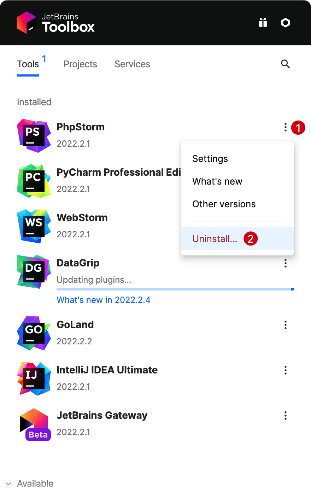

# 卸载

卸载 PhpStorm 的正确方法取决于安装时的方法。

> **注意：** 执行卸载 PhpStorm 之前请关闭正在运行的 PhpStorm 软件。

## 卸载独立安装

如果正在运行独立的 PhpStorm 实例，则删除实例时会保留默认的IDE目录，以备以后保留设置，或将其用于其他实例、其他版本或其他IDE。

如果您确定不需要这些目录，则可以删除它们。

- 删除系统应用程序 `Applications` 目录中的 PhpStorm 应用程序。

- 删除以下目录：
<!--@include: ./partials/uninstall/delete-some-directories.md-->

## 卸载使用 Toolbox App 安装

如果使用 Toolbox App 安装了 PhpStorm，请执行以下操作：

- 打开 Toolbox 应用程序，单击必要实例的设置图标，然后选择卸载。

    

- 删除以下目录：
<!--@include: ./partials/uninstall/delete-some-directories.md-->
