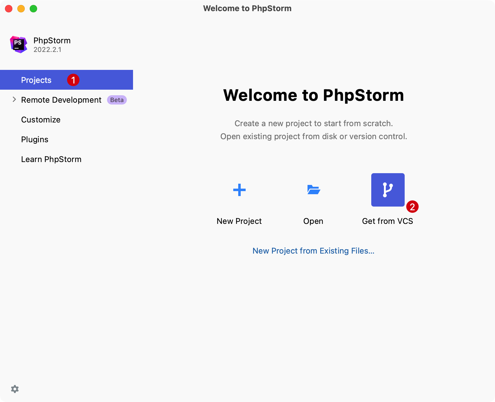
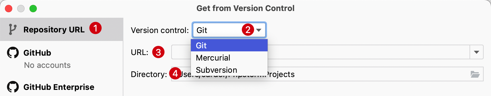
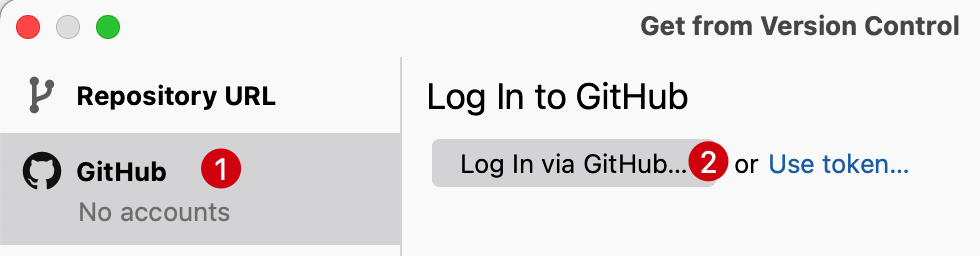
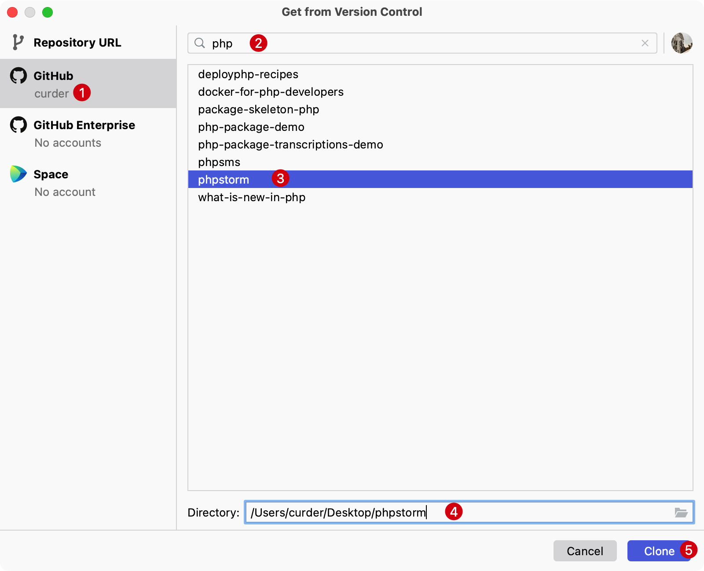

# Git 工作流

PhpStorm 集成了 Git、SVN 等版本管理工具，可以快速预览提交历史、提交版本、合并冲突等等。

来到 PhpStorm 的欢迎页面，在 `Projects` 有一个 `Get from VCS` 选项提供：

点击进入，可以选择对应版本控制软件、对应仓库URL地址以及本地存储地址。

也同时集成了 GitHub 账户授权登录。

登录成功后可以选择对应仓库和本地存储地址，则会将代码拉取到本地。

## 查看提交历史

在顶部菜单栏，选择 `Git` -> `Show Git Log`，或者使用快捷键 `Command + 9` 快速切换 Git 提交历史

查看提交历史界面如下：

1. 本地和远程分支预览
2. 分支、用户、时间和路径过滤
3. 提交历史列表
4. 提交对应文件变更列表

## 提交历史管理

本地暂存区文件

提交版本

版本回退

## 分支操作

新建本地分支

删除本地分支

编辑分支名称

分支合并操作

## 标签管理

新建标签

删除标签

