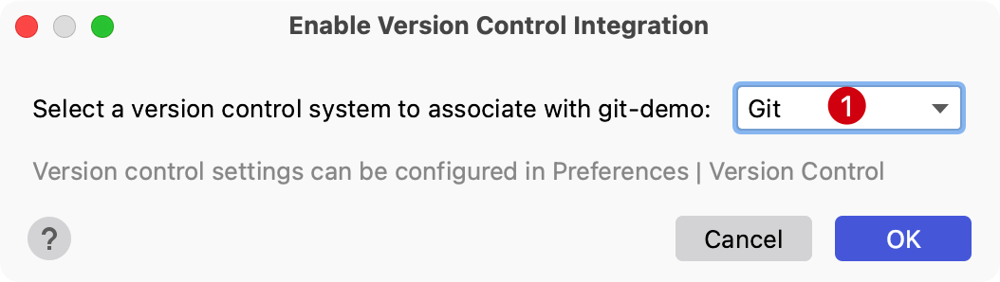

# Git 工作流

PhpStorm 集成了 Git、SVN 等版本管理工具，可以快速预览提交历史、提交版本、分支操作和标签的管理等等。

这里演示 PhpStorm 中使用 Git 的一些流程。

## 启用 Git 版本控制

当打开一个没有版本控制的项目时，可以在顶部主菜单 `VCS` | `Enable Version Control Integration...`

点击 OK 确认启用版本控制集成。

## 向版本库中添加文件

使用 PhpStorm 新建文件 `index.php` 时，编辑器默认会提示是否需要将新建的文件添加到版本库中

如果需要新增到版本库中可以点击 OK；当然也可以选择不添加，然后在后期需要添加的时候再添加。根据情况选择即可。

再添加一个 `route.php` 文件并且不添加到 Git 版本库中。

## 查看本地变更

默认情况下 PhpStorm 将本地变更记录取消了，但是可以通过系统偏好设置重新设置。

使用 Command , 来到 Version Control 相关的设置后选择 Commit，将 `Use non-modal commit interface` 反选后保存即可。

再使用快捷键 Command 9 在查看提交历史面板可以看到本地文件的变更。

## 提交历史管理

### 本地暂存区文件

在编写代码时，想浏览本地文件的变更情况，当然可以在终端输入 `git status` 来查看文件变更记录，那么使用 PhpStorm 应该怎么操作呢？

PhpStorm 的查看工作区文件变更情况远不止查看文件变更历史，还包含了：文件内容变更可视化查看、文件分组、树形显示、甚至可以直接提交版本等操作。

通过在 PhpStorm 主菜单点击 `Git` -> `Commit` 会弹出当前工作区文件的变更情况，或者直接使用快捷键 `Command + K` 即可。

1. 功能操作区

    - **查看差异** 将光标悬浮在下面文件上点击 `Show diff` 按钮可以看到对应文件的前后变更差异，也可以直接双击文件查看差异
    - **回滚** 一般用户文件状态回滚
    - **刷新** 一般用于本地文件变更后刷新列表
    - **分组方式** 默认为文件夹分组
    - **展开所有** 将所有文件夹展开，如果存在文件夹的话
    - **全部收缩** 将所有文件夹搜索，如果存在文件夹的话
    - **变更列表** 相当于可以将变更历史添加一个分组，方便后期查看对应分组中的文件变更

2. **文件变更列表**

   显示版本库当前变更记录，比如，新增文件、编辑文件、删除文件等。

   点击文件名称，在右侧可以看到对应的文件变更内容。

3. **提交信息**

   可以在这里提供提交版本时的信息。

4. **提交、提交并推送到远程**

   可以选择提交到版本库，也可以通过下拉选项选择提交到版本库之后直接推送到远程仓库。

### 版本回退

在上面查看本地文件暂存变更列表可以对文件提交版本管理，那么如果和历史版本进行回退呢？

使用 `Command + 9` 可以在版本库提交历史中定位到需要回退的版本，并使用右键点击 `Reset current branch to Here`
，然后在接下来的弹出层选择需要回退的模式。

还有另一种情况就是当我们回退版本后发现回退错了，还是应该将版本库切换到回退前的状态。当前建议使用 `git reflog`
查看版本库历史记录信息，并复制 hash 值。

然后来到主菜单的 `Git` -> `Reset Head...`，将上面执行的命令获取的hash值提取到粘贴到弹出层即可回退到指定版本。

## 添加远程仓库

开发一个项目一般会多人协同开发，如果将自己本地编写的代码推送到远程仓库，或者将远程仓库变更获取到本地。

接下来一起看一下在 PhpStorm 中添加远程仓库的流程。

在顶部主菜单选择 `Git` | `Manage Remotes...` 在弹窗中选择加号添加一个

- **Name**: `origin`
- **URL**: `git@github.com:curder/git-demo.git`

然后点击 OK 确认输入。

## 推送和拉取代码

### 推送代码到远程

在顶部主菜单选择 `Git` | `Push` 或者使用快捷键 Command Shift K 可以将本地提交的版本推送到远程仓库。

会弹出确认推送的面板，包含需要推送的本地历史提交和推送对应的文件变更列表。

点击 Push 就可以推送。

但是如果是一个协同开发的项目，一个好的习惯是推送之前先更新一下项目最新的代码再推送，那么接下来一起来看一下从远程仓库获取代码更新。

### 拉取代码到本地

当需要获取远程代码中其他伙伴更新的代码或者推送之前都建议拉取最新的仓库代码到本地。

在编辑器的顶部主菜单找到 Git | Update Project... 或者使用快捷键 Command T 可以从远程仓库更新项目代码到本地。

在弹出的更新项目模式可以选择 Merge 或 Rebase，这里选择 Rebase 即可。

## 查看提交历史

在顶部菜单栏，选择 `Git` -> `Show Git Log`，或者使用快捷键 `Command + 9` 快速切换 Git 提交历史

查看提交历史界面如下：

1. 本地和远程分支预览
2. 分支、用户、时间和路径过滤
3. 提交历史列表
4. 提交对应文件变更列表

## 分支操作

### 新建本地分支

当需要新建一个本地分支时，可以使用 `git branch 分支名` 来通过命令行的方式新建一个新分支。

在 PhpStorm 中可以通过在主菜单，选择 `Git` -> 点击 `New Branch...` 通过当前分支，创建一个新分支，并且默认情况下会将当前工作区自动切换到新分支上。

或者通过快捷键 `Ctrl + V` 呼出 VSC 操作项。

接着点击 `Create new branch...`

然后命名一个新分支即可。

### 删除本地分支

当需要删除对应分支时，可以使用命令 `git branch -d 待删除的分支名` 来删除不需要的本地分支。

在 PhpStorm 中可以通过主菜单上的 `Git` -> 选择 `Branches...`

或者通过快捷键 `Ctrl + V` 呼出 VSC 操作项，接着选择 `Branches...`，在接下来的弹窗选择对应分支，再选中 `Delete` 操作。

::: tip 温馨提示
删除的分支不能是当前所在分支
:::

### 编辑分支名称

当需要修改对应分支名称时，可以使用命令 `git branch -m 旧分支 新分支` 修改分支名称。

在 PhpStorm 中可以通过主菜单上的 `Git` -> 选择 `Branches...`

或者通过快捷键 `Ctrl + V` 呼出 VSC 操作项，接着选择 `Branches...`，在接下来的弹窗选择对应分支，再选中 `Rename` 操作。

在接下来的弹出层中输入修改后的分支名，然后点击 Rename 确认修改

### 分支合并操作

当需要合并另一个分支变更操作时，可以使用命令 `git merge 待合并的分支名` 来合并另一个分支。

在 PhpStorm 中可以通过主菜单上的 `Git` -> 选择 `Branches...`

或者通过快捷键 `Ctrl + V` 呼出 VSC 操作项，接着选择 `Branches...`，在接下来的弹窗选择对应分支，再选中 `Merge ... into ...`
操作。

## 标签管理

Git 可以给仓库历史中的某一个提交打上标签，以示重要，比较有代表性的是人们会使用这个功能来标记发布结点（ v1.0 、 v2.0 等等）。

### 新建标签

当需要在某个提交添加标签时，可以使用命令 `git tag 标签名` 或者指定提交ID参数 `git tag -a 标签名 hashId` 来新建一个标签。

Git 支持两种标签：轻量标签（lightweight）与附注标签（annotated）。

#### 方式一：主菜单

在 PhpStorm 中可以通过主菜单上的 `Git` -> 选择 `New Tag...`，这种方式创建的标签需要添加hashId，hashId的值可以通过提交历史获取。

以上方式在弹出的输入框由如下信息：

1. 输入新建的标签名
2. 对应提交HashId
3. 提交信息简介，如果提供了信息则为"附注标签"
   ，参考[git-scm 附注标签](https://git-scm.com/book/zh/v2/Git-%E5%9F%BA%E7%A1%80-%E6%89%93%E6%A0%87%E7%AD%BE)
4. 以上信息确认无误后点击 `Create Tag` 确认输入
   

#### 方式二：提交历史记录

使用快捷键 `Command + 9` 打开提交历史记录列表，将光标选中指定提交历史，右键点击获取弹出层，选中 `New Tag...`

可以看到，相比方式一：通过主菜单新建标签的方式不同的是，由于已经选择了具体关联的提交记录，所以不再需要提供
hashId，然后默认提交的是轻量标签，所以我们仅需要提供标签名称即可。

### 删除标签

使用快捷键 `Command + 9` 打开提交历史记录记录列表，将光标选中指定提交历史，右键点击获取弹出层，当存在多个标签时选中 `Tags`
或者 当前提交版本仅存在一个标签名时选中 `Tag 标签名`。

然后选中 `Delete`，确认操作误后点击回车确认即可。

