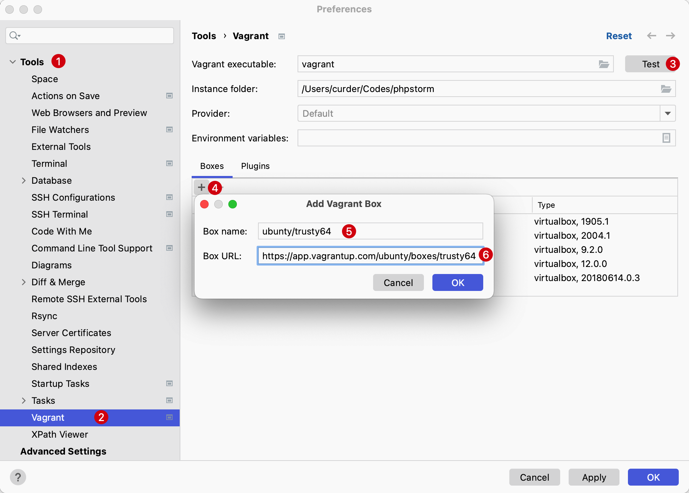

# Vagrant

[Vagrant](http://vagrantup.com/) 是一个命令行实用程序，用于管理虚拟机的生命周期。

PhpStorm 提供与 Vagrant 的完全集成，允许配置 Vagrant 虚拟环境，控制虚拟机的行为，并在项目中执行 Vagrant 命令。

在使用 Vagrant 的情况下，将满足以下定义：

- `Vagrantfile`：定义 Vagrant 环境的主要配置文件，存储虚拟镜像的所有配置，并告诉 Vagrant 如何使用虚拟机。
- `Virtual box`：包含预配置虚拟机的虚拟沙箱。 Vagrant 与不同的虚拟盒子供应商合作，例如 Oracle 的 VirtualBox、VMWare 或 AWS。
- `Instance`: 虚拟机

## 先决条件

- 从 [JetBrains repository](https://plugins.jetbrains.com/plugin/7379-vagrant) 下载并开启 `Vagrant` 插件
- 安装 [Vagrant](http://www.vagrantup.com/) 和 [Oracle 的 VirtualBox](https://www.virtualbox.org/) 应用程序，并分别启动他们。

## 初始化 Vagrant 文件

要开始使用 Vagrant，需要初始化 `Vagrantfile`，从下面的方式之一即可：

- 打开终端（`⌥ + F12`）并运行以下命令：`vagrant init`

  > 这将初始化 `Vagrantfile` 并默认将其放入项目根文件夹中。

- 使用快捷键 `Command + Shift + X` 将创建初始化文件命令输入 `vagrant init` 输入即可。

打开生成的 `Vagrantfile` 文件，会看到已经有一个预定义的配置。

`config.vm.box = "base"` 行指定将在项目中使用的虚拟框。

## 指定虚拟镜像

例如，指定 `ubuntu/trusty64` 镜像。

它包含一个基本的 Ubuntu 虚拟机，也可以根据需要指定任何其他虚拟框。

要查找可用虚拟盒子的列表，请参阅 [Vagrant Boxes](https://www.vagrantup.com/vagrant-cloud/boxes/catalog)。

执行以下操作之一：

- 打开 Vagrantfile 并将 `config.vm.box = "base"` 行更改为以下内容：`config.vm.box = "ubuntu/trusty64"`
- 在 设置/首选项 对话框 (`⌘ + ,`) 中，选择 `Tools` -> `Vagrant`。在 Boxes 窗口中单击按钮并指定以下内容：

    - **Box name:** `ubuntu/trusty64`

    - **Box URL:** `https://app.vagrantup.com/ubuntu/boxes/trusty64`

  

一旦 Vagrantfile 初始化完成并指定了虚拟框，就可以部署和运行虚拟机了。

## 启动实例

执行以下操作之一：

- 打开终端（`Alt + F12`）并运行以下命令：`vagrant up`
- 使用快捷键 `Command + Shift + X` 后输入 `vagrant up`
- 从主菜单中，选择 `Tools` -> `Vagrant` -> `Up`

::: tip 通过 SSH 连接到正在运行的机器

启动虚拟机后，它保持在后端运行。

要通过 SSH 连接到正在运行的机器： 打开终端（`Alt + F12`）并运行命令：`vagrant ssh`
:::

## 一些命令

要控制实例，请使用 Vagrant 命令。它们可以从终端 `Alt + F12` 或主菜单 `Tools` -> `Vagrant` 后选择对应命令运行。

下面仅展示了使用虚拟机的最重要的命令。Vagrant 命令的完整列表，[参阅命令行界面](https://www.vagrantup.com/docs/cli)。

- `Suspend` 挂起：挂起实例会暂停所有进程并保存虚拟机的当前状态

  在终端中运行 `vagrant suspend` 或在主菜单中选择 `Tools` -> `vagrant` -> `Suspend`

- `Resume` 恢复：恢复一个实例会启动一个先前挂起的虚拟机
  在终端中运行 `vagrant resume` 或在主菜单中选择 `Tools` -> `vagrant` -> `Resume`

- `Reload` 重新加载：当修改了 Vagrantfile 进行更改并需要重新加载当前虚拟环境及其配置时，需要重新加载实例。
  在终端中运行 `vagrant reload` 或在主菜单中选择 `Tools` -> `vagrant` -> `Reload`

- `Halt` 关闭：关闭实例会停止正在运行的虚拟机
  在终端中运行 `vagrant halt` 或在主菜单中选择 `Tools` -> `vagrant` -> `Halt`

- `Destroy` 销毁：当需要删除与先前创建的环境相关的所有内容时，销毁虚拟机很重要。在创建实例期间提供的所有资源都将被删除
  在终端中运行 `vagrant destroy` 或在主菜单中选择 `Tools` -> `vagrant` -> `Destroy`
