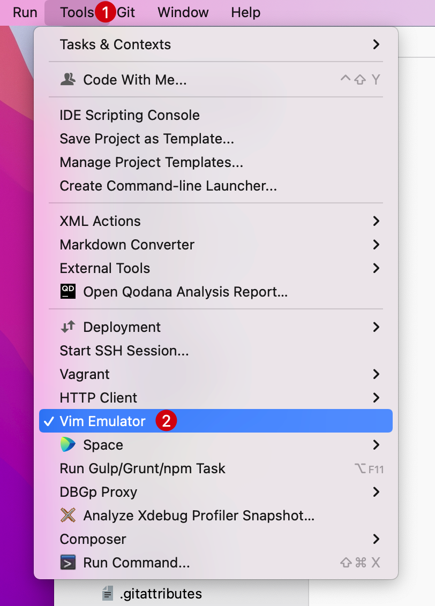

# 带映射的 Vi 模式

如果之前使用过其它代码编辑器，比如 `VS Code`、`Eclipse`、`Sublime Text` 等等，并且已经习惯那一套快捷键，可以在 PhpStorm
的插件市场安装对应的快捷键映射方案：

::: details 点击展示或隐藏截图

1. 进入到 PhpStorm 系统偏好设置(使用快捷键 `Command + ,`)
2. 选择 `Plugins` -> `Marketplace` -> 搜索 `keymap` 关键字，选择需要映射的编辑器快捷键
   
   :::

## 安装 IdeaVim

如果同时是 `Vim` 重度爱好者，或者想要体验在 PhpStorm 使用 `vim`
编辑器中，可以通过在插件市场安装 [`IdeaVim`](https://plugins.jetbrains.com/plugin/164-ideavim) 插件：

1. 进入到 PhpStorm 系统偏好设置(使用快捷键 `Command + ,`)
2. 选择 `Plugins` -> `Marketplace` -> 搜索 `IdeaVim` 关键字
3. 在搜索结果列表处点击 `Install` 下载到编辑器
   ::: details 点击展示或隐藏截图
   
   :::

安装完成后，重启 PhpStorm。

## 启动 IdeaVim

1. 点击顶部菜单 `Tools`
2. 在下拉菜单列表中点击 `Vim Emulator` 启动 Vim 编辑器
   ::: details 点击展示或隐藏截图
   
   :::

> 要禁用它，请在主菜单中取消选择 `Tools` | `Vim Emulator`。

## 基本使用

启动 `IdeaVim` 之后在代码编辑区域，不再是之前待输入的鼠标光标，而是 `Vim` 编辑器对应的只读光标：

::: details 点击展示或隐藏截图

:::

要更改为写入模式，请按字母 `i`，光标将变为一行：
::: details 点击展示或隐藏截图

:::

在只读模式下，可以输入新代码或更改现有代码。也可以进入其他 Vim 模式，比如：输入 `r` 进入替换模式。

如果要返回正常模式，请按 `Esc`。

## IdeaVim 配置

Vim 是使用 `vimrc` 文件配置的，而`VimIdea` 插件使用具有相同语法的 `ideavimrc` 文件。

```bash
touch ~/.ideavimrc

echo "imap jj <Esc>" >> ~/.ideavimrc  # 比如配置一个快捷键 在输入模式输入 jj 则自动转换为只读模式 
```

**配置完之后需要重启 PhpStorm 编辑器使配置生效**

## 测试配置

1. 使用 `i` 进入到写入模式
2. 输入 2 次 j，进入到只读模式
   ::: details 点击展示或隐藏截图
   
   :::

