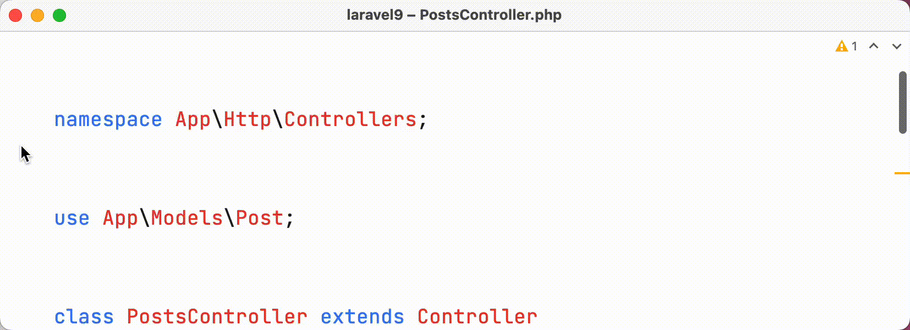
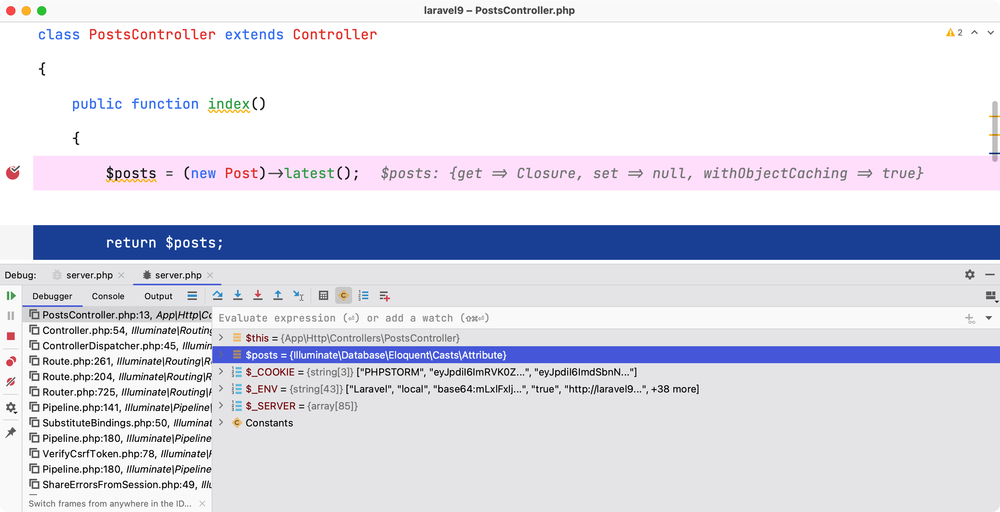

# Laravel 项目中使用 Xdebug

PhpStorm 内置 Debug 调试支持 Xdebug 和 Zend Debugger，下面演示在 PhpStorm 中配合本地 PHP 开发环境使用 Xdebug 调试 Laravel 项目的流程。

一些相关网址：

- [Laravel](https://laravel.com/docs)
- [Xdebug](https://xdebug.org/)
- Xdebug Helper For browsers
    - [Google Chrome](https://chrome.google.com/extensions/detail/eadndfjplgieldjbigjakmdgkmoaaaoc)
    - [Firefox](https://addons.mozilla.org/en-US/firefox/addon/xdebug-helper-for-firefox/)
      Or [Xdebug-ext](https://addons.mozilla.org/en-US/firefox/addon/xdebug-ext-quantum/)
    - [Safari](https://apps.apple.com/app/safari-xdebug-toggle/id1437227804?mt=12)
    - [Edge](https://microsoftedge.microsoft.com/addons/detail/xdebug-helper/ggnngifabofaddiejjeagbaebkejomen)
- [YouTube - Debugging With PhpStorm And Xdebug | Christoph Rumpel | phpday 2021](https://youtu.be/MFAfbNx4apA)

## 预配置

1. 安装并配置 Xdebug 3 到 PHP
    1. 安装
       首先，确保在本地 PHP 安装了 xdebug，使用命令 `php --version`，比如：

       

       如果输出信息中没有看到 Xdebug 相关的信息，请来到 [Xdebug 安装向导](https://xdebug.org/wizard) 复制当前使用的 PHP
       的 `phpinfo()` 并粘贴到向导中，按照说明进行操作。

    2. 配置 Xdebug 3

       通过 `php --ini`命令在输出中定位到 xdebug 配置文件路径或者直接将下面的配置放到 `php.ini` 配置中。
       ```php
       [opcache]
       ;extension_dir=/opt/homebrew/lib/php/pecl/20210902
       zend_extension="xdebug.so"
       xdebug.mode=debug
       xdebug.client_host=127.0.0.1
       xdebug.client_port=9003
       xdebug.log="/tmp/xdebug.log"
       ```
    3. 检查当前配置的PHP是否跟Laravel项目使用的PHP一致

       比如，可以在Laravel 项目中打印一个 `phpinfo();` 检查一下 xdebug 配置

2. 下载浏览器插件

   为了开始调试，您首先需要在服务器上激活调试器引擎。为此，需要设置一个特殊的 `GET`/`POST` 或 `COOKIE` 参数。
   虽然可以手动执行此操作，但使用浏览器扩展程序更方便，只需单击一下即可启用调试器。

    1. 选择需要下载的浏览器拓展：[Xdebug Helper](https://www.jetbrains.com/help/phpstorm/2022.2/browser-debugging-extensions.html)
    2. Google Chrome 浏览器安装 Xdebug Helper
       拓展 [参考 PhpStorm 官方文档](https://www.jetbrains.com/help/phpstorm/2022.2/browser-debugging-extensions.html?utm_source=product&utm_medium=link&utm_campaign=PS&utm_content=2022.2#xdebug-helper-extension)

        - 从 [Chrome Web Store](https://chrome.google.com/extensions/detail/eadndfjplgieldjbigjakmdgkmoaaaoc) 为 Chrome
          安装
          Xdebug 帮助程序扩展
        - 从浏览器端启动连接。单击浏览器工具栏上的 Xdebug Helper 图标以启动调试、分析或跟踪会话：
          
        - 右键点击 Xdebug Helper 图标，选择 `选项`，来到它的配置页面，选择 `PhpStorm` 并点击 `Save` 保存配置
          

3. 配置 PhpStorm

   使用快捷键 `Command + ,` 来到 PhpStorm 系统便好设置，选择 `PHP` -> `Debug`，配置如下：
   

4. 开启监听

   在 PhpStorm 中，通过顶部主菜单选择 `Run` -> `Start Listening for PHP Debug Connections` 开始监听 PHP 调试连接
   

自此，预配置工作已经准备就绪，接下来看一下如何在项目中进行调试。

## 在 Laravel 中调试

### 示例代码

- 路由文件 `web`

    ```php
    <?php
    
    use App\Http\Controllers\PostsController;
    
    Route::get('/posts', [PostsController::class, 'index']); 
    ```


- 模型文件 `Post`

    ```php
    <?php
    
    namespace App\Models;
    
    use Illuminate\Database\Eloquent\Casts\Attribute;
    use Illuminate\Database\Eloquent\Factories\HasFactory;
    use Illuminate\Database\Eloquent\Model;
    
    class Post extends Model
    {
        use HasFactory;
    
        public function latest(): ?Attribute
        {
            if (true) {
                return Attribute::get(fn () => null);
            }
    
            return Attribute::get(fn() => ['Post1', 'Post2']);
        }
    }
    ```


- 控制器 `PostsController`

    ```php
    <?php
    
    namespace App\Http\Controllers;
    
    use App\Models\Post;
    
    class PostsController extends Controller
    {
        public function index()
        {
            $posts = app(Post::class)->latest;
    
            return $posts;
        }
    }
    ```

当访问 `/posts` 路由时会交给控制器 `PostsController` 代码逻辑处理，在控制器中调用了模型 `Post` 的方法（当前这个方法返回的是不正确的）。
                                                                    
### 新增断点

在访问之前，还需要在代码逻辑中打上断点，比如在 `PostsController` 中新增一个断点，如下：



### 开始调试

在浏览器访问 `/posts` 这个**正确的地址**，此时浏览器应该停止在正在刷新的界面。


**注意：** 首次配置 PhpStorm 会弹出提示层，点击确认即可。此时，在系统偏好设置，`PHP` -> `Servers` 会添加上刚刚配置的信息，值得注意的是： `Use path mapping` 无需勾选。


再次访问浏览器，可以看到 PhpStorm Debug 调试功能界面一起弹出，此刻可以点击 `Step Over` 或者 `F8` 进入到将逻辑进入到下一行。


此时假如预期的 `latest` 返回的应该是一个 `Attribute` 对象，却得到一个 `null`，可以返回到模型中将 `latest` 代码中的逻辑修复，再此刷新浏览器进行调试。




相比于在代码中添加 `dd()` 或者 `var_dump()` 打印变量的方式不同的是，使用 `xdebug` 调试代码能打印更多的变量、调用栈等信息，方便开发者进行分析。

但是，由于需要额外添加很多浏览器插件下载和配置、编辑器配置，增加了门槛，带来的好处也显而易见。

而对比通过在代码中添加代码打印的方式就简单许多，如何选择由开发者自行判断，希望大家能在实际开发中能把 xdebug 调试技术运用上，增加开发效率。
