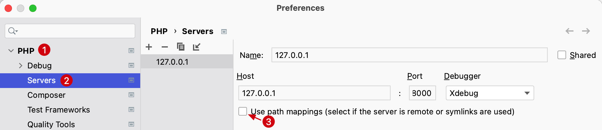

# Laravel 项目中使用 Xdebug

PhpStorm 内置 Debug 调试支持 Xdebug 和 Zend Debugger，下面演示在 PhpStorm 中配合本地 PHP 开发环境使用 Xdebug 调试 Laravel
项目的流程。

分别采用配置 `PHP Web Page` 和使用浏览器扩展或URL传递 `XDEBUG_SESSION` 参数的方式对项目进行调试。

一些相关网址：

- [Laravel](https://laravel.com/docs)
- [Xdebug](https://xdebug.org/)
- Xdebug Helper For browsers
    - [Google Chrome](https://chrome.google.com/extensions/detail/eadndfjplgieldjbigjakmdgkmoaaaoc)
    - [Firefox](https://addons.mozilla.org/en-US/firefox/addon/xdebug-helper-for-firefox/)
      Or [Xdebug-ext](https://addons.mozilla.org/en-US/firefox/addon/xdebug-ext-quantum/)
    - [Safari](https://apps.apple.com/app/safari-xdebug-toggle/id1437227804?mt=12)
    - [Edge](https://microsoftedge.microsoft.com/addons/detail/xdebug-helper/ggnngifabofaddiejjeagbaebkejomen)
- [YouTube - Debugging With PhpStorm And Xdebug | Christoph Rumpel | phpday 2021](https://youtu.be/MFAfbNx4apA)

以下根据不同的请求方式分为两种不同的编辑器配置演示在 Laravel 项目中对 Xdebug 的支持。

## 调试 GET 请求

### 示例代码

- 路由文件 `web`
  ```php
    <?php
    use Illuminate\Support\Facades\Route;
    use App\Http\Controllers\PostsController;

    Route::get('/posts', [PostController::class, 'index']);  
  ```

- 控制器 `PostsController`
    ```php
    <?php

    namespace App\Http\Controllers;

    use App\Repositories\PostsRepository;

    class PostController extends Controller
    {
        protected PostsRepository $postRepository;

        public function __construct(PostsRepository $postsRepository)
        {
            $this->postRepository = $postsRepository;
        }

        public function index()
        {
            $posts = $this->postRepository->all();

            return view('posts.index', compact('posts'));
        }
    }
    ```

- 仓库文件 `PostsRepository`
    ```php
    <?php

    namespace App\Repositories;

    class PostsRepository
    {
        public function all(): ?array
        {
            if (true) {
                return null;
            }

            return ['post 1', 'post 2'];
        }
    }
 
    ```

站点调试 GET 请求相对配置较简单，可以通过一下流程：

1. 安装并配置 Xdebug 3 到 PHP
    1. 安装
       首先，确保在本地 PHP 安装了 xdebug，使用命令 `php --version`，比如：

       

       如果输出信息中没有看到 Xdebug 相关的信息，请来到 [Xdebug 安装向导](https://xdebug.org/wizard) 复制当前使用的 PHP
       的 `phpinfo()` 并粘贴到向导中，按照说明进行操作。

    2. 配置 Xdebug 3

       通过 `php --ini`命令在输出中定位到 xdebug 配置文件路径或者直接将下面的配置放到 `php.ini` 配置中。
       ```php
       [xdebug]
       ;extension_dir=/opt/homebrew/lib/php/pecl/20210902
       zend_extension="xdebug.so"
       xdebug.mode=debug
       xdebug.client_host=127.0.0.1
       xdebug.client_port=9003
       xdebug.log="/tmp/xdebug.log"
       ```
    3. 检查当前配置的PHP是否跟Laravel项目使用的PHP一致

       比如，可以在Laravel 项目中打印一个 `phpinfo();` 检查一下 xdebug 配置

2. 在编辑器顶部菜单选择 `Run` -> `Edit Configurations...` 打开编辑配置弹出窗
3. 点击左上角的 + 号添加一个 **PHP Web Page**
   
4. 在配置项中的 Server 段添加一个新的web服务配置，包括名称、URL和端口，以及Debugger选择 Xdebug
   
5. 再回到 **PHP Web Page** 配置，将上一步配置的 Server选择上，并补充名称、起始URL等
   

6. 开始调试之前，在需要代码断点处添加断点。然后来到编辑器顶部菜单选择 `Run` -> `Debug '/posts'` 或者直接使用快捷键 Ctrl D。

   可以看到浏览器上打开了对应的URL `http://127.0.0.1:8000/posts?XDEBUG_SESSION_START=10372`
   并添加了默认的 `XDEBUG_SESSION_START` 参数。
   此刻浏览器正在等待 PhpStorm 编辑器 Debug 的调试响应。

   可以使用 `Step Into` 或者使用快捷键 F7 进入到 `PostsRepository` 类的 `all` 方法内部查看代码的执行逻辑。使用

以上便是通过配置 `PHP Web Server` 的方式调试 Laravel 项目中的 GET 请求。

这种方式调试 Laravel 项目的优点是简单直接，缺点也很明显就是如果需要调试其他路由则需要重新配置一个路由关系，比较繁琐。

那么 PhpStorm 也支持监听 Debug 调试的功能，需要我们开启并正确传递 Cookie 或者请求参数即可。

下面我们以调试 POST 请求演示一下另一种 Debug 调试的配置。

## 调试 POST 请求

### 预配置

1. 安装并配置 Xdebug 3 到 PHP
    1. 安装
       首先，确保在本地 PHP 安装了 xdebug，使用命令 `php --version`，比如：

       

       如果输出信息中没有看到 Xdebug 相关的信息，请来到 [Xdebug 安装向导](https://xdebug.org/wizard) 复制当前使用的 PHP
       的 `phpinfo()` 并粘贴到向导中，按照说明进行操作。

    2. 配置 Xdebug 3

       通过 `php --ini`命令在输出中定位到 xdebug 配置文件路径或者直接将下面的配置放到 `php.ini` 配置中。
       ```php
       [xdebug]
       ;extension_dir=/opt/homebrew/lib/php/pecl/20210902
       zend_extension="xdebug.so"
       xdebug.mode=debug
       xdebug.client_host=127.0.0.1
       xdebug.client_port=9003
       xdebug.log="/tmp/xdebug.log"
       ```
    3. 检查当前配置的PHP是否跟Laravel项目使用的PHP一致

       比如，可以在Laravel 项目中打印一个 `phpinfo();` 检查一下 xdebug 配置

2. 下载浏览器插件

   为了开始调试，您首先需要在服务器上激活调试器引擎。为此，需要设置一个特殊的 `GET`/`POST` 或 `COOKIE` 参数。
   虽然可以手动执行此操作，但使用浏览器扩展程序更方便，只需单击一下即可启用调试器。

    1. 选择需要下载的浏览器拓展：[Xdebug Helper](https://www.jetbrains.com/help/phpstorm/2022.2/browser-debugging-extensions.html)
    2. Google Chrome 浏览器安装 Xdebug Helper
       拓展 [参考 PhpStorm 官方文档](https://www.jetbrains.com/help/phpstorm/2022.2/browser-debugging-extensions.html?utm_source=product&utm_medium=link&utm_campaign=PS&utm_content=2022.2#xdebug-helper-extension)

        - 从 [Chrome Web Store](https://chrome.google.com/extensions/detail/eadndfjplgieldjbigjakmdgkmoaaaoc) 为 Chrome
          安装
          Xdebug 帮助程序扩展
        - 从浏览器端启动连接。单击浏览器工具栏上的 Xdebug Helper 图标以启动调试、分析或跟踪会话：
          
        - 右键点击 Xdebug Helper 图标，选择 `选项`，来到它的配置页面，选择 `PhpStorm` 并点击 `Save` 保存配置
          
   > 这种方式是可选的，也可以通过URL传递参数 `XDEBUG_SESSION=PHPSTORM` 的方式触发 Debug 调试，只不过通过浏览插件的方式会更加直观。
3. 配置 PhpStorm

   使用快捷键 `Command + ,` 来到 PhpStorm 系统便好设置，选择 `PHP` -> `Debug`，配置如下：
   

4. 开启监听

   在 PhpStorm 中，通过顶部主菜单选择 `Run` -> `Start Listening for PHP Debug Connections` 开始监听 PHP 调试连接
   

自此，预配置工作已经准备就绪，接下来看一下如何在项目中进行调试。

### 示例代码

- 路由文件 `web`

    ```php
    <?php
    use Illuminate\Support\Facades\Route;
    use App\Http\Controllers\PostsController;
    
    Route::post('/posts', [PostController::class, 'store']);
    ```

- 仓库文件 `PostsRepository`

    ```php
    <?php

    namespace App\Repositories;

    class PostsRepository
    {
        public function create(): array
        {
            return [
                'name' => 'post name',
            ];
        }
    }
    ```

- 控制器 `PostsController`

    ```php
    <?php

    namespace App\Http\Controllers;

    use App\Repositories\PostsRepository;

    class PostController extends Controller
    {
        protected PostsRepository $postRepository;

        public function __construct(PostsRepository $postsRepository)
        {
            $this->postRepository = $postsRepository;
        }

        public function store()
        {
            $post = $this->postRepository->create();

            return $post;
        }
    }
    ```

- 将路由地址添加 CSRF 忽略
    ```php
    <?php

    namespace App\Http\Middleware;

    use Illuminate\Foundation\Http\Middleware\VerifyCsrfToken as Middleware;

    class VerifyCsrfToken extends Middleware
    {
        /**
         * The URIs that should be excluded from CSRF verification.
         *
         * @var array<int, string>
         */
        protected $except = [
            '/posts'
        ];
    }
    ```

当使用通过 POST 方式请求 `/posts` 路由时会交给控制器 `PostsController` 代码逻辑处理，在控制器中调用了 `PostsRepository`
仓库的 `store` 方法。

### 新增断点

在访问之前，还需要在代码逻辑中打上断点，比如在 `PostsController` 中新增一个断点，如下：


### 开始调试

通过 Curl 命令或 Postman 等工具访问 `/posts` 这个uri，**并添加请求参数 `?XDEBUG_SESSION=PHPSTORM`**，此时浏览器应该停止在正在刷新的界面后点击 `Accept`。


**注意：** 首次配置 PhpStorm 会弹出提示层，点击确认即可。此时，在系统偏好设置，`PHP` -> `Servers`
会添加上刚刚配置的信息，值得注意的是： `Use path mapping` 无需勾选。


再次访问可以看到 PhpStorm Debug 调试功能界面一起弹出，此刻可以点击 `Step Over` 或者 `F8` 进入到将逻辑进入到下一行。


相比于在代码中添加 `dd()` 或者 `var_dump()` 打印变量的方式不同的是，使用 `xdebug` 调试代码能打印更多的变量、调用栈等信息，方便开发者进行分析。

但是，由于需要额外添加很多浏览器插件下载和配置、编辑器配置，增加了门槛，带来的好处也显而易见。

而对比通过在代码中添加代码打印的方式就简单许多，如何选择由开发者自行判断，希望大家能在实际开发中能把 xdebug
调试技术运用上，增加开发效率。
