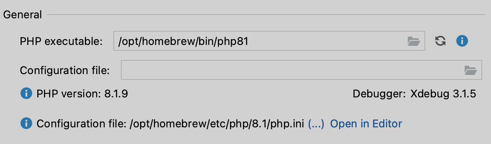
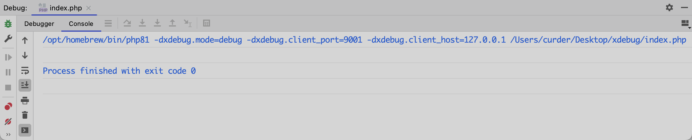
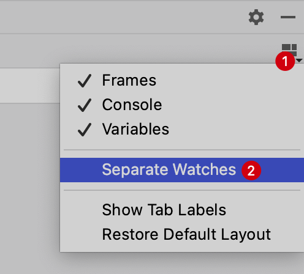
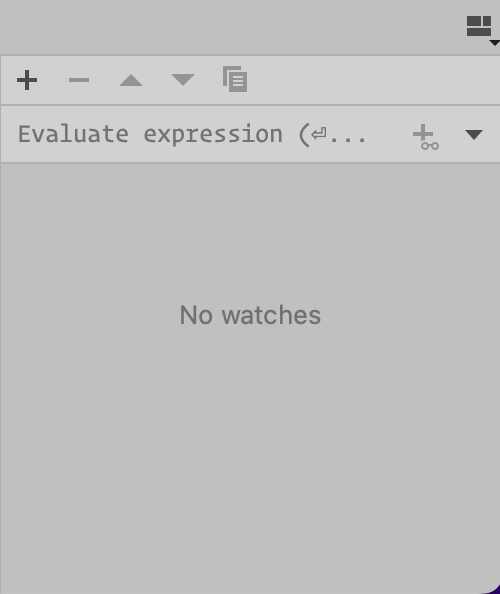
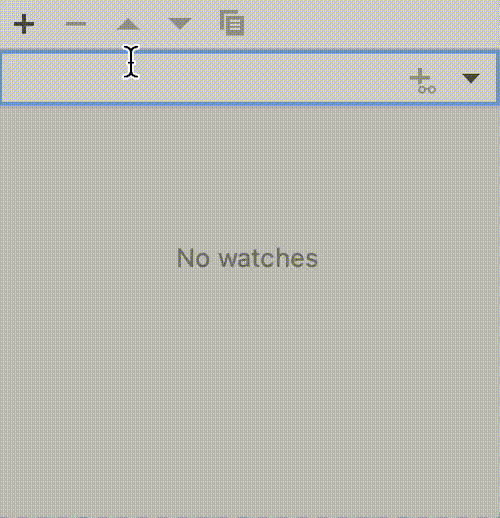
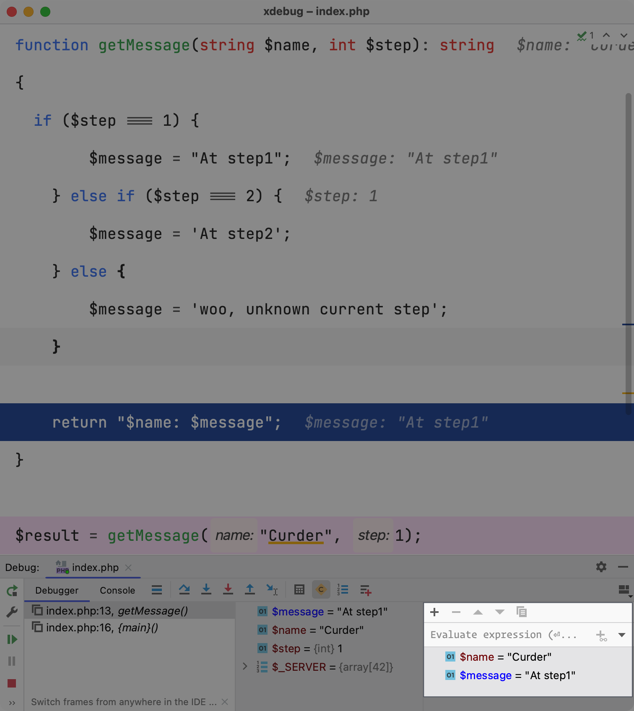

# PHP 文件使用 Xdebug

## xdebug 调试单文件

假如有如下 PHP 文件：

```php
<?php

function getMessage(string $name, int $step): string
{
    if ($step === 1) {
        $message = "At step1";
    } else if ($step === 2) {
        $message = 'At step2';
    } else {
        $message = 'woo, unknown current step';
    }

    return "$name: $message";
}

$result = getMessage("Curder", 1);
```

如何追踪 PHP 在运行过程中变量的赋值情况，一种情况可以通过打印 `$result` 变量的结果，比如使用 `var_dump($result);` 如果使用的是 Laravel 项目也可以使用 `dd($result);`，然后在浏览器中查看结果。

然而上面的情况我们可以很方便的在 xdebug 中追踪逻辑在运行过程中变量的赋值情况。

PhpStorm 支持直接使用 Xdebug 调试 PHP 文件，但是需要有如下前置需求：

<!-- markdownlint-disable MD013 -->
下载与 PHP 版本兼容的 [Xdebug 扩展](https://www.xdebug.org/)，并按照[安装指南](https://xdebug.org/docs/install)中的说明进行安装，[可以参考这里给 PHP 安装好 Xdebug 扩展](https://www.jetbrains.com/help/phpstorm/configuring-xdebug.html#updatingPhpIni)
<!-- markdownlint-enable MD013 -->

## 在 PhpStorm 中配置 Xdebug

以下配置的流程来自 [PhpStorm 官方帮助文档](https://www.jetbrains.com/help/phpstorm/configuring-xdebug.html#integrationWithProduct)，可以在官方文档查看更多详情。

1. 使用快捷键 `⌘ + ,`，打开 `IDE` 设置并选择 **PHP**。
2. 检查与所选 PHP 解释器关联的 Xdebug 安装：
   1. 在 PHP 页面上，从 `CLI Interpreter` 列表中选择相关的 PHP 安装，然后单击 `...`。该列表显示了 PhpStorm 中可用的所有 PHP 安装。
   2. 打开的 CLI 解释器对话框显示以下内容：
      1. 所选 PHP 安装的版本。
      2. 与所选 PHP 安装（Xdebug 或 Zend Debugger）关联的调试引擎的名称和版本。如果没有配置调试器，PhpStorm 会显示相应的消息：
      

## 开始调试 PHP 文件

当 PHP 配置好 Xdebug，并且在 PhpStorm 中正确设置后就可以对 `.php` 文件进行调试。

来到主菜单栏 `Run` -> `Debug 'index.php'`（或者直接使用快捷键 `Control（或 Ctrl）⌃ + D`）就可以对当前文件进行调试，但是执行完之后发现代码并没有按预期，脚本执行完直接退出了。


出现这个问题的原因是并**未设置断点**，xdebug并不知道从哪儿截断程序的执行，自然就一直执行到脚本执行完毕才退出。


设置完断点后再执行快捷键 `Control（或者 Ctrl）⌃ + D` 就可以看到如下调试界面：
    1. `Show Execution Point` 查看当前断点所在位置
    2. `Step Over` 跳过当前代码行并带您到下一行，即使突出显示的行中有方法调用。方法的实现被跳过，直接进入调用者方法的下一行。
    3. `Step Into` 进入该方法以显示其中发生的事情。当您不确定该方法是否返回正确的结果时，请使用此选项。
    4. `Force Step Into` 方法中的步骤，即使此方法被常规 `Step Into` 跳过。
    5. `Step Out` 跳出当前方法到调用者方法。
    6. `Run to Cursor` 继续执行，直到到达插入符号的位置。途中的所有断点都将被忽略。

> Tips: 在 xdeug 调试过的步骤中，当我们将鼠标光标悬浮在变量名上，可以看到对应变量运行时的值。

## 添加变量监听

当调试的项目相对复杂时，会需要单独观察一些变量，可以将它们添加到 `Watches Lists`

### 开启 Separate Watches

1. 点击右侧的 `Layout Settings` 布局设置按钮
2. 点击 `Separate Watches` 选项，开启 `Separate Watches`
    ::: details 点击切换截图展示与隐藏
    - 使用下面的示例流程开启 `Separate Watches`

        

    - 下图为开启 `Separate Watches` 后的面板

        
    :::

### 添加监听的变量

- 可以通过在输入框添加要监听的变量名，并点击右侧的 `+` 按钮或使用快捷键`Command + Shift + Enter`添加。
- 也可以点击面板左侧的 `+` 按钮在随后新增的输入框中输入要监听的变量名并按回车 Enter 确认输入。



这样方便在众多变量中筛选出关心的变量进行监听查看。


